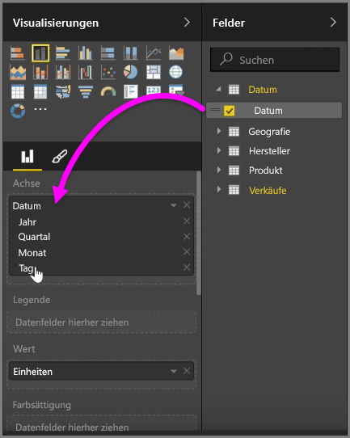
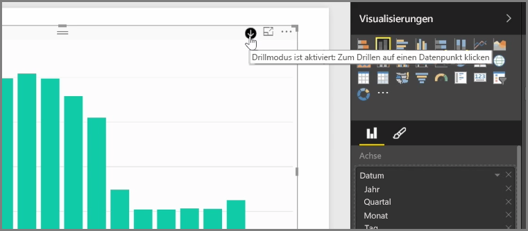
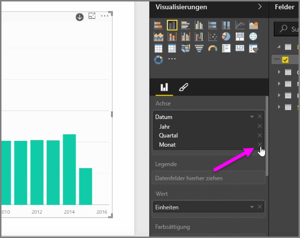
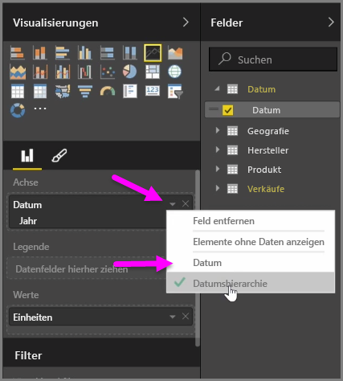
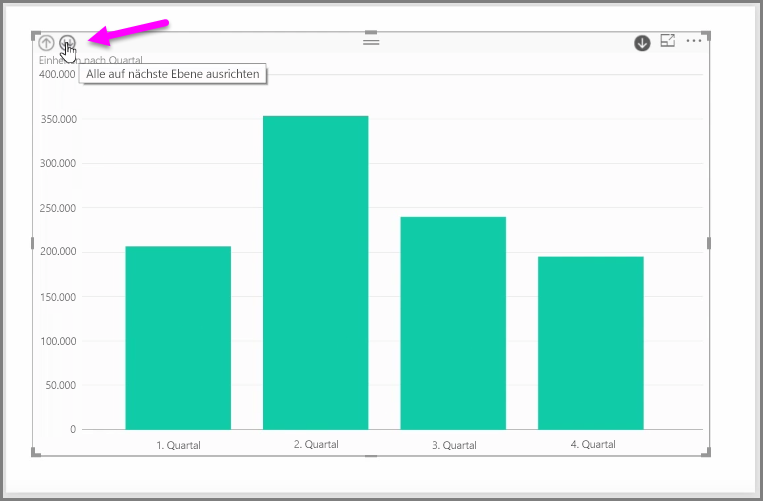

Beim Hinzufügen eines *Datumsfelds* zu einem visuellen Element im Feldbucket *Achse* wird in Power BI automatisch eine Zeithierarchie hinzugefügt, die *Jahr*, *Quartal*, *Monat* und *Tag* enthält. Dies ermöglicht eine zeitbasierte Interaktion mit den visuellen Elementen in den Berichten in Power BI, sodass Benutzer einen Drilldown durch die verschiedenen Zeitebenen ausführen können.

Wenn eine Hierarchie vorhanden ist, können Sie den Drilldown durch die Zeithierarchie ausführen. Durch Klicken auf ein Jahr im Diagramm wird z. B. ein Drilldown zur nächsten Ebene in der Hierarchie ausgeführt, in diesem Fall zu den *Quartalen*, die dann im visuellen Element angezeigt werden.

In dieser automatisch erstellten Hierarchie können Sie auch festlegen, bis zu welcher Ebene des freigegebenen Berichts Benutzer einen Drilldown ausführen können. Klicken Sie dazu einfach im Bereich „Visualisierungen“ auf das „X“ neben der zu entfernenden Hierarchieebene. Die gelöschte Ebene wird aus dem Bericht entfernt, und auf dieser Ebene wird kein Drilldown mehr angezeigt.

Wenn Sie diese Hierarchieebene wieder hinzufügen möchten, entfernen Sie einfach das *Datumsfeld*, und fügen Sie es dann aus dem Bereich **Felder** wieder hinzu. Die Hierarchie wird wieder automatisch erstellt.

Unter Umständen möchten Sie die Hierarchie für ein bestimmtes visuelles Element nicht verwenden. In diesem Fall können Sie die Schaltfläche mit dem Pfeil nach unten neben dem *Datumsfeld* auswählen (nachdem Sie das Feld einem visuellen Element hinzugefügt haben) und dann **Datum** anstatt **Datumshierarchie** auswählen. Dies bewirkt, dass in Power BI die Rohdatumswerte im visuellen Element angezeigt werden.

Sie können außerdem alle aktuell sichtbaren Datenelemente gleichzeitig erweitern, anstatt ein bestimmtes Quartal oder Jahr auszuwählen. Wählen Sie dazu das Symbol *Drilldown zur nächsten Ebene* links oben im visuellen Element aus (d. h. das Symbol mit zwei Pfeilen nach unten).

