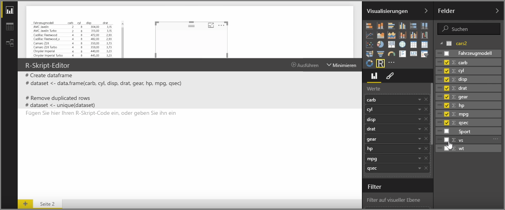
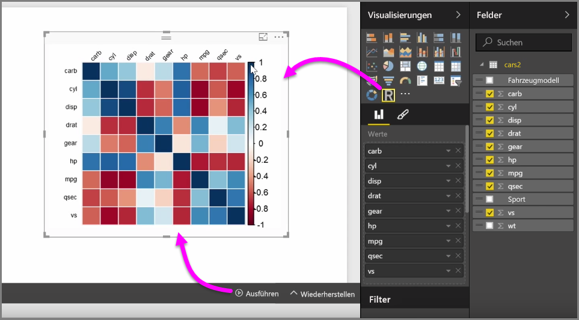
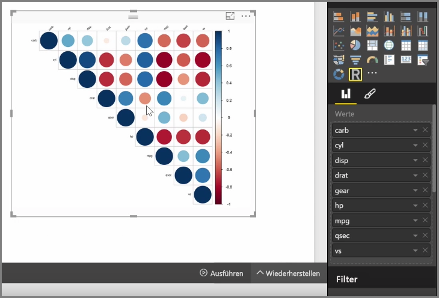

Durch die R-Integration können Sie mit Power BI Desktop analytische und statistische Analysen durchführen und beeindruckende visuelle Elemente erstellen. Sie können diese R-Visualisierungen im Bericht Power BI Desktop hosten.

Bei der Auswahl des Symbols für **visuelle R-Elemente** im Bereich **Visualisierungen** erstellt Power BI einen Platzhalter im Zeichenbereich, um das visuelle R-Element zu hosten. Anschließend wird ein R-Skript-Editor geöffnet, den Sie direkt im Zeichenbereich verwenden können. Während Sie dem visuellen R-Element Felder hinzufügen, werden diese von Power BI Desktop im Bereich des R-Skript-Editors hinzugefügt.

Unterhalb der von Power BI im R-Skript-Editor generierten Elemente können Sie damit beginnen, das R-Skript zu erstellen, um das visuelle Element zu generieren. Wenn Sie das Skript fertiggestellt haben, wählen Sie **Ausführen** aus. Nun geschieht Folgendes:

1. Die dem visuellen Element (über den Bereich **Felder**) hinzugefügten Daten werden von Power BI Desktop an die lokale Installation von R gesendet.
2. Das im R-Skript-Editor von Power BI Desktop erstellte Skript wird in dieser lokalen Installation von R ausgeführt.
3. Anschließend erhält Power BI Desktop ein visuelles Element von der R-Installation, das im Zeichenbereich angezeigt wird.

Diese Schritte werden sehr schnell ausgeführt, und das Ergebnis wird in der Visualisierung des **visuellen R-Elements** im Zeichenbereich angezeigt.

Sie können das visuelle R-Element ändern, indem Sie das R-Skript anpassen und dann erneut **Ausführen** auswählen. In der folgenden Abbildung wurde das visuelle Element so geändert, dass anstelle von Quadraten Kreise angezeigt werden.

Da sich das visuelle R-Element ebenso verhält wie jede andere Visualisierung in Power BI Desktop, können Sie mit ihm interagieren und Verbindungen mit anderen visuellen Elementen im Zeichenbereich erstellen. Bei der Interaktion mit anderen visuellen Objekten im Zeichenbereich (durch Filtern oder Hervorheben), reagiert das visuelle R-Element automatisch genauso wie alle anderen Power BI-Visualisierungen. Das R-Skript muss nicht angepasst werden.

Dies ist eine hervorragende Möglichkeit, die Leistungsfähigkeit von R in Power BI Desktop unmittelbar zu nutzen.

## Nächste Schritte
**Herzlichen Glückwunsch!** Sie haben diesen Abschnitt **Visualisierungen** im Kurs **Geführtes Lernen** für Power BI abgeschlossen. Sie verfügen jetzt über fundierte Kenntnisse zu vielen der in Power BI verfügbaren Visualisierungen und wissen außerdem, wie Sie sie verwenden, ändern und anpassen können. Das Erfreuliche ist: Da Visualisierungen in Power BI Desktop und im Power BI-Dienst nahezu identisch sind, können Sie das Gelernte auf beides anwenden.

Sie sind nun bereit, mehr über die Cloud und den Power BI-Dienst zu erfahren, mit dem Sie **Daten durchsuchen** können. Wie Sie wissen, sieht der Ablauf in etwa wie folgt aus:

* Abrufen von Daten in **Power BI Desktop** und Erstellen eines Berichts
* Veröffentlichen im Power BI-Dienst, in dem neue **Visualisierungen** und Dashboards erstellt werden
* **Freigeben** von Dashboards für andere Benutzer, insbesondere für mobile Benutzer
* Anzeigen und Verwenden von freigegebenen Dashboards und Berichten in **Power BI Mobile**-Apps

Ob Sie Berichte erstellen oder einfach anzeigen und mit ihnen interagieren – Sie wissen nun, wie diese interessanten visuellen Elemente erstellt und mit den Daten verbunden werden. Als Nächstes werden diese visuellen Elemente und Berichte in Aktion vorgestellt.

Wir sehen uns im nächsten Abschnitt!

