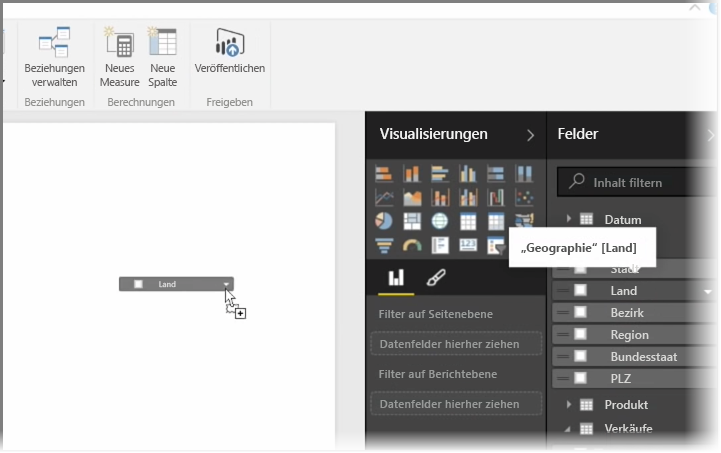
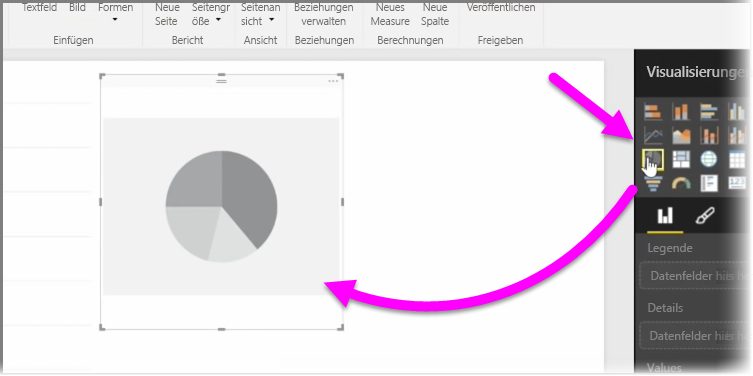
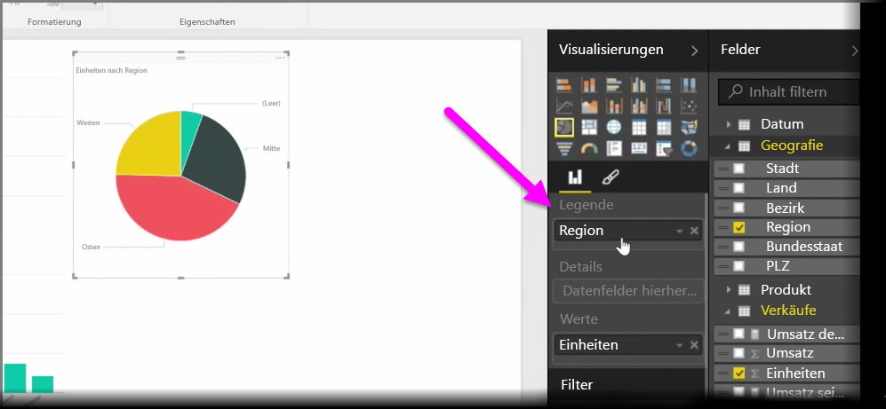
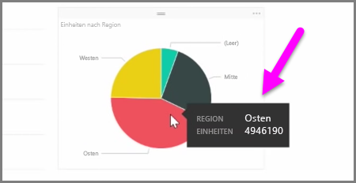
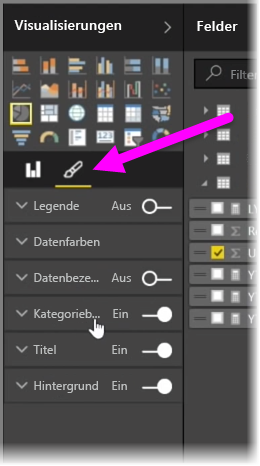

In diesem Artikel erfahren Sie, wie Sie neue Balkendiagramme, Kreisdiagramme und Treemaps erstellen und für Ihre Berichte anpassen können.

Es gibt zwei Möglichkeiten, eine neue Visualisierung in Power BI Desktop zu erstellen:

* Sie können Feldnamen aus dem Bereich **Felder** in den Berichtszeichenbereich ziehen. Standardmäßig wird die Visualisierung als Datentabelle angezeigt.
  
  
* Außerdem können Sie im Bereich **Visualisierungen** auf den zu erstellenden Visualisierungstyp klicken. Mit dieser Methode wird standardmäßig ein leerer Platzhalter angezeigt, der dem ausgewählten Typ des visuellen Elements ähnelt.
  
  

Nach dem Erstellen eines Graphen, einer Karte oder eines Diagramms können Sie Datenfelder in den unteren Teil des Bereichs **Visualisierung** ziehen, um das visuelle Element zu erstellen und zu strukturieren. Die jeweils verfügbaren Felder hängen dabei vom ausgewählten Visualisierungstyp ab. Beim Ziehen und Ablegen von Datenfeldern wird die Visualisierung automatisch mit den Änderungen aktualisiert.

Sie können die Größe der Visualisierung ändern, indem Sie sie markieren und dann die Ziehpunkte nach innen oder außen ziehen. Durch Klicken und Ziehen können Sie die Visualisierung auch an eine beliebige Stelle des Zeichenbereichs verschieben. Wenn Sie zwischen verschiedenen Visualisierungstypen wechseln möchten, wählen Sie das zu ändernde visuelle Element und dann über die Symbole im Bereich **Visualisierung** einfach ein anderes visuelles Element aus. In Power BI wird versucht, die ausgewählten Felder so ähnlich wie möglich in den neuen Typ des visuellen Elements umzuwandeln.

Wenn Sie auf bestimmte Segmente Ihrer Visualisierungen zeigen, wird eine QuickInfo angezeigt, die Details zum entsprechenden Segment enthält, z. B. Beschriftungen oder den Gesamtwert.

Wählen Sie das **Pinselsymbol** im Bereich **Visualisierungen** aus, um kosmetische Änderungen an dem visuellen Element vorzunehmen, z. B. Ausrichtung des Hintergrunds, Texttitel und Farben der Daten.

Die für kosmetische Änderungen an dem visuellen Element verfügbaren Optionen hängen dabei vom ausgewählten Visualisierungstyp ab.

