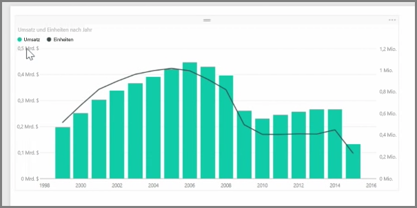
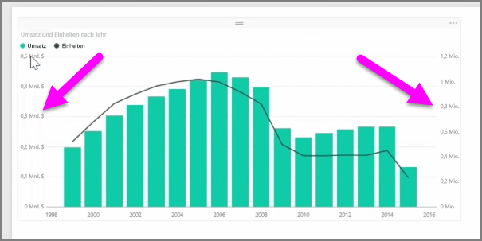
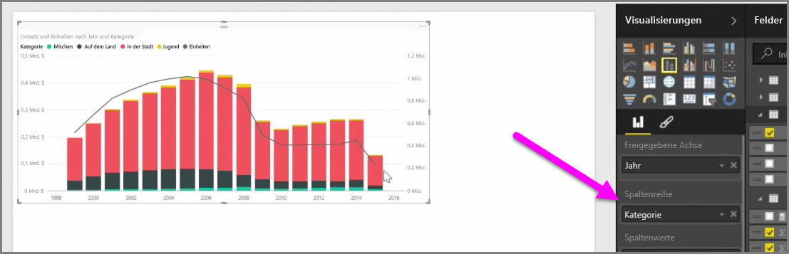

Wenn Sie zwei Measures mit stark abweichenden Skalen visualisieren möchten, z.B. Umsatz und Einheiten, ist ein **Verbunddiagramm** nützlich, in dem eine Zeile und eine Leiste mit unterschiedlichen Achsenskalierungen angezeigt werden. Power BI unterstützt standardmäßig viele Arten von Verbunddiagrammen, darunter die gängigen **Zeilendiagramme** und **Gestapelte Säulendiagramme**.

Beim Erstellen eines Verbunddiagramms werden ein Feld für **Gemeinsame Achse** (die X-Achse) sowie Werte für die zwei Felder angezeigt. In diesem Fall sind dies eine Spalte und eine Zeile. Die zwei Legenden der Y-Achse werden jeweils auf einer Seite der Visualisierung angezeigt.

Sie können auch jede Spalte nach Kategorie aufteilen, indem Sie im Bereich „Visualisierungen“ eine Kategorie in das Feld „Spaltenreihe“ ziehen. In diesem Fall wird jeder Balken proportional eingefärbt, basierend auf den Werten in den einzelnen Kategorien.

Verbunddiagramme sind eine effiziente Möglichkeit, mehrere Measures mit stark abweichenden Skalen in einer einzelnen Visualisierung darzustellen.

