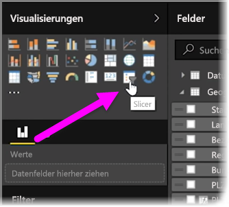
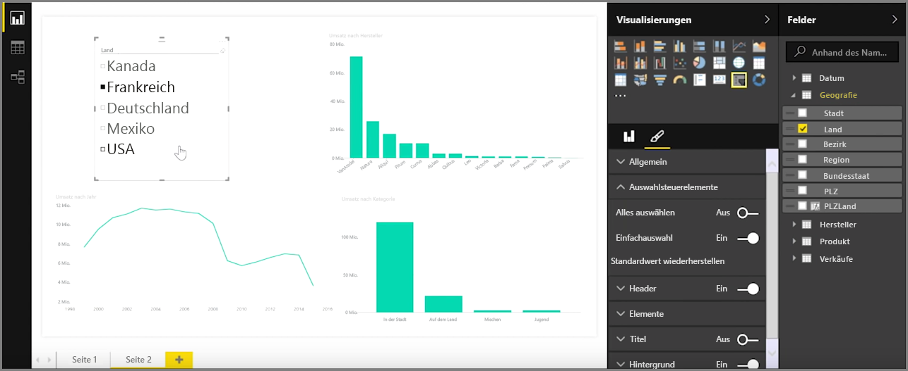
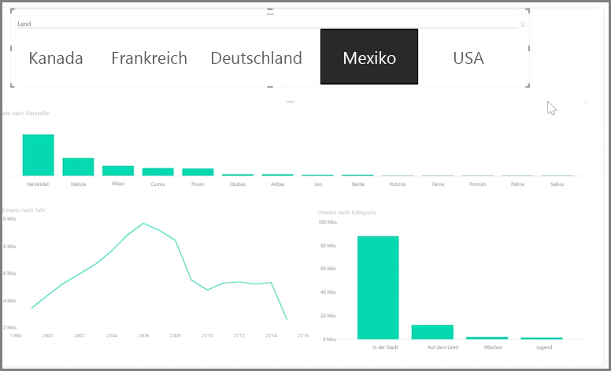

Datenschnitte sind eine der leistungsfähigsten Visualisierungsarten, insbesondere als Bestandteil eines umfassenden Berichts. Ein **Datenschnitt** ist in **Power BI Desktop** ein visueller Filter im Zeichenbereich, über den die Benutzer die Daten eines Berichts nach einem bestimmten Wert segmentieren können, z. B. nach Jahr oder nach dem geografischen Standort.

Um einem Bericht einen Datenschnitt hinzuzufügen, wählen Sie **Datenschnitt** im Bereich **Visualisierungen** aus.

Ziehen Sie das Feld für den Datenschnitt, und legen Sie es auf dem Datenschnittplatzhalter ab. Die Visualisierung wird nun als Liste von Elementen mit Kontrollkästchen dargestellt. Diese Elemente sind die Filter. Aktivieren Sie das Kontrollkästchen neben einem Segment, und alle anderen Visualisierungen auf derselben Seite des Berichts werden gemäß der Auswahl gefiltert bzw. *aufgeteilt*.

Für die Formatierung des Datenschnitts stehen einige Optionen zur Verfügung. Sie können festlegen, dass mehrere Eingaben gleichzeitig akzeptiert werden, oder in den Modus **Einfachauswahl** umschalten, um immer nur je eine Eingabe zu verwenden. Außerdem können Sie den Datenschnittelementen die Option **Alles auswählen** hinzufügen. Dies ist hilfreich, wenn die Liste besonders lang ist. Ändern Sie die standardmäßige vertikale Ausrichtung des Datenschnitts in horizontal, und statt der Checkliste wird eine Auswahlleiste angezeigt.

