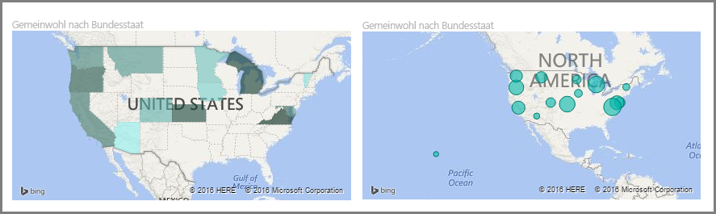
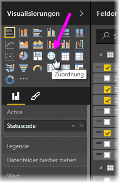
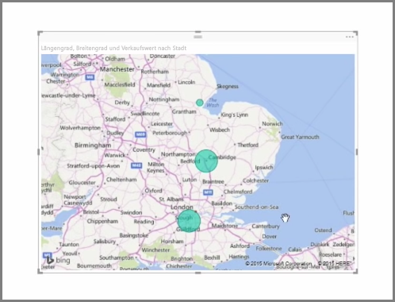
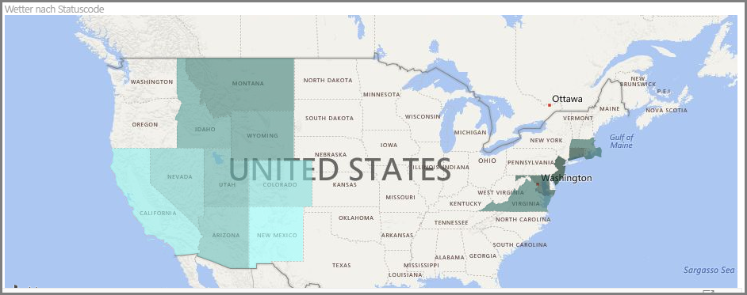
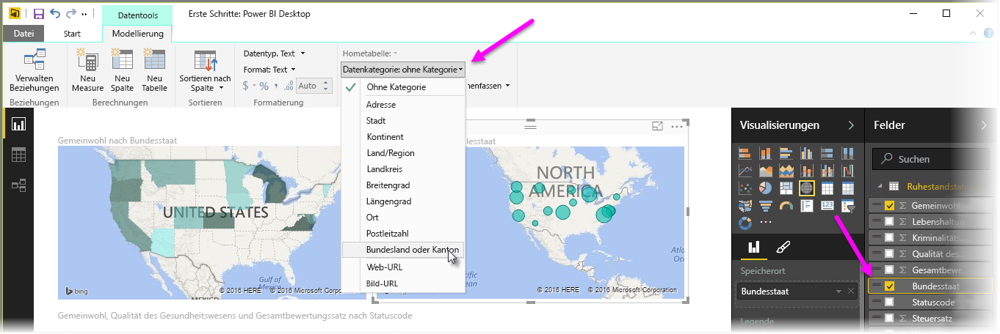

Power BI bietet zwei verschiedene Arten von Kartenvisualisierungen: eine Blasendiagrammkarte, bei der Blasen über geografischen Punkten platziert werden, und ein Flächenkartogramm, bei dem die Kontur der zu visualisierenden Regionen angezeigt wird.

> [!NOTE]
> Verwenden Sie bei der Arbeit mit Ländern oder Regionen das dreistellige Buchstabenkürzel, um sicherzustellen, dass die Geocodierung in Kartenvisualisierungen ordnungsgemäß funktioniert. Verwenden Sie *nicht* die zweistelligen Kürzel, da einige Länder oder Regionen sonst unter Umständen nicht ordnungsgemäß erkannt werden.
> Falls Sie nur über zweistellige Kürzel verfügen, informieren Sie sich in [diesem externen Blogbeitrag](https://blog.ailon.org/how-to-display-2-letter-country-data-on-a-power-bi-map-85fc738497d6#.yudauacxp) darüber, wie Sie Ihren zweistelligen Länder-/Regionskürzeln die dreistelligen Länder-/Regionskürzel zuordnen.
> 
> 

## Erstellen von Blasendiagrammkarten
Wählen Sie zum Erstellen einer Blasendiagrammkarte die Option **Karte** im Bereich **Visualisierung** aus. Um ein visuelles Kartenelement verwenden zu können, müssen Sie dem Bucket *Standort* in den Optionen unter **Visualisierungen** einen Wert hinzufügen.

Standortwerte können in Power BI flexibel eingegeben werden: angefangen bei allgemeineren Angaben, z. B. der Name des Orts oder der Flughafencode, bis hin zu sehr spezifischen Angaben zum Breiten- und Längengrad. Fügen Sie dem Bucket **Größe** ein Feld hinzu, um die Größe der Blase für jede Kartenposition entsprechend zu ändern.

## Erstellen von Flächenkartogrammen
Wählen Sie zum Erstellen eines Flächenkartogramms die Option **Flächenkartogramm** im Bereich „Visualisierung“ aus. Wie bei Blasendiagrammkarten müssen Sie für die Verwendung des visuellen Elements dem Bucket „Standort“ einen Wert hinzufügen. Durch Hinzufügen eines Werts zum Bucket „Größe“ können Sie die Intensität der Füllfarbe entsprechend ändern.

Ein Warnsymbol in der linken oberen Ecke eines visuellen Elements gibt an, dass für die Karte weitere Standortdaten erforderlich sind, um die Werte genau darstellen zu können. Dies ist besonders häufig der Fall, wenn die Daten für den Standort uneindeutig sind, z. B. wenn Sie einen Bereichsnamen wie *Washington* angeben, bei dem es sich um einen Bundesstaat oder einen District in den USA handeln kann. Eine Möglichkeit zum Umgehen dieses Problems besteht darin, dass Sie den Titel der Spalte spezifischer benennen, z. B. mit *Bundesstaat*. Eine andere Möglichkeit besteht darin, die Datenkategorie manuell zurückzusetzen. Wählen Sie dazu auf der Registerkarte „Modellierung“ die Option **Datenkategorie** aus. Über diese Option können Sie den Daten eine Kategorie zuweisen, z. B. „Bundesstaat“ oder „Ort“.

