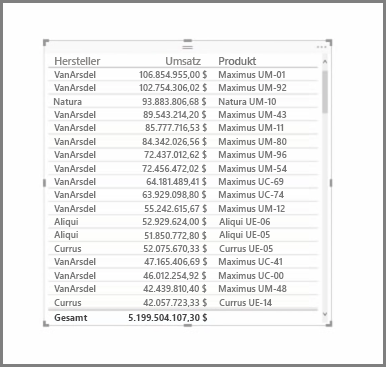
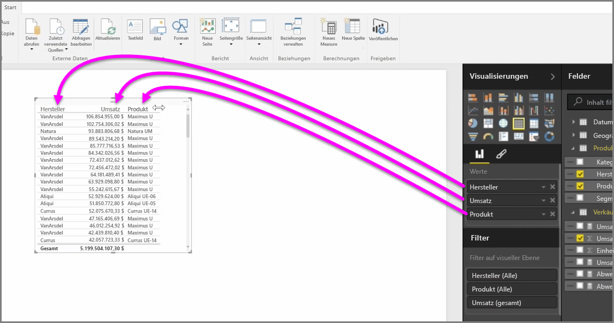
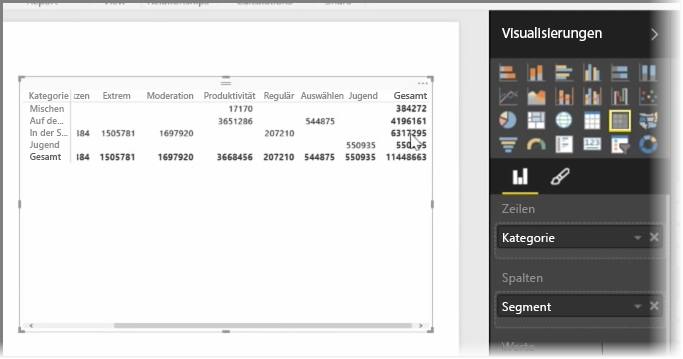

Zusätzlich zu einer Fülle von Diagrammen unterstützt Power BI Desktop auch weitere tabellarische Visualisierungen. Wenn Sie ein Kategorienfeld oder ein Textfeld auf die Berichtszeichenfläche ziehen, erhalten Sie standardmäßig eine Tabelle der Ergebnisse. Sie können einen Bildlauf nach oben und unten durch die Tabelle durchführen. Anfänglich ist die Tabelle alphabetisch sortiert.

Wenn eine Tabelle numerische Daten enthält, z.B. Umsätze, wird unten eine Gesamtsumme angezeigt. Sie können manuell nach jeder Spalte sortieren, indem Sie auf die jeweilige Spaltenüberschrift klicken, um zwischen aufsteigender und absteigender Reihenfolge zu wechseln. Wenn eine Spalte nicht breit genug ist, um sämtliche Inhalte anzuzeigen, klicken Sie auf die Überschrift, und ziehen Sie sie zur Seite, um die Spalte zu vergrößern.

Die Reihenfolge der Felder im Bucket *Werte* des Bereichs **Visualisierungen** bestimmt die Reihenfolge, in der sie in der Tabelle angezeigt werden.

Eine **Matrix** ist mit einer Tabelle vergleichbar, allerdings verfügt sie über andere Kategorienheader für die Spalten und Zeilen. Wie bei Tabellen werden numerische Informationen automatisch am unteren und rechten Rand der Matrix summiert.

Es stehen viele kosmetische Optionen für Matrizen zur Verfügung, z.B. die automatische Größenanpassung von Spalten, das Umschalten zwischen den Gesamtsummen für Zeilen und Spalten, das Festlegen von Farben usw. Stellen Sie beim Erstellen einer Matrix sicher, dass die Kategoriendaten (die nicht numerischen Daten) auf der linken Seite der Matrix und die numerischen Dateien auf der rechten Seite der Matrix angeordnet sind, damit die horizontale Bildlaufleiste angezeigt und der Bildlauf ordnungsgemäß ausgeführt wird.

