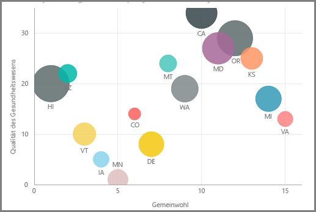
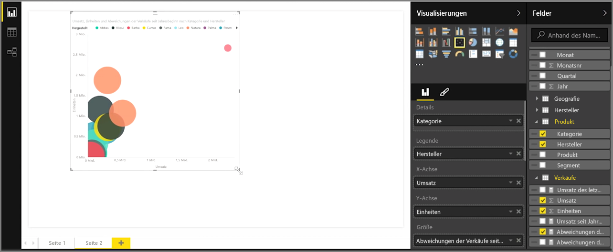
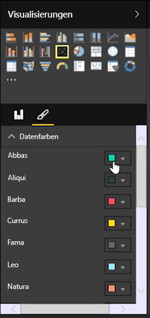
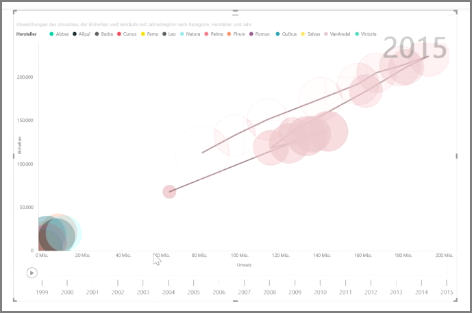

Wenn Sie zwei verschiedene Measures, z. B. Stückverkäufe und Umsatzerlös, vergleichen möchten, wird als Visualisierung häufig ein Punktdiagramm verwendet.

Wählen Sie zum Erstellen eines leeren Diagramms die Option **Punktdiagramm** im Bereich **Visualisierungen** aus. Ziehen Sie die beiden Felder, die Sie vergleichen möchten, vom Bereich **Felder** auf die Bucketoptionen *X-Achse* und *Y-Achse*. Nun wird in der Mitte des Punktdiagramms wahrscheinlich nur eine kleine Blase angezeigt. Sie müssen dem Bucket *Details* ein Measure hinzufügen, um anzugeben, wie die Daten segmentiert werden sollen. Wenn Sie beispielsweise die Stückverkäufe mit dem Umsatzerlös vergleichen, möchten Sie die Daten möglicherweise nach Kategorie, Hersteller oder Verkaufsmonat untergliedern.

Durch Hinzufügen eines weiteren Felds zum Bucket *Legende* werden die Blasen entsprechend dem Wert des Felds farbkodiert. Sie können zudem dem Bucket *Größe* ein Feld hinzufügen, um die Blasengröße entsprechend diesem Wert zu ändern.

Punktdiagramme verfügen außerdem über zahlreiche visuelle Formatierungsoptionen, z. B. Aktivieren einer Kontur für die einzelnen farbigen Blasen und Umschalten einzelner Beschriftungen. Sie können auch die Datenfarben für andere Diagrammtypen ändern.

Sie können eine Animation der Änderungen des Blasendiagramms im Verlauf der Zeit erstellen, indem Sie dem Bucket *Wiedergabeachse* einen zeitbasierten Wert hinzufügen. Wenn Sie während der Animation auf eine Blase klicken, wird der entsprechende Ablauf angezeigt.

>[!NOTE]
>Wenn in einem Punktdiagramm nur eine Blase angezeigt wird, liegt das daran, dass die Daten in Power BI standardmäßig aggregiert werden. Fügen Sie dem Bucket *Details* im Bereich **Visualisierungen** eine Kategorie hinzu, damit weitere Blasen angezeigt werden.
> 
> 

