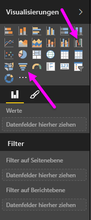
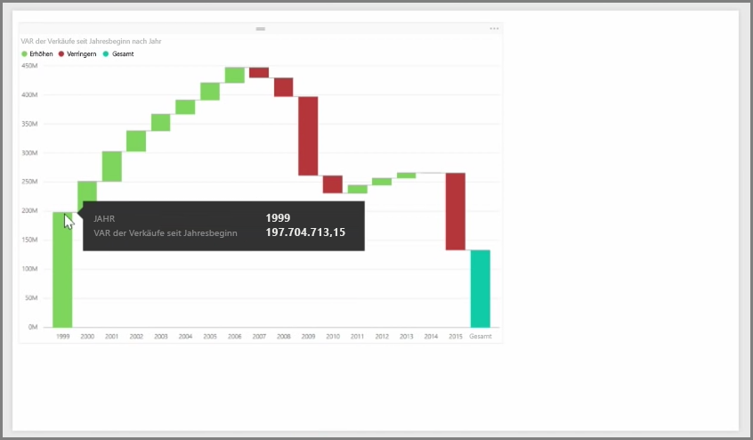
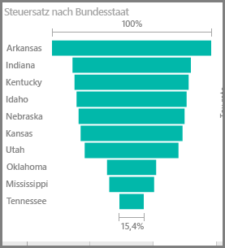

Wasserfall- und Trichterdiagramme sind zwei der interessanteren (und vielleicht ungewöhnlicheren) Standardvisualisierungen, die in Power BI enthalten sind. Um ein leeres Diagramm von einem dieser Typen zu erstellen, wählen Sie im Bereich **Visualisierungen** das entsprechende Symbol aus.

**Wasserfalldiagramme** werden normalerweise verwendet, um Änderungen eines bestimmten Werts im Laufe der Zeit anzuzeigen.

Wasserfälle verfügen nur über zwei Bucket-Optionen: *Kategorie* und *Y-Achse*. Ziehen Sie ein zeitbasiertes Feld wie *Jahr* in den Bucket *Kategorie*, und den Wert, den Sie nachverfolgen möchten, in den Bucket *Y-Achse*. Zeiträume mit einem Anstieg des Werts werden standardmäßig grün angezeigt, während Zeitspannen mit einer Abnahme des Werts rot angezeigt werden.

**Trichterdiagramme** werden in der Regel verwendet, um Änderungen bei einem bestimmten Prozess zu veranschaulichen, z.B. bei einer Vertriebspipeline oder bei Maßnahmen zur Kundenbindung auf einer Website.

Sowohl **Wasserfalldiagramme** als auch **Trichterdiagramme** können aufgeteilt und visuell angepasst werden.

