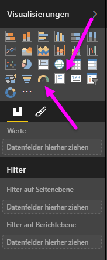
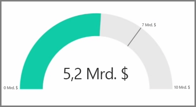
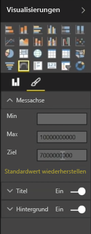
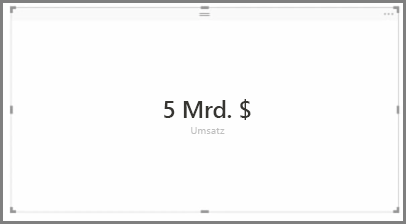
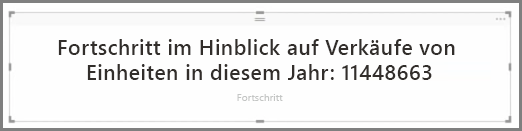

Im Allgemeinen werden Visualisierungen zum Vergleichen von mindestens zwei unterschiedlichen Werten verwendet. Mitunter soll beim Erstellen von Berichten jedoch nur ein einzelner Key Performance Indicator (KPI) oder eine einzelne Metrik nachverfolgt werden. In Power BI Desktop besteht eine Möglichkeit hierfür in der Verwendung eines **Maßstabs** oder einer visuellen Karte mit **einzelner Zahl**. Um ein leeres Diagramm von einem dieser Typen zu erstellen, wählen Sie im Bereich **Visualisierungen** das entsprechende Symbol aus.

Maßstäbe sind besonders nützlich, wenn Sie Dashboards erstellen und den Fortschritt im Hinblick auf ein bestimmtes Ziel anzeigen möchten. Um einen Maßstab zu erstellen, wählen Sie im Bereich **Visualisierungen** das entsprechende Symbol aus, und ziehen Sie das zu verfolgende Feld in den Bucket *Wert*.

Maßstäbe werden standardmäßig bei 50 % oder mit dem doppelten *Wert* angezeigt. Es gibt zwei Möglichkeiten zum Anpassen dieser Einstellung. Um die Werte dynamisch festzulegen, ziehen Sie die Felder in die Buckets *Minimum*, *Maximum* und *Ziel*. Sie können auch die visuellen Formatierungsoptionen verwenden, um den Wertebereich für den Maßstab manuell anzupassen.

Kartenvisualisierungen zeigen ganz einfach eine numerische Darstellung eines Felds. Standardmäßig werden in Kartenvisualisierungen Anzeigeeinheiten verwendet, um die Zahlen kurz zu halten, z.B. wird „$5bn“ anstelle von „$5.000.000.000“ angezeigt. Verwenden Sie die visuellen Formatierungsoptionen, um die verwendete Einheit zu ändern oder vollständig zu deaktivieren.

Eine interessante Anwendungsmöglichkeit für Karten besteht darin, ein benutzerdefiniertes Measure anzuzeigen, das Sie mit Text verkettet haben. Um das oben genannte Beispiel zu verwenden, könnte die Karte mit einem benutzerdefinierten Measure erweiterte DAX-Funktionen enthalten und etwa Folgendes anzeigen: „Gesamtumsatz dieses Jahr: $5bn“ oder „Status verkaufter Einheiten in diesem Jahr:“. Dann kann die Zahl hinzufügt werden, die den Status darstellt.

