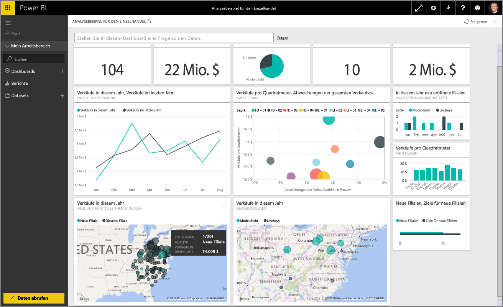

Willkommen im Abschnitt **Durchsuchen von Daten** im Kurs **Geführtes Lernen** für Power BI. Nachdem Sie nun Power BI Desktop kennen und wissen, wie Sie Daten abrufen und visualisieren, sind Sie bereit, um Daten im Power BI-Dienst zu durchsuchen.

In diesem Abschnitt werden Sie viel Neues erfahren. Die überzeugende Interaktivität und die Funktionen zum Teilen von Power BI kommen hier besonders gut zur Geltung. Sie erwartet ein ansprechender und interessanter Abschnitt.

## Einführung in den Power BI-Dienst
*Erfahren Sie, welche Vorteile der Power BI-Dienst für Ihre Organisation haben kann.*

Der Power BI-Dienst ist die natürliche Erweiterung von **Power BI Desktop**, und beinhaltet Funktionen wie das Hochladen von Berichten und das Erstellen von Dashboards. Außerdem können Sie Ihren Daten mithilfe natürlicher Sprache Fragen stellen. Sie können den Dienst verwenden, um Aktualisierungszeiten für Daten festzulegen, Daten in Ihrer Organisation freizugeben und benutzerdefinierte Service Packs zu erstellen.

In den folgenden Themen erkunden wir den Power BI-Dienst und zeigen Ihnen, wie sie aus Ihren Business Intelligence-Daten Einblicke gewinnen und eine teamorientierte, entschlussfreudige Umgebung schaffen.

