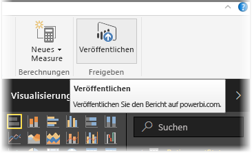
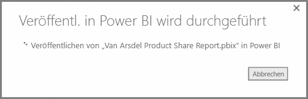
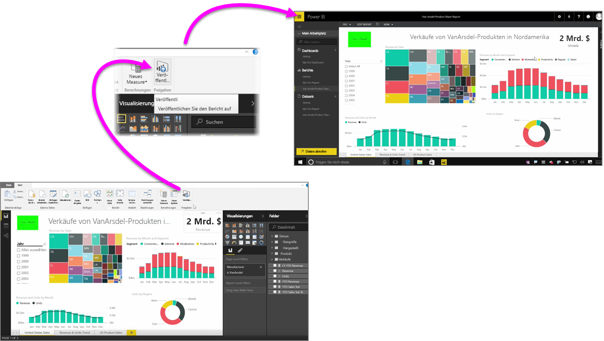

Das Veröffentlichen von Berichten im Power BI-Dienst geht schnell und einfach.

Nachdem Sie Ihren Bericht in **Power BI Desktop** fertiggestellt haben, wählen Sie einfach die Schaltfläche **Veröffentlichen** auf der Registerkarte **Start** in Power BI Desktop, um den Prozess zu starten.

Der Bericht und die Daten, einschließlich der Visualisierungen, Abfragen und benutzerdefinierten Measures, werden zusammengefasst und im Power BI-Dienst hochgeladen.

> [!NOTE]
> Power BI Desktop-Berichte werden üblicherweise als **PBIX**-Dateien bezeichnet. Diese Erweiterung wird in Windows vergeben.
> 

Wenn der Upload abgeschlossen ist, weist ein Dialogfeld darauf hin, dass die Veröffentlichung erfolgreich war. Dieses Dialogfeld enthält außerdem einen Link, über den Sie direkt zu dem Bericht im Power BI-Dienst in einem Webbrowser gelangen.

Und das ist schon alles – die Veröffentlichung von Berichten aus Power BI Desktop im Power BI-Dienst ist ganz einfach.

