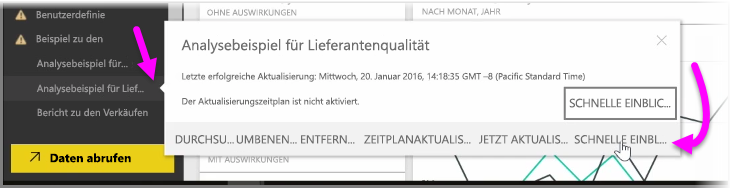
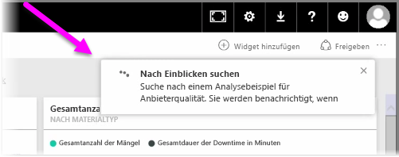
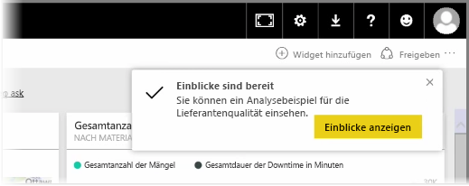
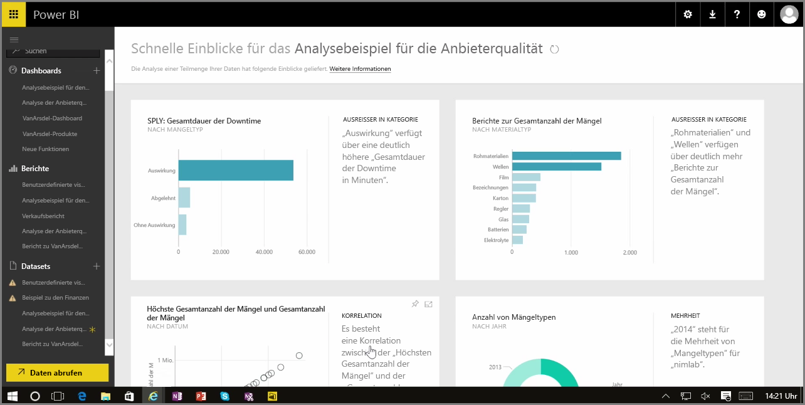

Wenn Sie mit einem Dashboard, Bericht oder Dataset im Power BI-Dienst arbeiten, können Sie sich mithilfe von Power BI schnelle Einblicke in die Daten verschaffen. Wählen Sie in Power BI im Abschnitt **Datasets** im linken Bereich die *Auslassungspunkte* (drei Punkte) neben dem gewünschten Dataset aus. Ein Menü mit verschiedenen Optionen wird angezeigt, ganz rechts befindet sich die Option **Schnelleinblicke**.

Wenn Sie „Schnelleinblicke“ auswählen, werden in Power BI einige Vorgänge des maschinellen Lernens durchgeführt und die Daten durchsucht. Diese werden analysiert, um nach Schnelleinblicken zu suchen. Oben rechts im Dienst wird in einer Benachrichtigung angezeigt, dass Power BI nach Einblicken sucht.

Nach ca. 15 Sekunden ändert sich die Benachrichtigung und gibt nun an, dass Power BI einige Einblicke gefunden hat.

Wenn Sie auf die Schaltfläche **Einblicke anzeigen** in der Benachrichtigung klicken, wird eine Seite mit visuellen Elementen mit den in Power BI gefundenen Einblicken angezeigt, die der folgenden Abbildung ähnelt. Es gibt eine Reihe von Einblicken, durch die Sie auf der Seite nach unten scrollen können, um sie anzuzeigen und zu prüfen.

Wie mit allen anderen visuellen Elementen auch können Sie mit den visuellen Elementen auf der Seite „Schnelleinblicke“ interagieren und sie zudem an ein Dashboard anheften oder eines oder mehrere (bzw. beliebig viele) visuelle Elemente weiter filtern, um nach weiteren Einblicken zu suchen, die möglicherweise noch zutage gefördert werden können.

Über **Schnelleinblicke** können Sie es Power BI überlassen, Ausreißer und Trends in den Daten aufzuspüren. Die Ergebnisse können Sie dann in Ihren Dashboards verwenden oder weiter einschränken oder filtern, um die Einblicke anzuzeigen, die für Sie am wichtigsten sind.

