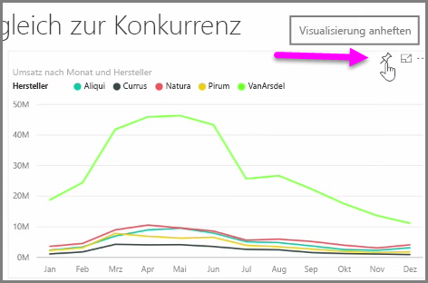
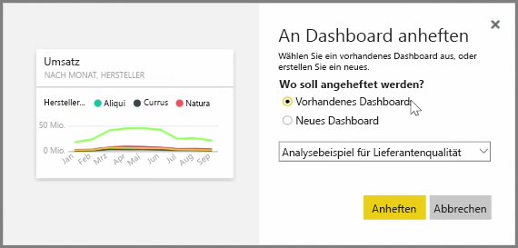
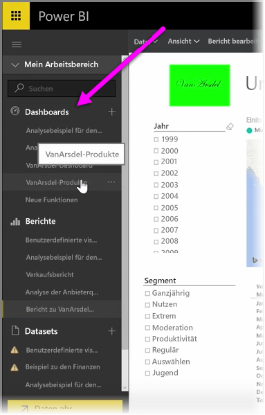
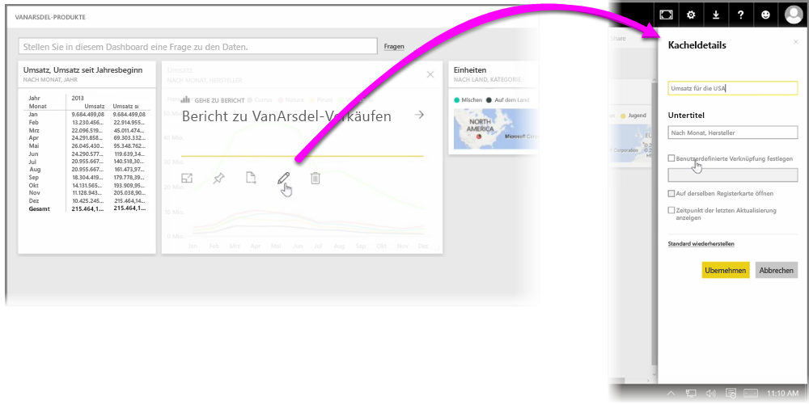

**Dashboards** in Power BI sind einseitige Sammlungen mit Visualisierungen, die über den Power BI-Dienst erstellt werden. Dashboards erstellen Sie durch **Anheften** von Visualisierungen aus Berichten, die Sie mithilfe von Power BI Desktop erstellt und veröffentlicht haben, oder von Visualisierungen, die Sie im Power BI-Dienst erstellt haben. Das **Anheften** von visuellen Elementen an ein Dashboard gestaltet sich in etwa wie das Anheften eines Bilds an eine Korkwand: Ein visuelles Element wird an einer bestimmten Position angebracht und ist für andere Benutzer sichtbar. Um ein visuelles Element anzuheften, öffnen Sie den zugehörigen Bericht im Power BI-Dienst. Zeigen Sie auf das visuelle Element, das Sie anheften möchten, und wählen Sie das **Anheftsymbol** aus.

Ein Dialogfeld wird angezeigt, in dem Sie im entsprechenden Dropdownmenü ein Zieldashboard für das visuelle Element auswählen oder auch ein neues Dashboard erstellen können. Sie können sich außerdem das im Dashboard angeheftete visuelle Element in einer Vorschau ansehen. Sie können Visualisierungen aus mehreren Berichten und Seiten an ein und dasselbe Dashboard anheften. So können Sie verschiedene Datasets und Quellen kombinieren und die entsprechenden Einblicke auf einer Seite anzeigen.

Unter **Dashboards** können Sie alle Arten von Visualisierungen, darunter Diagramme, Karten, Bilder und Formen, durch Anheften hinzufügen. Nachdem ein visuelles Element an ein Dashboard angeheftet wurde, wird es als **Kachel** bezeichnet.

Ihre Dashboards, auch alle neuen Dashboards, werden im Abschnitt „Dashboards“ auf der linken Seite des Power BI-Diensts angezeigt. Wählen Sie ein Dashboard in der Liste aus, um es anzuzeigen.

Sie können das Layout der visuellen Elemente in einem Dashboard ganz nach Belieben ändern. Zum Ändern der Größe einer Kachel ziehen Sie die Ziehpunkte nach innen bzw. außen. Um eine Kachel zu verschieben, klicken Sie einfach auf die Kachel, und ziehen Sie sie an eine andere Stelle im Dashboard. Zeigen Sie auf eine Kachel, und klicken Sie auf das **Stiftsymbol**, um den Bereich **Kacheldetails** zu öffnen, in dem Sie den **Titel** oder **Untertitel** ändern können.

Klicken Sie auf eine Dashboardkachel, um den Bericht anzuzeigen, aus dem sie stammt. So können Sie problemlos und schnell die zugrunde liegenden Daten unterhalb eines visuellen Elements anzeigen. Diese Verknüpfung können Sie auch ändern, indem Sie das Feld **Benutzerdefinierte Verknüpfung festlegen** in **Kacheldetails** verwenden.

Sie können Kacheln aus einem Dashboard an ein anderes Dashboard anheften, z. B. wenn Sie über eine Sammlung von Dashboards verfügen und eine Zusammenfassungspinnwand erstellen möchten. Dazu gehen Sie nach dem bekannten Muster vor: Zeigen Sie auf die Kachel, und wählen Sie das **Anheftsymbol** aus. Dashboards können wirklich sehr einfach erstellt und geändert werden. Darüber hinaus können Sie sie anpassen, um auf Ihrem einseitigen Dashboard genau die gewünschten Elemente anzuzeigen.

