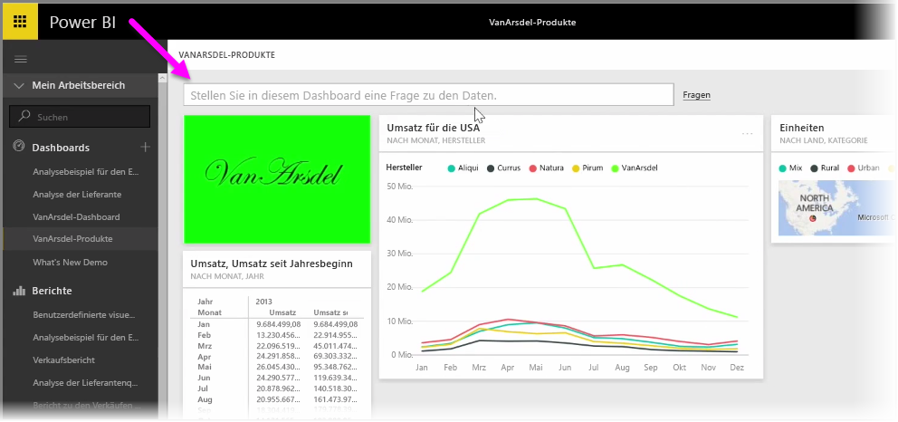
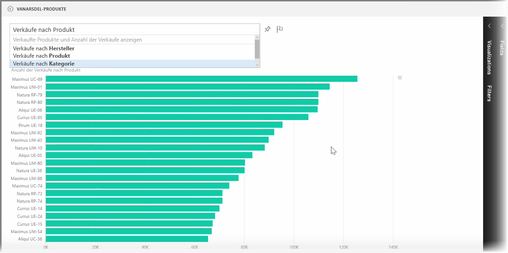
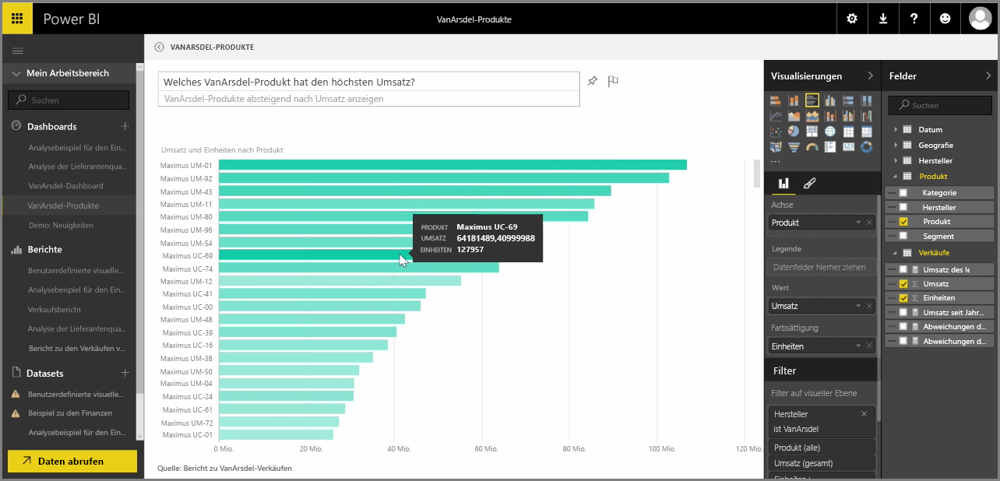

Power BI beinhaltet ein leistungsfähiges Spracherkennungsmodul, das es Ihnen ermöglicht, mithilfe von Sätzen und Fragen aus der gesprochenen Sprache Fragen an Ihre Daten zu stellen. Sie können also mit Power BI nicht nur Berichte und Visualisierungen, sondern auch Diagramme und Grafiken erstellen, indem Sie einfache Fragen stellen.

Um eine Frage zu stellen, öffnen Sie ein Dashboard in Power BI. Am oberen Rand des Bildschirms sehen Sie ein Eingabefeld, in dem Sie Fragen zu den angezeigten Daten stellen können. Dieses Feature wird manchmal als *Fragen und Antworten* oder zumeist als **F&A** bezeichnet.

Wenn Sie in das Feld klicken, zeigt Power BI auf Basis der Daten einige vorgeschlagene Begriffe an, z.B. „Jahresumsatz“. Sie können auf einen vorgeschlagenen Begriff klicken, um das Ergebnis anzuzeigen, das häufig als einfache Tabelle oder Karte dargestellt wird. Wenn Sie einen der Vorschläge auswählen, erstellt Power BI basierend auf Ihrer Auswahl automatisch und in Echtzeit ein visuelles Element.

Sie können Ihre Fragen auch unter Verwendung natürlicher Sprache stellen, zum Beispiel: „Wie hoch war unser Umsatz im letzten Jahr?“ Oder: „Welches Produkt hatte den höchsten Umsatz im März 2014?“ Power BI zeigt die Interpretation Ihrer Frage an und wählt den am besten geeigneten visuellen Elementtyp aus, um die Antwort darzustellen. Ebenso wie jedes andere visuelle Element in Power BI können Sie dieses Element im Dashboard Ihrer Wahl **anheften**, indem Sie das Symbol zum **Anheften** auswählen.

Sie können das visuelle Element jederzeit bearbeiten, das auf Basis der natürlichen Sprache oder des Satzes erstellt wurde. Verwenden Sie hierfür einfach die Bereiche **Visualisierungen** und **Felder** auf der rechten Seite des Bildschirms. Wie bei allen anderen visuellen Elementen in Power BI können Sie das Layout ändern, Filter anpassen und die Feldeingaben ändern.

Sobald Sie mit dem visuellen Element zufrieden sind und die Visualisierung in einem Dashboard speichern möchten, klicken Sie einfach auf das Symbol zum **Anheften** neben dem Eingabefeld für die Fragen.

