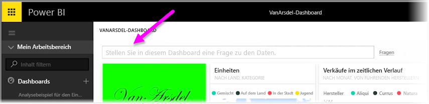
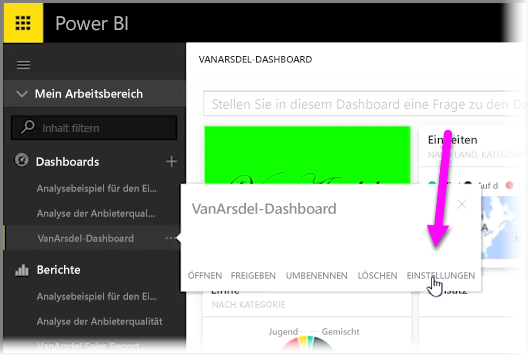

Mit Power BI können Sie eigene Fragenvorschläge für andere Benutzer hinzufügen, die das Abfragefeld für natürliche Sprache im Dashboard verwenden – oft als **F&A**-Feld bezeichnet. Die Benutzer werden drei Fragenvorschläge sehen, wenn sie auf das Eingabefeld am oberen Rand eines Dashboards klicken.

Um eigene Fragen hinzuzufügen, wählen Sie die drei Auslassungspunkte neben dem Namen des Dashboards aus, das Sie verwenden möchten. Wählen Sie anschließend im Menü die Option **Einstellungen** aus.

 Daraufhin wird die Seite **Einstellungen** für das Dashboard und die zugrunde liegenden Datasets oder Arbeitsmappen geöffnet. Sie können das F&A-Sucheingabefeld vollständig im Abschnitt **Dashboards** der Seite **Einstellungen** deaktivieren. Da hier aber Fragen hinzugefügt werden sollen, wählen Sie den Abschnitt **Datasets** aus.

Im Abschnitt **Datasets** werden alle mit dem Dashboard verknüpften Datasets angezeigt. Wählen Sie in der Liste das Dataset aus, das mit Ihrem Dashboard verknüpft ist. Wählen Sie anschließend **Ausgewählte Q&A-Fragen** und dann die Verknüpfung **Frage hinzufügen** aus. Geben Sie Ihre Frage oder Aufforderung im Eingabefeld ein, und wählen Sie **Anwenden** aus.

Wenn nun ein Benutzer auf das Sucheingabefeld des ausgewählten Dashboards klickt, werden Ihre vorgeschlagenen Einträge am Anfang der Vorschlagsliste aufgeführt. Wählt der Benutzer eine der Fragen aus, gelangt er direkt zu der Antwort. Dies ist eine sinnvolle Möglichkeit, um die Benutzer der Dashboards dazu zu motivieren, über die verfügbaren Datentypen nachzudenken und wie sie sie am besten nutzen können.

