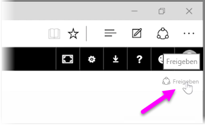
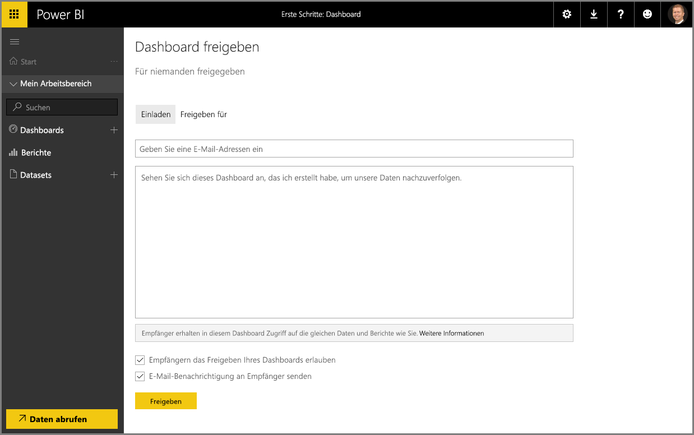

Wir haben bereits gesehen, wie Sie mit Power BI Daten suchen, in einem Datenmodell erfassen und Berichte und Visualisierungen auf Basis dieser Daten erstellen können. Darüber hinaus wurde gezeigt, wie Sie diese Berichte im Power BI-Dienst veröffentlichen und Dashboards erstellen können, mit denen Sie Ihre Informationen im Laufe der Zeit überwachen können. Alle diese Funktionen sind noch nützlicher, wenn Sie Ihre Erkenntnisse für andere Personen in Ihrer Organisation freigeben. Das Freigeben von Dashboards ist glücklicherweise ganz einfach.

Um ein Dashboard freizugeben, öffnen Sie es im Power BI-Dienst, und wählen Sie in der oberen rechten Ecke den Link **Freigeben** aus.

Die Seite **Dashboard freigeben** wird geöffnet, auf der Sie den Abschnitt **Einladen** auswählen können. Tragen Sie in das Eingabefeld **E-Mail-Adresse** die E-Mail-Adressen der Benutzer ein, denen Sie Zugang zu Ihrem Dashboard gewähren möchten. Power BI vergleicht die E-Mail-Adressen während der Eingabe mit Konten in Ihrer Domäne und in der Office 365-Domäne und vervollständigt sie nach Möglichkeit automatisch. Sie können die E-Mail-Adressen auch kopieren und in diesem Feld einfügen oder eine Verteilerliste, eine Sicherheitsgruppe oder eine Office 365-Gruppe verwenden, um mehrere Personen gleichzeitig zu erreichen.

Wenn Sie (am unten Rand) das Kontrollkästchen *E-Mail-Benachrichtigung an Empfänger senden* aktiviert haben, erhalten die Empfänger eine E-Mail mit der Mitteilung, dass Sie ein Dashboard für sie freigegeben haben. Auch der Link zum Dashboard ist in der E-Mail-Nachricht enthalten. Sie können Sie dieser E-Mail einen Kommentar hinzufügen oder den Text senden, den Power BI erstellt hat (diesen finden Sie direkt unter dem Feld, in dem Sie die E-Mail-Adressen eingegeben haben).

>[!NOTE]
>Empfänger ohne Power BI-Konto werden durch den Anmeldevorgang geführt, bevor sie Ihr Dashboard anzeigen können.
> 
> 

Jeder Benutzer, für den Sie ein Dashboard freigegeben haben, kann dieses genauso wie Sie anzeigen und damit interagieren. Der Zugriff auf die zugrunde liegenden Berichte ist für diese Benutzer jedoch *schreibgeschützt*, und sie verfügen über *keinen Zugriff* auf die zugrunde liegenden Datasets.

Auf der Seite „Dashboard freigeben“ können Sie auch die Registerkarte **Freigegeben für** auswählen, um anzuzeigen, für welche Benutzer Sie ein Dashboard bereits freigegeben haben.

