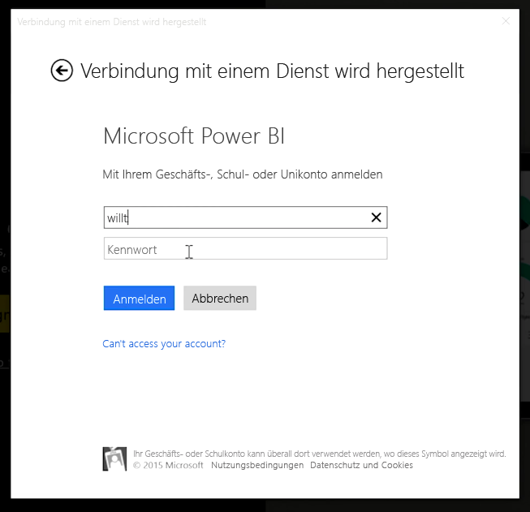
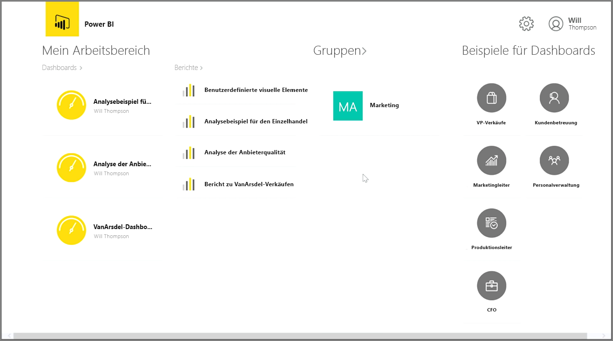
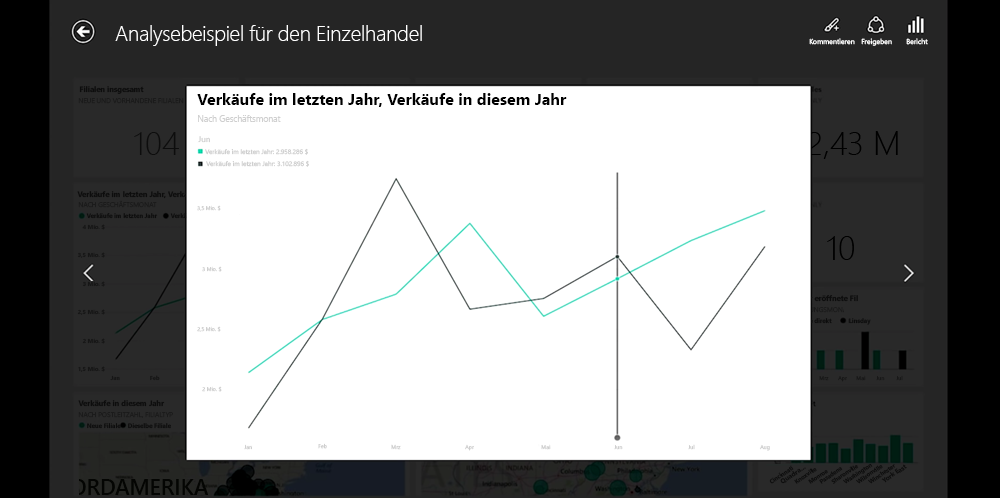
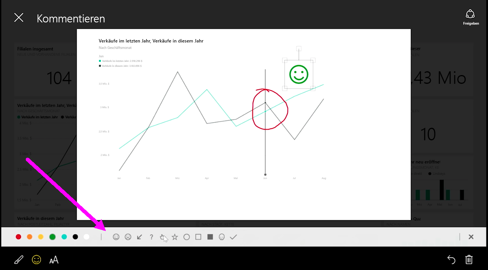

Wenn Sie Ihre Daten auch unterwegs im Blick behalten möchten, können Sie eine der mobilen Power BI-Anwendungen für iOS, Android und Windows-Geräte verwenden.

Um die Power BI-App zu verwenden, melden Sie sich zunächst mit Ihren Kontoinformationen des Power BI-Diensts bei Ihrem Konto an. Auf einem mobilen Windows-Gerät (in diesem Fall ein Tablet) sieht die Anmeldung wie folgt aus.

Im ersten Bildschirm werden alle Inhalte angezeigt, auf die Sie zugreifen können, darunter Berichte, Dashboards und Gruppen. Es stehen auch einige Beispieldashboards bereit, die Sie zur Inspiration nutzen können oder um sich über die Power BI-Funktionen zu informieren. Die App ist für die Toucheingabe optimiert: Tippen Sie auf ein Dashboard oder auf einen Bericht, um in den Vollbildmodus zu wechseln, und blättern Sie mit dem Finger.

Sie können jedes Dashboard öffnen, indem Sie darauf tippen. In einem Dashboard können Sie auf eine Dashboardkachel tippen, um eine größere Ansicht zu öffnen.

Sie können auch Einblicke mit einer Anmerkung versehen, indem Sie in der oberen rechten Ecke auf **Anmerken** tippen. Dadurch können Sie in einer fokussierten Kachel zeichnen, um gewünschte Bereiche hervorzuheben. Die Anmerkungstools finden Sie am unteren Bildschirmrand.

Geben Sie die kommentierte Kachel frei, indem Sie in der oberen rechten Ecke auf die Verknüpfung **Freigeben** tippen.

Tippen Sie auf die Verknüpfung **Bericht** in der oberen rechten Ecke, um den zugrunde liegenden Bericht für eine Kachel anzuzeigen. Hiermit zeigen Sie dieselben Visualisierungen an, die in einem Webbrowser oder in Power BI Desktop angezeigt werden. Sie haben außerdem die Möglichkeit zur Interaktion mit dem Bericht, indem Sie auf Balken tippen, Drilldowns ausführen oder Datenschnitte verwenden.

