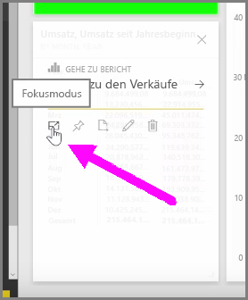
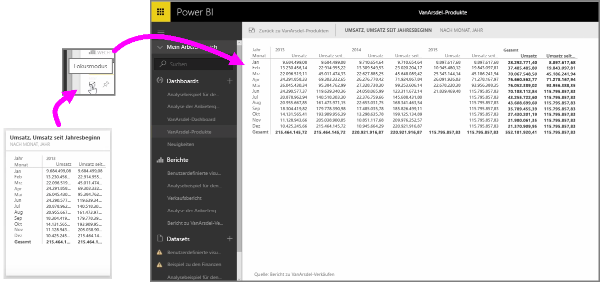

Wenn Sie sich Power BI-Dashboards oder -Berichte im Dienst ansehen, kann es manchmal hilfreich sein, den Fokus auf ein einzelnes Diagramm oder eine einzelne Visualisierung zu legen. Dafür haben Sie zwei Möglichkeiten.

In einem Dashboard zeigen Sie auf eine Kachel, um einige andere Symboloptionen in der oberen rechten Ecke anzuzeigen. Bei Auswahl der drei Auslassungspunkte sehen Sie eine Sammlung von Symbolen, die Aktionen darstellen, die Sie für die Kachel durchführen können.

Das Symbol ganz links hat die Bezeichnung **Fokusmodus**. Wählen Sie dieses Symbol aus, um die Kachel so zu erweitern, dass sie den vollständigen Raum des Dashboards einnimmt.

Im **Fokusmodus** können Sie deutlich mehr Details der visuellen Elemente und Legenden sehen. Wenn Sie zum Beispiel die Größe einer Kachel in Power BI ändern, werden möglicherweise einige Spalten nicht angezeigt, da der verfügbare Platz in der Kachel nicht ausreicht.

Im **Fokusmodus** sehen Sie alle Daten. Sie können das visuelle Element auch direkt aus dem Fokusmodus heraus in einem anderen Dashboard anheften, indem Sie das Symbol zum **Anheften** auswählen. Wenn Sie den **Fokusmodus** beenden möchten, wählen Sie das Symbol **Zurück zu...** in der oberen linken Ecke des **Fokusmodus** aus.

Der Prozess ähnelt der Anzeige eines Berichts. Zeigen Sie auf ein visuelles Element, um die drei Symbole in der oberen rechten Ecke anzuzeigen, und wählen Sie das Symbol **Fokusmodus** aus. Durch Auswahl dieser Option wird die Visualisierung so erweitert, dass sie den gesamten Berichtszeichenbereich einnimmt. Das visuelle Element ist in diesem Modus weiterhin interaktiv, obwohl vorübergehend alle Kreuzfiltereffekte zwischen Visualisierungen unterbrochen werden.

Zeigen Sie auf eine erweiterte Kachel oder einen erweiterten Bericht, und wählen Sie das Symbol **Zurück zu...** in der oberen linken Ecke aus, um zur vorherigen Ansicht zurückzukehren.

