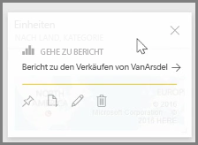
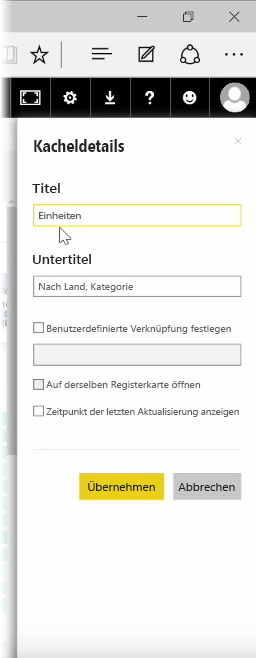
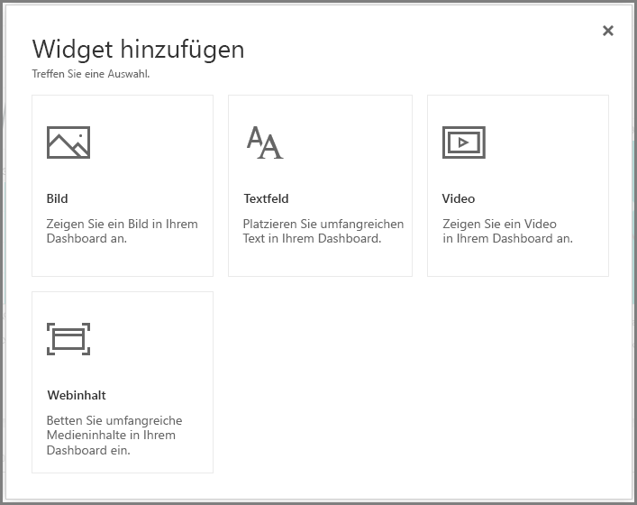
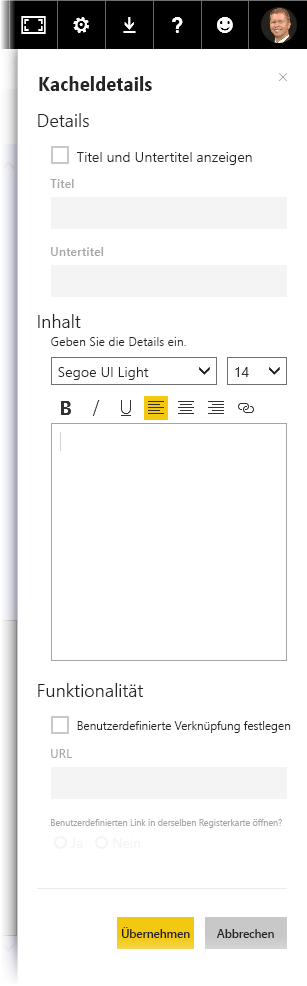

Nachdem Sie ein Dashboard erstellt haben, können Sie die **Kacheln* im Power BI-Dienst bearbeiten, um einige Formatierungsänderungen vorzunehmen.

Um eine Kachel zu ändern, zeigen Sie auf die Kachel. Wählen Sie dann die drei Auslassungspunkte aus, um eine Sammlung von Symbolen anzuzeigen, über die Sie die Kachel ändern können.

Wählen Sie das **Stiftsymbol** aus, um den Bereich **Kacheldetails** zu öffnen. Hier können Sie den **Titel** und den **Untertitel** der Kachel ändern und den Zeitpunkt der letzten Aktualisierung und das Datum einschließen sowie andere Details ändern. Zum Beispiel können Sie einen benutzerdefinierten Link erstellen.

In der Standardeinstellung gelangen Sie durch das Klicken auf eine Dashboardkachel zu dem Bericht, aus dem sie stammt. Um dieses Verhalten zu ändern, verwenden Sie das Feld **Benutzerdefinierte Verknüpfung festlegen** im Bereich **Kacheldetails**. Dieses Feature wird häufig dazu verwendet, Benutzer zur Startseite der Organisation zu leiten, wenn sie auf ein Logobild klicken.

## Hinzufügen von Widgets zum Dashboard
Sie können Ihrem Dashboard auch Widgets hinzufügen. Ein **Widget** ist eine spezielle Dashboard-Kachel, die keine Visualisierung, sondern andere Elemente enthält, z.B. ein Bild, ein Onlinevideo, ein Textfeld oder umfangreiche Webinhalte.

Wenn Sie die Verknüpfung „Widget hinzufügen“ in der oberen rechten Ecke eines Dashboards auswählen, wird das Dialogfeld **Widget hinzufügen** angezeigt.

Wenn Sie beispielsweise ein Textfeld hinzufügen, wird auf der rechten Seite ein Bereich **Kacheldetails** angezeigt, in dem Sie einige Details bearbeiten können, ähnlich wie bei der Bearbeitung der Details aller anderen Kacheln. Bei Widgets gibt es jedoch auch einen Abschnitt zum Definieren oder Ändern der Widgetinhalte, z.B. einen Rich-Text-Editor für ein Textfeld.

Mithilfe von Widgets und der Möglichkeit, Kacheldetails zu bearbeiten, können Sie Ihr Dashboard individuell an Ihre Wünsche anpassen.

