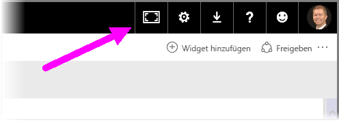
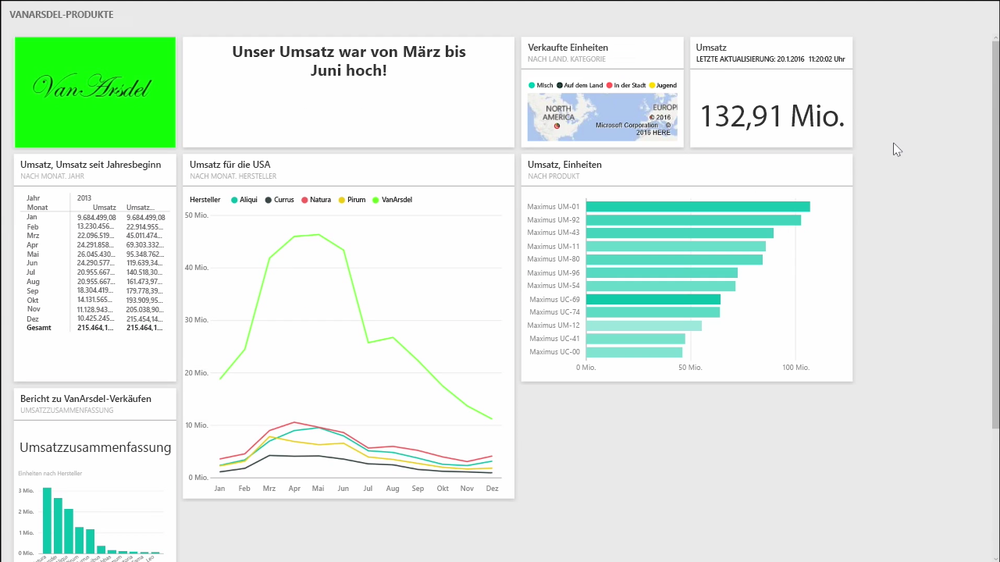
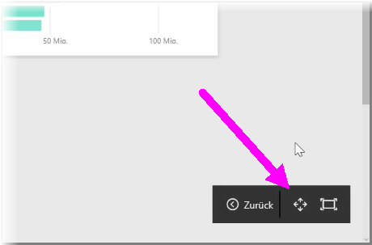
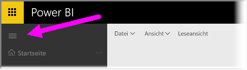

Beim Erstellen von Dashboards stellen Sie manchmal vielleicht fest, dass nicht alle Inhalte im Zeichenbereich Platz finden. Es gibt einige Lösungen, mit denen Sie die Anzeige des Dashboards verwalten können, um eine vollständige Ansicht aller Dashboardinhalte zu erhalten.

Die einfachste Methode zum Anzeigen des gesamten Dashboards auf einem Bildschirm besteht darin, in der oberen rechten Ecke des Dashboards die Schaltfläche **Vollbildmodus** auszuwählen.

Wenn Sie die Schaltfläche **Vollbildmodus** auswählen, wird der Browser in den Vollbildmodus versetzt. Alle Chromelemente werden aus dem Dashboard entfernt, und somit wird der sichtbare Bereich vergrößert.

Innerhalb des **Vollbildmodus** können Sie die Option **An Bildschirmgröße anpassen** auswählen, um alle Kacheln so zu verkleinern, dass sie auf einen einzelnen Bildschirm passen, ohne dass Bildlaufleisten angezeigt werden müssen. Dies wird in der Regel als *TV-Modus*, bezeichnet und eignet sich für Präsentationen mit Dashboards oder zum Anzeigen eines Dashboards auf Kiosksystemen.

Eine weitere Möglichkeit zur Verwaltung des Dashboardplatzes besteht darin, den Navigationsbereich auf der linken Seite zu reduzieren, indem Sie das Hamburger-Symbol auswählen. Klicken Sie erneut auf das Symbol, um den Navigationsbereich zu erweitern.

Sie können festlegen, dass die Navigationsleiste eines Dashboards immer reduziert ist, indem Sie Folgendes am Ende der URL anfügen:

> ?collapseNavigation=true
> 
> 

Benutzer, die diesem Link folgen, öffnen das Dashboard mit einer reduzierten Navigationsleiste.

