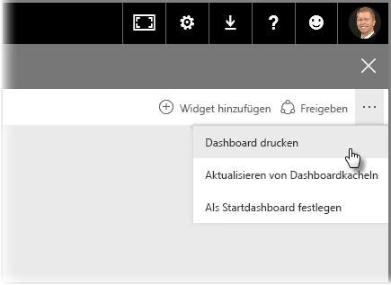
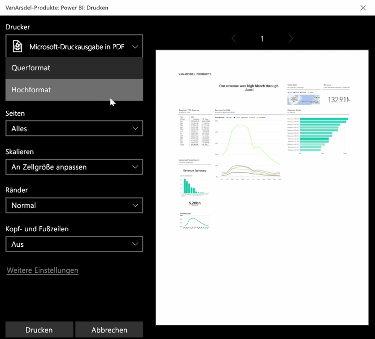
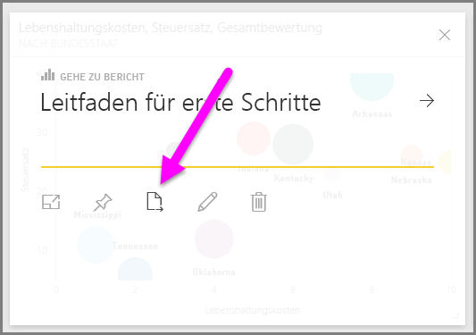
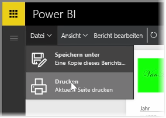

Manchmal möchten Sie vielleicht einen gedruckten Bericht oder ein gedrucktes Dashboard zu einer Besprechung mitbringen, um sie mit anderen zu teilen. Mit Power BI haben Sie verschiedene Möglichkeiten, Ihre Visuals auszudrucken.

Wählen Sie im Power BI-Dienst die drei Auslassungspunkte oben rechts aus, und wählen Sie dann **Dashboard drucken**.

Das Dialogfeld **Drucken** wird angezeigt, in dem Sie den Drucker auswählen können, an den Sie das Dashboard senden möchten. Außerdem können Sie Standarddruckoptionen auswählen, z.B. die Ausrichtung *Hochformat* oder *Querformat*.

## Exportieren von Daten aus einer Visualisierung
Sie können auch die Daten aus jeder Visualisierung im Power BI-Dienst exportieren. Wählen Sie einfach die Auslassungspunkte eines visuellen Elements aus, und wählen Sie dann die Schaltfläche **Daten exportieren** (die mittlere Schaltfläche) aus. Anschließend wird eine CSV-Datei erstellt und auf dem lokalen Computer heruntergeladen. Im Browser wird (wie bei allen im Browser initiierten Downloads) in einer Meldung angezeigt, dass der Download abgeschlossen ist.

Das Drucken oder Exportieren ist auch direkt aus einem Bericht heraus möglich. Wählen Sie beim Anzeigen eines Berichts im Power BI-Dienst **Datei > Drucken**, um das Dialogfeld zum Drucken zu öffnen.

Wie bei einem Dashboard können Sie auch in einem Bericht Daten aus einem visuellen Element exportieren, indem Sie die Schaltfläche zum Exportieren für das visuelle Element auswählen.

