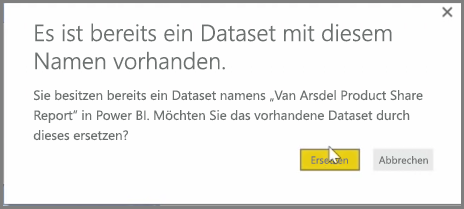
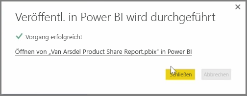

Sie können Berichte und Datasets, die Sie bereits über Power BI Desktop veröffentlicht haben, im Power BI-Dienst aktualisieren. Wählen Sie hierzu **Veröffentlichen** auf der Registerkarte **Start** des Menübands.

Beim Veröffentlichen eines Berichts, der bereits im Power BI-Dienst vorhanden ist, müssen Sie bestätigen, dass Sie das vorherige Dataset und die Berichte durch die bearbeitete Version ersetzen möchten, die Sie soeben zur Aktualisierung ausgewählt haben.

Wenn Sie die Option **Ersetzen**, auswählen, werden die Datasets und Berichte im Power BI-Dienst mit den Datasets und Berichten der neuesten Power BI Desktop-Version der Datei überschrieben.

Wie bei allen anderen Ereignissen zum **Veröffentlichen** in Power BI Desktop auch, wird in einem Dialogfeld angezeigt, dass die Veröffentlichung erfolgreich war, und Sie erhalten einen Link zum Bericht im Power BI-Dienst.

Dies ist eine Möglichkeit, um Ihre Daten manuell zu aktualisieren. Datasets und Berichte können auch automatisch aktualisiert werden. Dieses Verfahren wird in einem anderen Thema behandelt.

