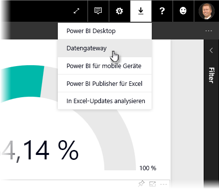
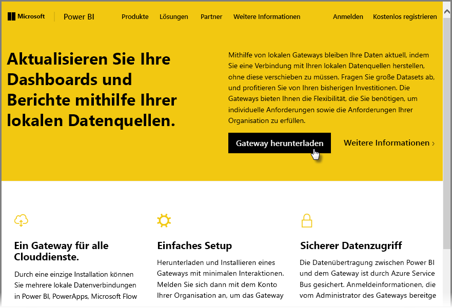
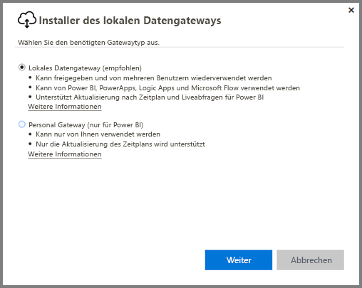
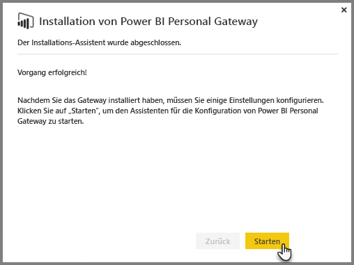
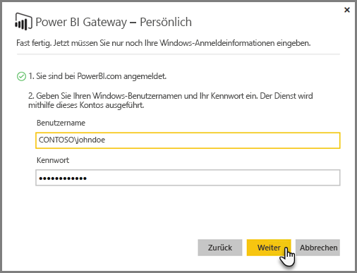
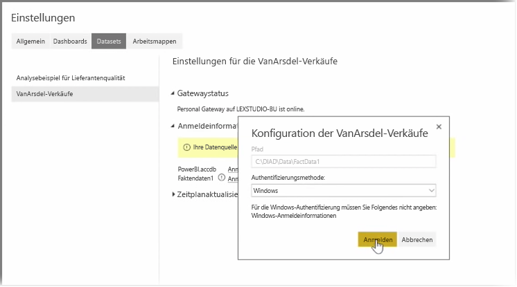
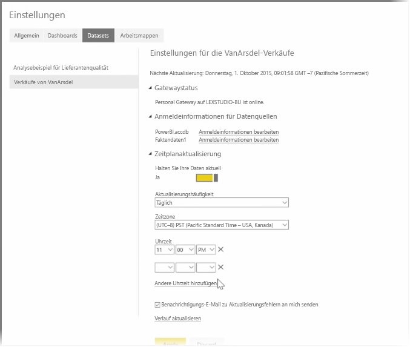

In vorherigen Themen wurde erläutert, wie Sie mithilfe von Power BI Datenquellen verbinden können und wie Sie Ihre Datasets im Power BI-Dienst manuell aktualisieren. Da Sie aber vermutlich nicht bei jeder Änderung der Daten eine manuelle Aktualisierung durchführen möchten, können Sie Power BI verwenden, um eine geplante Aktualisierung einzurichten. Diese wird mit den Datenquellen verbunden, die dann automatisch im Power BI-Dienst veröffentlicht werden. Dies gibt Ihnen außerdem die Möglichkeit, den Dienst mit lokalen Datenquellen zu verbinden, einschließlich Excel-Dateien, Access-Datenbanken, SQL-Datenbanken und mehr.

Das System, das es Ihnen ermöglicht, lokale Datenquellen mit dem Power BI-Dienst zu verbinden, wird als **Datengateway** bezeichnet. Dabei handelt es sich um eine kleine Anwendung, die auf Ihrem Computer ausgeführt wird und die einen vordefinierten Zeitplan verwendet, um eine Verbindung mit Ihren Daten herzustellen und um Updates abzurufen und an den Power BI-Dienst zu übertragen. **Personal Gateway** ist eine Version von **Datengateway**, die ohne Administratorkonfiguration verwendet werden kann.

>[!NOTE]
>Der Computer mit Power BI Personal Gateway *muss* mit dem Internet verbunden sein, damit **Personal Gateway** ordnungsgemäß funktioniert.
> 

Melden Sie sich zum Einrichten von **Personal Gateway** zunächst beim Power BI-Dienst an. Wählen Sie das Symbol **Herunterladen** in der oberen rechten Ecke des Bildschirms und dann im Menü die Option **Datengateways** aus.

Von dort aus gelangen Sie zu einer Webseite, auf der Sie **Power BI Gateway - Personal** auswählen können, wie unten dargestellt.

Führen Sie die Anwendung aus, sobald der Download abgeschlossen ist, und folgen Sie dem Installations-Assistenten.

Sie werden dann aufgefordert, den Assistenten zum Einrichten des Gateways zu starten.

Sie werden aufgefordert, sich zunächst bei Ihrem Power BI-Dienstkonto und danach beim Windows-Konto des Computers anzumelden, da der Gatewaydienst unter Ihrem Konto ausgeführt wird.

Kehren Sie zum Power BI-Dienst zurück. Wählen Sie das Menü mit den drei Auslassungspunkten neben dem Dataset aus, das aktualisiert werden soll, und wählen Sie dann **Zeitplanaktualisierung** aus. Daraufhin wird die Seite **Aktualisierungseinstellungen** geöffnet. Power BI erkennt, dass Sie **Personal Gateway** installiert haben, und zeigt den entsprechenden Status an.

Wählen Sie neben jeder gewünschten Datenquelle **Anmeldeinformationen bearbeiten** aus, und richten Sie die Authentifizierung ein.

Legen Sie schließlich die Optionen unter **Zeitplanaktualisierung** fest, um automatische Updates zu aktivieren und festzulegen, wann und wie häufig diese durchgeführt werden sollen.

Und das ist auch schon alles. Zum festgelegten Zeitpunkt ruft Power BI diese Datenquellen unter Verwendung der angegebenen Anmeldeinformationen und der Verbindung mit dem Computer mit **Personal Gateway** ab und aktualisiert die Berichte und Datasets gemäß dem Zeitplan. Wenn Sie Power BI das nächste Mal öffnen, spiegeln diese Dashboards, Berichte und Datasets die Daten der letzten geplanten Aktualisierung wider.

## Nächste Schritte
**Herzlichen Glückwunsch!** Sie haben diesen Abschnitt **Durchsuchen von Daten** im Kurs **Geführtes Lernen** für Power BI abgeschlossen. Der Power BI-Dienst bietet viele interessante Möglichkeiten, um Daten zu durchsuchen, Erkenntnisse zu teilen und mit visuellen Elementen zu interagieren. Den Zugang zu allen diesen Funktionen erhalten Sie über einen Browser und über einen Dienst, zu dem Sie unabhängig von Ihrem Standort eine Verbindung herstellen können.

Ein leistungsstarker und bekannter Partner von Power BI ist **Excel**. Power BI und Excel sind hervorragend aufeinander abgestimmt. Ihre Arbeitsmappen können Sie nahtlos und ganz einfach in Power BI integrieren.

Wie einfach? Das erfahren Sie im nächsten Abschnitt, **Power BI und Excel**.

Wir sehen uns im nächsten Abschnitt!

