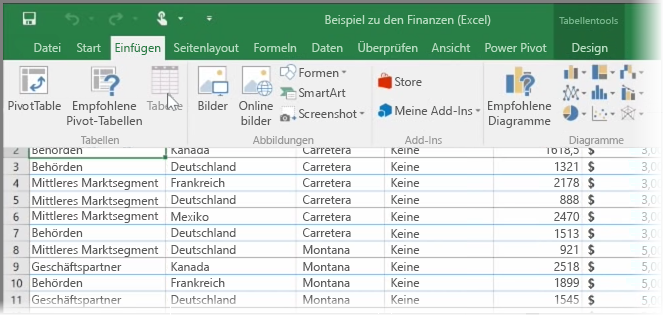
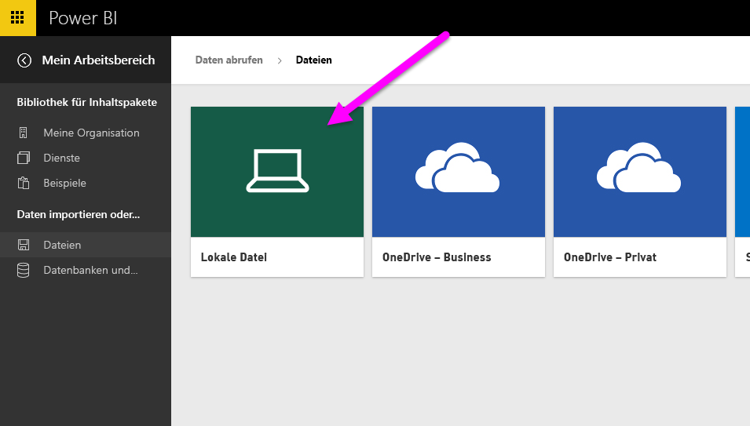
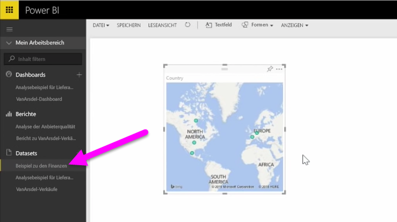

In diesem Thema wird zunächst beschrieben, wie Sie eine Excel-Arbeitsmappendatei mit einer einfachen **Tabelle** von einem lokalen Laufwerk in Power BI importieren. Dann erfahren Sie, wie Sie die Daten dieser Tabelle in Power BI durchsuchen können, indem Sie einen Bericht erstellen.

## Achten Sie darauf, die Daten als Tabelle zu formatieren.
Damit Power BI die Daten aus der Arbeitsmappe importieren kann, müssen diese Daten **als Tabelle formatiert** sein. Das ist ganz einfach. In Excel können Sie einen Bereich von Zellen markieren. Klicken Sie dann auf der Registerkarte **Einfügen** des Excel-Menübands auf **Tabelle**.

Sie sollten sicherstellen, dass jede Spalte einen aussagekräftigen Namen aufweist. Das erleichtert es Ihnen, die gewünschten Daten zu finden, wenn Sie Ihre Berichte in Power BI erstellen.

## Importieren von einem lokalen Laufwerk
Wo immer Ihre Dateien gespeichert sind, mit Power BI können Sie sie problemlos importieren. In Power BI können Sie **Daten abrufen** > **Dateien** > **Lokale Datei** verwenden, um die gewünschte Excel-Datei zu suchen und auszuwählen.

Nach dem Import in Power BI können Sie mit dem Erstellen von Berichten beginnen.

Die Dateien müssen sich natürlich nicht auf einem lokalen Laufwerk befinden. Wenn Sie die Dateien auf OneDrive oder einer SharePoint-Teamwebsite speichern, ist das noch besser. In einem der folgenden Themen wird darauf näher eingegangen.

## Erstellen von Berichten
Nachdem die Daten der Arbeitsmappe importiert wurden, wird in Power BI ein Dataset erstellt. Dieses befindet sich unter **Datasets**. Jetzt können Sie damit beginnen, die Daten zu untersuchen, indem Sie Berichte und Dashboards erstellen. Klicken Sie einfach auf das Symbol **Menü öffnen** neben dem Dataset und dann auf **Durchsuchen**. Ein neuer, leerer Berichtszeichenbereich wird geöffnet. Auf der rechten Seite unter **Felder** sehen Sie die Tabellen und Spalten. Wählen Sie einfach die Felder aus, für die Sie eine neue Visualisierung im Zeichenbereich erstellen möchten.

Sie können den Typ der Visualisierung ändern und **Filter** sowie weitere Eigenschaften unter **Visualisierungen** anwenden.

