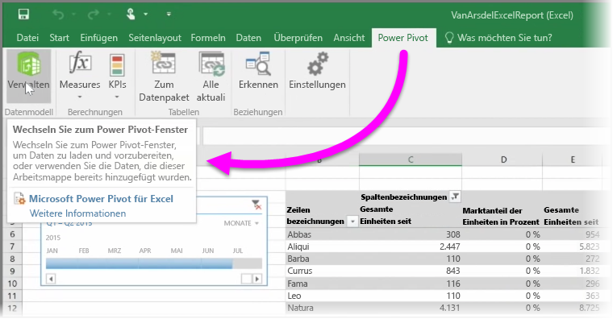

Wenn Sie die erweiterten BI-Funktionen in Excel verwenden, z.B. **Power Query** (**Abrufen und transformieren** in Excel 2016) zum Abfragen und Laden von Daten, **Power Pivot** zum Erstellen leistungsstarker Datenmodelle und **Power View** zum Erstellen dynamischer Berichte, können Sie diese auch in Power BI importieren.

Wenn Sie mit **Power Pivot** komplexe Datenmodelle erstellen, z.B. mit mehreren verknüpften Tabellen, Measures, berechneten Spalten und Hierarchien, importiert Power BI dies alles ebenfalls.

Wenn die Arbeitsmappe **Power View-Blätter** enthält, ist das kein Problem. Power BI erstellt diese erneut als neue **Berichte** in Power BI. Sie können sofort Visualisierungen an Dashboards anheften.

Und hier ist noch eine großartige Funktion von Power BI: Wenn Sie Power Query oder Power Pivot verwenden, um eine Verbindung mit Daten in einer externen Datenquelle herzustellen, sie abzufragen und zu laden, können Sie eine **geplante Aktualisierung** einrichten, sobald Sie Ihre Arbeitsmappe in Power BI importiert haben. Bei der geplanten Aktualisierung verwendet Power BI die Verbindungsinformationen aus der Arbeitsmappe, um direkt eine Verbindung mit der Datenquelle herzustellen und alle geänderten Daten abzufragen und zu laden. Alle Visualisierungen in Berichten werden automatisch ebenfalls aktualisiert.

