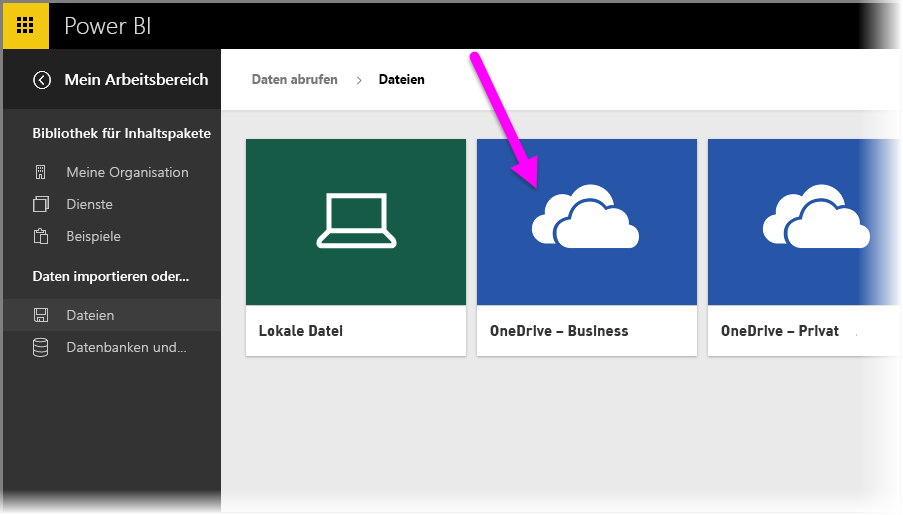
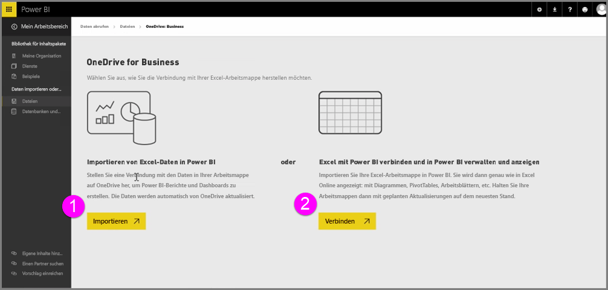
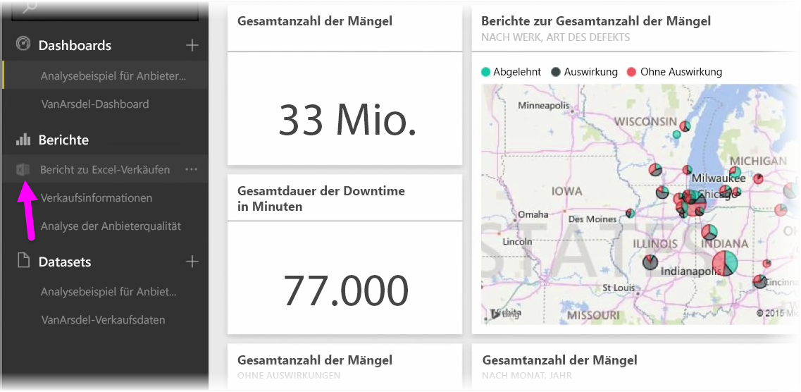
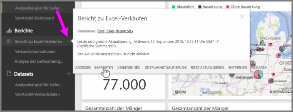

Wenn Sie Ihre Excel-Arbeitsmappen auf OneDrive speichern, erhalten Sie eine nahtlose Integration von Power BI und Excel.

Da sich OneDrive, genau wie Power BI, in der Cloud befindet, wird eine Live-Verbindung zwischen Power BI und OneDrive hergestellt. Wenn Sie eine Arbeitsmappe auf OneDrive ändern, werden diese Änderungen *automatisch mit Power BI synchronisiert*. Die Visualisierungen in Berichten und Dashboards werden auf dem aktuellen Stand gehalten. Wenn die Arbeitsmappe eine Verbindung mit externen Datenquellen wie einer Datenbank oder einem OData-Feed herstellt, können Sie mit den Funktionen für die **Zeitplanaktualisierung** in Power BI nach Updates suchen. Möchten Sie Fragen zu Daten in der Arbeitsmappe stellen? Kein Problem. Hierfür sind die **Funktionen für Fragen und Antworten** in Power BI genau richtig.

Es gibt zwei Möglichkeiten, um eine Verbindung mit Excel-Dateien auf OneDrive for Business herzustellen:

1. Importieren von Excel-Daten in Power BI
2. Excel mit Power BI verbinden und in Power BI verwalten und anzeigen

### Importieren von Excel-Daten in Power BI
Wenn Sie Excel-Daten in Power BI importieren möchten, werden Tabellendaten aus der Arbeitsmappe in ein neues Dataset in Power BI geladen. Wenn die Arbeitsmappe **Power View**-Blätter enthält, werden diese importiert, und neue Berichte werden automatisch auch in Power BI erstellt.

Power BI erhält die Verbindung mit der Arbeitsmappendatei auf OneDrive for Business aufrecht. Wenn Sie Änderungen an der Arbeitsmappe vornehmen, werden diese Änderungen beim Speichern *automatisch mit Power BI synchronisiert**, normalerweise innerhalb einer Stunde. Wenn die Arbeitsmappe mit externen Datenquellen verbunden ist, können Sie eine geplante Aktualisierung einrichten, damit das Dataset in Power BI auf dem neuesten Stand gehalten wird. Da Visualisierungen in Berichten und Dashboards in Power BI die Daten aus dem Dataset verwenden, sind Ihre Abfragen beim Untersuchen der Daten extrem schnell.

### Verknüpfen, Verwalten und Anzeigen von Excel in Power BI
Wenn Sie eine Verbindung mit der Excel-Arbeitsmappe herstellen, können Sie nahtlos mit der Arbeitsmappe in Excel und Power BI arbeiten. Bei dieser Art der Verbindung wird neben dem Arbeitsmappenbericht ein kleines Excel-Symbol angezeigt.

Im Bericht sehen Sie Ihre Excel-Arbeitsmappe in Power BI, so wie sie in **Excel Online** angezeigt würde. Sie können die Arbeitsblätter in Excel Online untersuchen und bearbeiten, indem Sie im Menü mit den Auslassungspunkten „Bearbeiten“ auswählen. Wenn Sie Änderungen vornehmen, werden alle Visualisierungen, die Sie an Dashboards angeheftet haben, automatisch aktualisiert.

In Power BI wird kein Dataset erstellt. Alle Daten bleiben in der Arbeitsmappe auf OneDrive. Einer der vielen Vorteile dieses Ansatzes liegt darin, dass Sie eine **geplante Aktualisierung** einrichten können, wenn Ihre Arbeitsmappe eine Verbindung mit externen Datenquellen herstellt. Sie können Elemente wie PivotTables und Diagramme auswählen und sie direkt an Dashboards in Power BI **anheften**. Wenn Sie Änderungen vornehmen, werden diese automatisch in Power BI widergespiegelt. Und Sie können mit den großartigen Funktionen für **Fragen und Antworten** in Power BI Fragen zu den Daten in der Arbeitsmappe stellen.  

