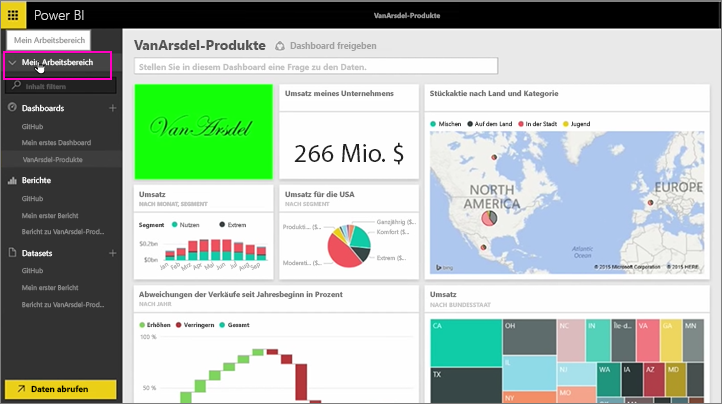
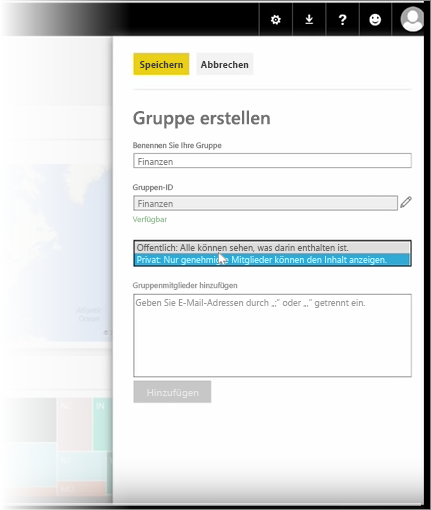

In dieser Lektion erstellen wir zunächst eine *Gruppe*. Eine **Gruppe** definiert eine Gruppe von Benutzern, die Zugriff auf bestimmte Dashboards, Berichte und Daten haben.

Gruppen in Power BI basieren auf Gruppen in Office 365. Wenn Sie also mit Office 365-Gruppen E-Mails, Kalender und Dokumente für Ihre Gruppe verwaltet haben, werden Sie sehen, dass Power BI die gleichen Funktionen und darüber hinaus weitere Optionen bietet. Wenn Sie eine Gruppe in Power BI erstellen, erstellen Sie eigentlich eine Office 365-Gruppe.

Im Szenario für dieses Modul wird eine neue Finanzgruppe eingerichtet. Wir zeigen, wie Sie die Gruppe einrichten, Dashboards, Berichte und Datasets für die Gruppe freigeben und Mitglieder hinzufügen, die Zugriff auf die Elemente in der Gruppe haben.

Ich beginne in „Mein Arbeitsbereich“... Dies sind die Dashboards, Berichte und Datasets, die ich erstellt habe oder die für mich freigegeben wurden.

Wenn ich „Mein Arbeitsbereich“ erweitere, kann ich **Gruppe erstellen** auswählen.

Hier kann ich einen Namen eingeben. Wir verwenden das Szenario einer Finanzgruppe, daher gebe ich „Finance“ ein. Power BI stellt sicher, dass der Name in der Domäne nicht bereits vorhanden ist.

Ich kann die Sicherheitsstufe festlegen, indem ich angebe, ob jeder in meiner Organisation die Inhalte der Gruppe sehen darf oder nur die Mitglieder.

Hier gebe ich E-Mail-Adressen, Sicherheitsgruppen und Verteilerlisten ein. Ich wähle **Hinzufügen** aus, um daraus Mitglieder der Gruppe zu erstellen, und speichere die Gruppe.

Auf zur nächsten Lektion!

