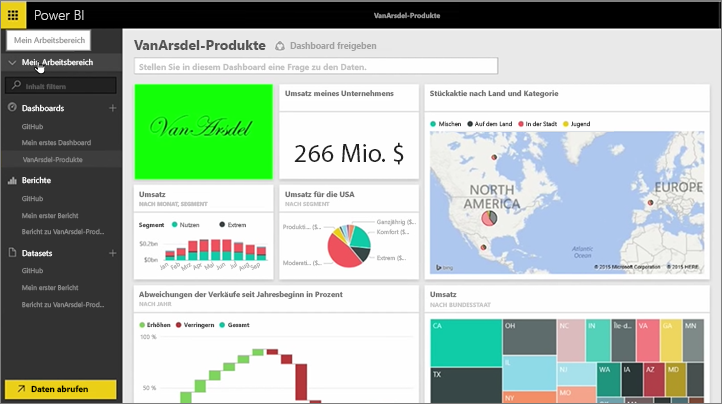
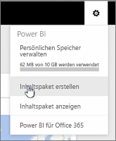
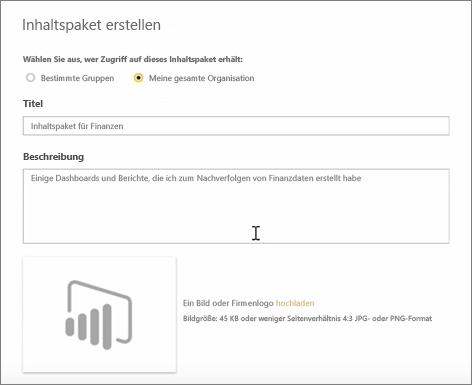
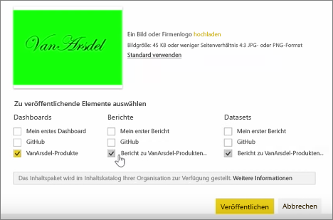
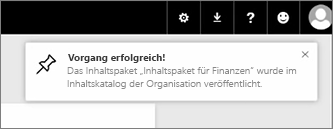

In dieser Lektion erstellen Sie ein *Inhaltspaket* mit in Power BI bereits vorhandenen Artefakten und geben es dann für Ihre Kollegen frei.

In **Mein Arbeitsbereich** werden ein Dashboard und darunter der Bericht und das Dataset angezeigt. Ich möchte diese als Paket für andere Benutzer in meiner Organisation freigeben, sodass sie sie wiederverwenden können.

Wenn ich das Symbol **Einstellungen** auswähle (das Zahnrad rechts oben im Dienstfenster), sehe ich, wie viel Speicher ich verwende, und kann ein Inhaltspaket erstellen.

Im daraufhin angezeigten Dialogfeld kann ich auswählen, ob das Paket an bestimmte Benutzer oder Gruppen verteilt werden soll, und einen Titel festlegen. Es ist auch sinnvoll, eine detaillierte Beschreibung im Feld **Beschreibung** einzugeben, damit Benutzer, die ein Inhaltspaket suchen, wissen, was es enthält oder bereitstellt.

Unten im Dialogfeld kann ich ein Bild für das Inhaltspaket hochladen. Und der wichtigste Schritt: Ich wähle das Dashboard aus, das in das Inhaltspaket eingeschlossen werden soll. Dabei wählt Power BI automatisch den Bericht und das Dataset aus, die in dem Dashboard verwendet werden. Ich kann die Auswahl des Berichts oder Datasets nicht deaktivieren, da sie für das Dashboard, das in das Inhaltspaket eingeschlossen werden soll, benötigt werden.

Ich könnte auch andere Dashboards, Berichte und Datasets auswählen, werde dies aber jetzt nicht tun.

Bei der Veröffentlichung wird das Inhaltspaket dem Inhaltskatalog der Organisation hinzugefügt.

Auf zur nächsten Lektion!

