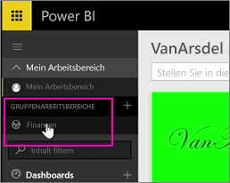
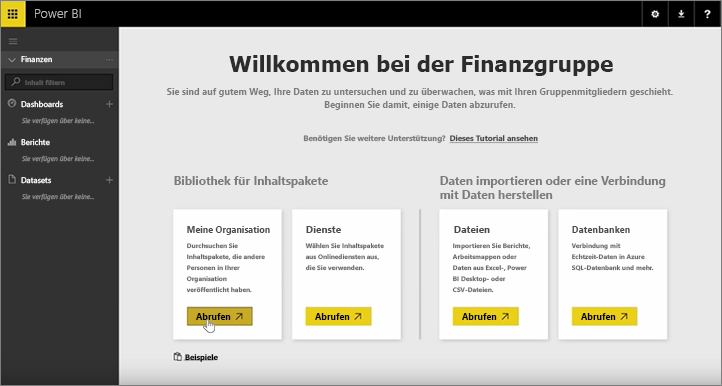
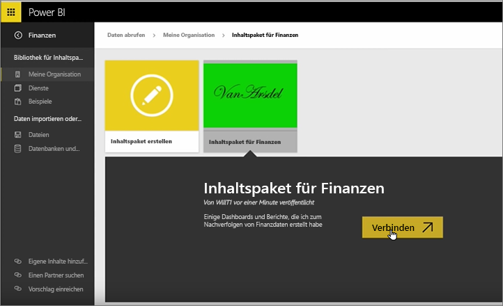
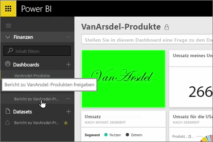
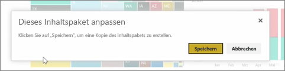
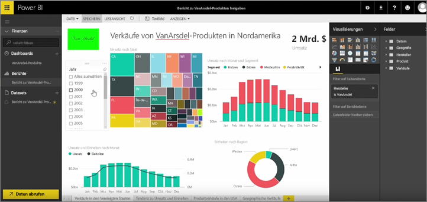

In den vorherigen Lektionen haben wir bereits ein Inhaltspaket und eine Gruppe erstellt. In dieser Lektion werden wir eine Instanz des Inhaltspakets für alle Benutzer in der Gruppe erstellen.

Ich beginne im Arbeitsbereich...

... und wechsle zurück zur Gruppe „Finance“, die ich in einer vorherigen Lektion erstellt habe.

Die Gruppe enthält noch keine Dashboards, Berichte oder Datasets. Ich werde die app zu verwenden, die ich erstellt habe. Ich werden apps aus meiner Organisation anstelle der von Diensten von Drittanbietern durchsuchen.

Ich finde es sich um die app, die ich vor einer Minute erstellt. Das zeigt mir, weshalb es wichtig ist, einen aussagekräftigen Titel, eine Beschreibung und ein Bild zuzuweisen, damit andere es finden können. Ich stelle eine Verbindung her.

Powerbi importiert die Dashboards, Berichte und Datasets, die in der app befinden.

Wenn Sie das Dataset auswählen, fordert Power BI, wenn ich möchte, um die app zu personalisieren.

Erstellt eine Kopie der app, der ich bearbeiten kann, und trenne sie von der veröffentlichten Version der app. Wenn es sich bei der app-Ersteller die Änderungen der veröffentlichten Version vornimmt, erhalte ich wird nicht automatisch diese Updates.

Aber ich kann das Dashboard, den Bericht und sogar das Dataset bei Bedarf bearbeiten.

App sind also eine einfache Möglichkeit, Wiederverwenden von Inhalt, die von anderen Personen in Ihrer Organisation erstellt.

Auf zur nächsten Lektion!

