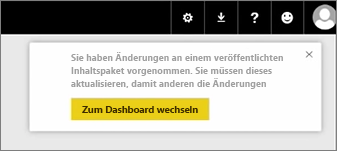
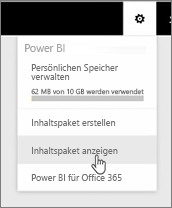
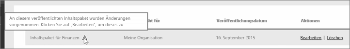

In dieser Lektion wird das ursprüngliche Inhaltspaket, das zuvor erstellt wurde, bearbeitet, und wir sehen, wie es für die anderen Benutzer aktualisiert wird, die eine Verbindung damit hergestellt haben.

Ich bin wieder in „Mein Arbeitsbereich“ und bearbeite mein ursprüngliches Dashboard.

Jedes Mal, wenn ich Änderungen am Dashboard vornehme, erhalte ich diese Erinnerung, dass ich etwas geändert habe, das ich in einem Inhaltspaket für andere Benutzer freigegeben habe. Ich werde aufgefordert, die freigegebene Version zu aktualisieren.

Ich gehe zurück zum Einstellungssymbol und wähle **Inhaltspaket anzeigen** aus, um die Inhaltspakete anzuzeigen, die ich bereits veröffentlicht habe.

Ich sehe das Inhaltspaket, das ich erstellt habe. Dieses kleine Symbol zeigt mir, dass ich etwas an dem Inhaltspaket geändert habe und dass ich das Inhaltspaket bearbeiten muss, damit die anderen Benutzer meine Änderungen sehen können.

Wenn ich **Bearbeiten** auswähle, wird wieder der Bildschirm angezeigt, auf dem ich den Titel und die Beschreibung bearbeiten kann. Jetzt wird aber auch die Schaltfläche **Aktualisieren** angezeigt, die ich jetzt auswähle.

Power BI übernimmt diese Änderungen und veröffentlicht das aktualisierte Inhaltspaket im Inhaltspaketkatalog.

Jeder, der eine Verbindung mit meinem Inhaltspaket hergestellt hat, erhält eine Nachricht, dass das Inhaltspaket geändert wurde, und wird gefragt, ob er die Änderungen übernehmen oder die ältere Version beibehalten möchte.

Als Besitzer des Inhaltspakets können Sie also die Versionen verwalten, die Ihre Kollegen verwenden.

