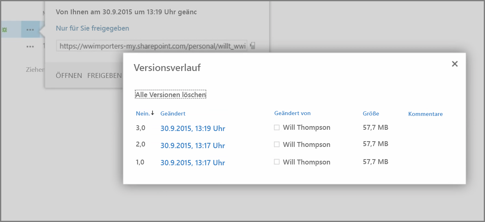
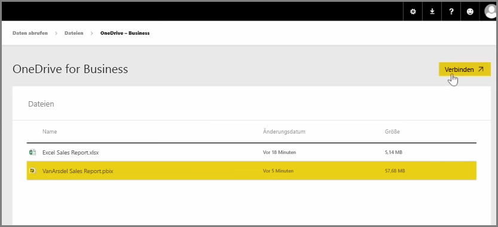
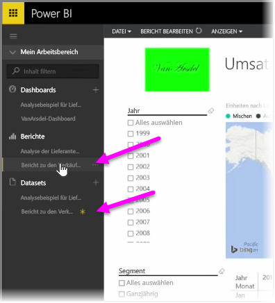

In einem früheren Artikel wurde das Erstellen von Gruppen behandelt, damit in Ihrer Organisation die Inhalte in Power BI verwaltet und gemeinsam bearbeitet werden können. Mit **OneDrive for Business** können Sie auch Ihre Power BI/Office 365-Gruppen für Zusammenarbeit und Freigabe verwenden.

Wenn Sie OneDrive for Business als Quelle für Power BI-Inhalte verwenden, haben Sie Zugriff auf eine Vielzahl von nützlichen Tools, z.B. den Versionsverlauf. Sie können Ihre Dateien auch für eine Office 365-Gruppe in OneDrive for Business freigeben, um vielen Benutzern Zugriff zu erteilen und die Zusammenarbeit an den gleichen Power BI- oder Excel-Dateien zu ermöglichen.

Wenn Sie eine Verbindung mit einer PBIX-Datei (Power BI Desktop) auf OneDrive for Business herstellen möchten, melden Sie sich im Power BI-Dienst an, und wählen Sie **Daten abrufen** aus. Wählen Sie unter „Daten importieren oder mit Daten verbinden“ die Option **Dateien** aus, und wählen Sie dann **OneDrive – Geschäftlich** aus. Markieren Sie die gewünschte Datei, und wählen Sie **Verbinden** aus.

Der Inhalt wird in der linken Navigationsleiste angezeigt.

Jetzt werden alle Änderungen an der Datei auf **OneDrive for Business** automatisch auch in der Power BI-Umgebung angezeigt und im Versionsverlauf erfasst.

