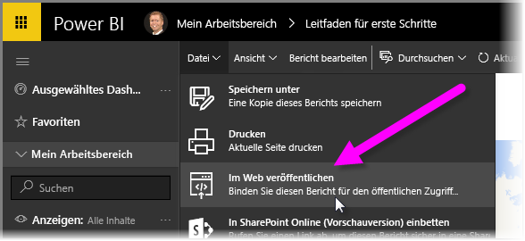
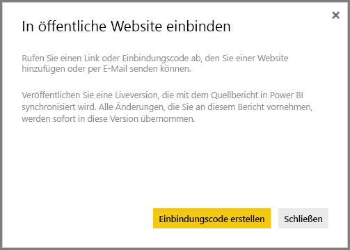
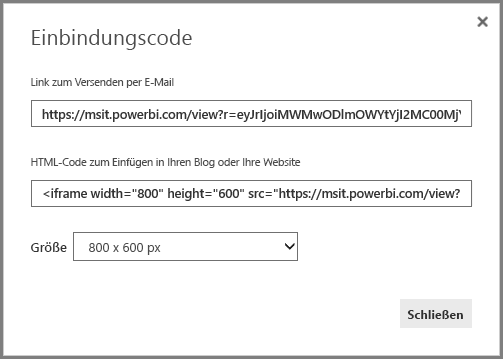
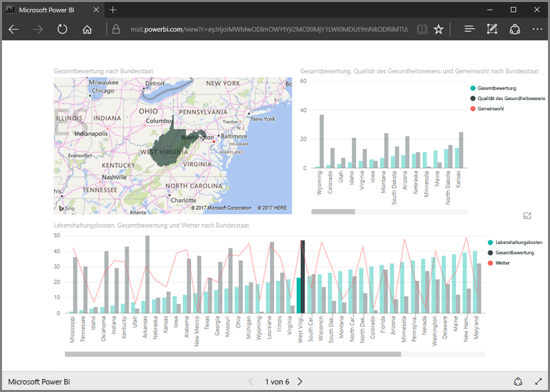
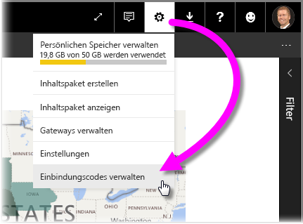
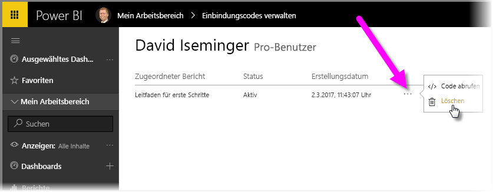

In dieser Lektion erfahren Sie in wenigen Schritten, wie Sie einen Power BI-Bericht auf einer Webseite oder per E-Mail freigeben. Dieses leicht zu verwendende und einfach zu verwaltende Power BI-Feature wird häufig als **Webveröffentlichung** bezeichnet.

Wählen Sie in Power BI den Bericht aus, den Sie freigeben möchten, sodass er im Zeichenbereich angezeigt wird. Wählen Sie dann im Menü **Datei > Im Web veröffentlichen**.

Ein Dialogfeld wird angezeigt. Dort wird erklärt, dass Sie einen *Einbindungscode* erhalten, mit dem Sie den Bericht in eine Website oder E-Mail einbinden können.

Wenn Sie **Einbindungscode erstellen** auswählen, gelangen Sie zu einem weiteren Power BI-Dialogfeld, in dem Sie erneut darauf hingewiesen werden, dass die Daten für jeden im Internet sichtbar sein werden. Vergewissern Sie sich, dass alles so seine Ordnung hat.

Power BI zeigt jetzt ein Dialogfeld mit zwei Links an:

* Einen Link zur Freigabe per E-Mail, der auf den Bericht als Webseite verweist
* Einen Link in einem IFrame als HTML-Code, mit dem Sie den Bericht in eine Webseite einbetten können

Die Größe des eingebetteten Berichts kann für den HTML-Link aus vordefinierten Werten ausgewählt werden. Sie können den IFrame-Code auch selbst ändern und die Größe so anpassen.

Der Link aus der E-Mail kann einfach in den Browser kopiert werden. Der Bericht wird dann als Webseite angezeigt. Mit dieser Webseite können Sie wie mit einem Bericht in Power BI interagieren. Die folgende Abbildung zeigt eine Seite im Browser, die mit dem Link aus dem Dialogfeld der Option **Im Web veröffentlichen** aufgerufen wurde:

Sie können den IFrame-Link in einen Blogbeitrag oder eine Website einbinden – sogar in Sway.

Möchten Sie einen Einbindungscode wieder löschen? Kein Problem. Wählen Sie rechts oben in Power BI das **Zahnradsymbol** und dann **Einbindungscodes verwalten** aus.

Im Power BI-Arbeitsbereich werden jetzt die erstellten Einbindungscodes angezeigt. (In der Abbildung unten wurde nur ein Code erstellt.) Über die Auslassungspunkte kann der Einbindungscode abgerufen und gelöscht werden.

Das war schon alles, was es zur Webveröffentlichung von Power BI-Berichten zu sagen gibt. Es ist ganz leicht!

