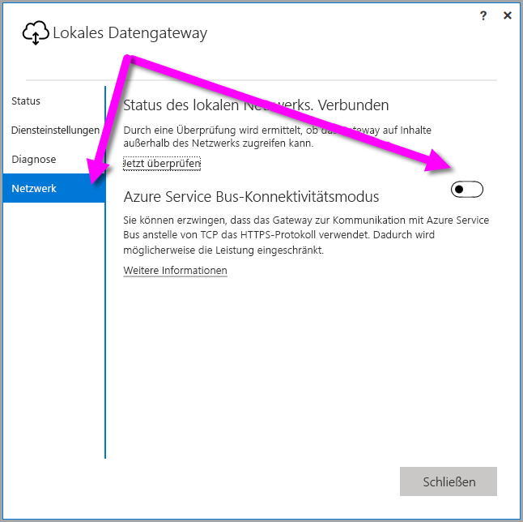
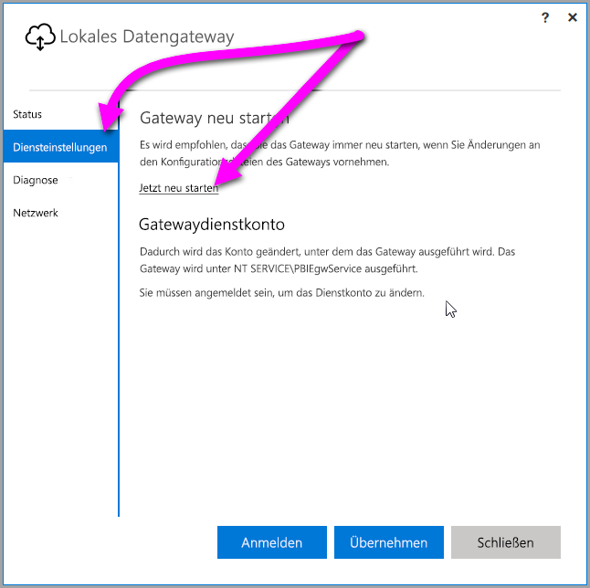

## <a name="sign-in-account"></a>Das Anmeldekonto

Benutzer melden sich mit einem Geschäfts-, Schul- oder Unikonto an. Dieses Konto ist Ihr **Organisationskonto**. Wenn Sie sich für ein Office 365-Angebot registriert haben und nicht Ihre tatsächliche geschäftliche E-Mail-Adresse angegeben haben, könnte es wie „nancy@contoso.onmicrosoft.com“ aussehen. Ihr Konto wird in einem Mandanten in Azure Active Directory (AAD) gespeichert. In den meisten Fällen entspricht der UPN Ihres AAD-Kontos der E-Mail-Adresse.

## <a name="windows-service-account"></a>Windows-Dienstkonto

Das lokale Datengateway ist so konfiguriert, dass *NT SERVICE\PBIEgwService* als Anmeldeinformationen für den Windows-Dienst verwendet wird. Standardmäßig ist die Anmeldung als Dienst auf dem Computer zulässig, auf dem Sie das Gateway installieren. Bei dem Konto handelt es sich nicht um dasselbe Konto, das zum Verbinden mit lokalen Datenquellen verwendet wird. Es ist auch nicht Ihr Geschäfts-, Schul- oder Unikonto, mit dem Sie sich bei Clouddiensten anmelden.

> [!NOTE]
> Wenn Sie den persönlichen Modus ausgewählt haben, konfigurieren Sie das Windows-Dienstkonto separat.

Wenn bei der Authentifizierung Ihres Proxyservers Probleme auftreten, ändern Sie das Windows-Dienstkonto in ein Domänenbenutzerkonto oder verwaltetes Dienstkonto. Weitere Informationen finden Sie unter [Proxykonfiguration](../service-gateway-proxy.md#changing-the-gateway-service-account-to-a-domain-user).

## <a name="ports"></a>Ports

Das Gateway stellt eine ausgehende Verbindung mit Azure Service Bus her. Die Kommunikation erfolgt über die ausgehenden Ports TCP 443 (Standardwert), 5671, 5672, 9350 bis 9354.  Das Gateway benötigt keine eingehenden Ports.

Es wird empfohlen, in der Firewall die Blockierung der IP-Adressen für Ihren Datenbereich aufzuheben. Sie können die [IP-Liste des Microsoft Azure-Rechenzentrums](https://www.microsoft.com/download/details.aspx?id=41653) herunterladen, die wöchentlich aktualisiert wird. Das Gateway verwendet für die Kommunikation mit Azure Service Bus die IP-Adresse zusammen mit dem vollständig qualifizierten Domänennamen (Fully Qualified Domain Name, FQDN). Wenn Sie für das Gateway Kommunikation per HTTPS erzwingen, verwendet das Gateway ausschließlich den FQDN, und es erfolgt keine Kommunikation mithilfe von IP-Adressen.

> [!NOTE]
> Die IP-Adressen in der Liste der Azure-Datacenter-IP-Adressen sind in CIDR-Notation angegeben. Beispielsweise bedeutet „10.0.0.0/24“ nicht „10.0.0.0 bis 10.0.0.24“. Erfahren Sie mehr zur [CIDR-Notation](http://whatismyipaddress.com/cidr).

Es folgt eine Liste der vollqualifizierten Domänennamen, die vom Gateway verwendet werden.

| Domänennamen | Ausgehende Ports | Beschreibung |
| --- | --- | --- |
| *.download.microsoft.com |80 |Zum Herunterladen des Installationsprogramms wird HTTP verwendet. |
| *.powerbi.com |443 |HTTPS |
| *.analysis.windows.net |443 |HTTPS |
| *.login.windows.net |443 |HTTPS |
| *.servicebus.windows.net |5671-5672 |Advanced Message Queuing Protocol (AMQP) |
| *.servicebus.windows.net |443, 9350-9354 |Listener an Service Bus Relay über TCP (erfordert 443 für Bezug des Access Control-Tokens) |
| *.frontend.clouddatahub.net |443 |HTTPS |
| *.core.windows.net |443 |HTTPS |
| login.microsoftonline.com |443 |HTTPS |
| *. msftncsi.com |443 |Wird zum Testen der Internetverbindung verwendet, wenn der Power BI-Dienst das Gateway nicht erreichen kann. |
| *.microsoftonline-p.com |443 |Wird abhängig von der Konfiguration für die Authentifizierung verwendet. |

> [!NOTE]
> Datenverkehr von „visualstudio.com“ oder „visualstudioonline.com“ wird für Einblicke in die App benötigt und ist für die Funktion des Gateways nicht erforderlich.

## <a name="forcing-https-communication-with-azure-service-bus"></a>Erzwingen der HTTPS-Kommunikation mit Azure Service Bus

Sie können erzwingen, dass das Gateway zur Kommunikation mit Azure Service Bus anstelle von TCP das HTTPS-Protokoll verwendet. Dies kann allerdings die Leistung beeinträchtigen. Ändern Sie zu diesem Zweck die Datei *Microsoft.PowerBI.DataMovement.Pipeline.GatewayCore.dll.config*, indem Sie den Wert von `AutoDetect` in `Https` ändern, wie im Codeausschnitt direkt nach diesem Abschnitt gezeigt. Diese Datei befindet sich (standardmäßig) unter *C:\Programme\Lokales Datengateway*.

```
<setting name="ServiceBusSystemConnectivityModeString" serializeAs="String">
    <value>Https</value>
</setting>
```

Beim Wert des *ServiceBusSystemConnectivityModeString*-Parameters muss die Groß-/Kleinschreibung beachtet werden. Gültige Werte sind *AutoDetect* und *Https*.

Alternativ können Sie mithilfe der Gatewaybenutzeroberfläche dieses Verhalten des Gateways erzwingen. Wählen Sie auf der Gateway-Benutzeroberfläche **Netzwerk** aus, und wählen Sie dann für **Azure Service Bus-Konnektivitätsmodus** die Option **Ein** aus.



Wenn Sie nach dem Durchführen der Änderung **Übernehmen** (eine Schaltfläche, die nur angezeigt wird, wenn Sie eine Änderung vornehmen) auswählen, wird der *Windows-Dienst Gateway* automatisch neu gestartet, damit die Änderung wirksam werden kann.

In ähnlichen Situationen in der Zukunft können Sie den *Windows-Dienst Gateway* über das Dialogfeld neu starten, indem Sie **Diensteinstellungen** und dann *Jetzt neu starten* auswählen.



## <a name="support-for-tls-1112"></a>Unterstützung für TLS 1.1/1.2

Das lokale Datengateway verwendet für die Kommunikation mit dem **Power BI-Dienst** standardmäßig Transport Layer Security (TLS) 1.1 bzw. 1.2. Frühere Versionen des lokalen Datengateways verwenden standardmäßig TLS 1.0. Am 15. März 2018 endet die Unterstützung für TLS 1.0 und damit auch die Option des Gateways, mit dem **Power BI-Dienst** über TLS 1.0 zu interagieren. Sie müssen für Ihre Installationen des lokalen Datengateways ein Upgrade durchführen, damit das Gateway funktionsfähig bleibt.

Beachten Sie, dass das lokale Datengateway TLS 1.0 bis zum 1. November unterstützt und als Fallbackmechanismus verwendet. Um sicherzustellen, dass für sämtlichen Datenverkehr im Gateway TLS 1.1 oder 1.2 verwendet wird (und um die Verwendung von TLS 1.0 im Gateway zu verhindern), müssen Sie auf dem Computer, auf dem der Gatewaydienst ausgeführt wird, die folgenden Registrierungsschlüssel hinzufügen oder ändern:

        [HKEY_LOCAL_MACHINE\SOFTWARE\Microsoft\.NETFramework\v4.0.30319]"SchUseStrongCrypto"=dword:00000001
        [HKEY_LOCAL_MACHINE\SOFTWARE\Wow6432Node\Microsoft\.NETFramework\v4.0.30319]"SchUseStrongCrypto"=dword:00000001

> [!NOTE]
> Durch Hinzufügen bzw. Ändern dieser Registrierungsschlüssel wird die Änderung auf alle .NET-Anwendungen angewendet. Weitere Informationen zu den Registrierungsänderungen mit Auswirkungen auf TLS für andere Anwendungen finden Sie unter [TLS-Registrierungseinstellungen (Transport Layer Security)](https://docs.microsoft.com/windows-server/security/tls/tls-registry-settings).

## <a name="how-to-restart-the-gateway"></a>So starten Sie das Gateway neu

Das Gateway wird als Windows-Dienst ausgeführt. Sie können es wie jeden anderen Windows-Dienst starten und beenden. In der Eingabeforderung müssen Sie daher wie folgt vorgehen:

1. Starten Sie auf dem Computer, auf dem das Gateway ausgeführt wird, eine Administratoreingabeaufforderung.
2. Verwenden Sie den folgenden Befehl zum Beenden des Diensts.
   
   net stop PBIEgwService
3. Verwenden Sie den folgenden Befehl zum Starten des Diensts.
   
   net start PBIEgwService

