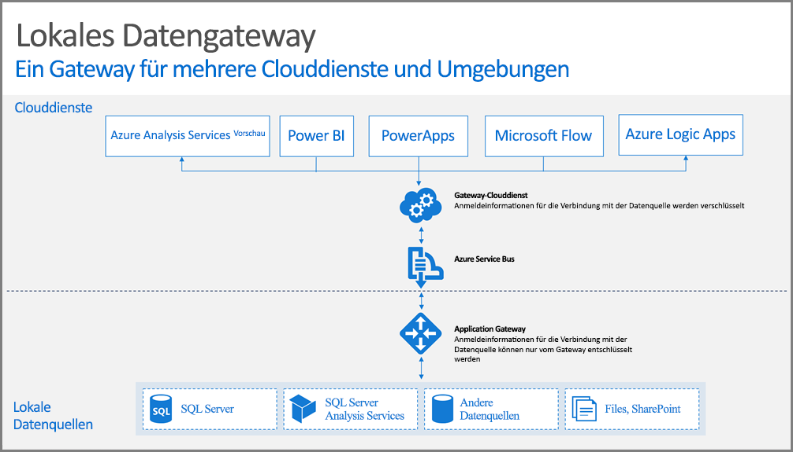

## So funktioniert das Gateway

Sehen wir uns zunächst an, was geschieht, wenn ein Benutzer mit einem Element interagiert, das mit einer lokalen Datenquelle verbunden ist. 

> [!NOTE]
> Für Power BI müssen Sie eine Datenquelle für das Gateway konfigurieren.
> 
> 

1. Eine Abfrage wird vom Clouddienst zusammen mit den verschlüsselten Anmeldeinformationen für die lokale Datenquelle erstellt und an die Warteschlange für die Bearbeitung durch das Gateway gesendet.
2. Die Abfrage wird daraufhin vom Gatewayclouddienst analysiert und die Anforderung mithilfe von Push an [Azure Service Bus](https://azure.microsoft.com/documentation/services/service-bus/) übertragen.
3. Das On-premises data gateway fragt [Azure Service Bus](https://azure.microsoft.com/documentation/services/service-bus/) für ausstehende Anfragen ab.
4. Das Gateway ruft die Abfrage ab, entschlüsselt die Anmeldeinformationen und stellt unter Verwendung dieser Anmeldeinformationen eine Verbindung mit der Datenquelle bzw. den Datenquellen her.
5. Das Gateway sendet die Abfrage zur Ausführung an die Datenquelle.
6. Die Ergebnisse werden von der Datenquelle zurück an das Gateway und anschließend weiter an den Clouddienst gesendet. Der Dienst verwendet dann die Ergebnisse.

