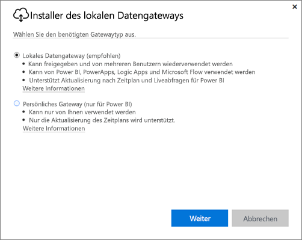
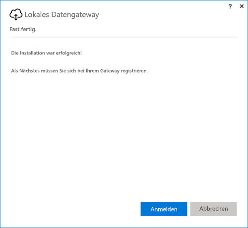
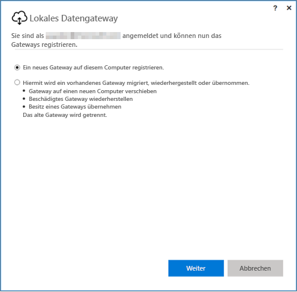
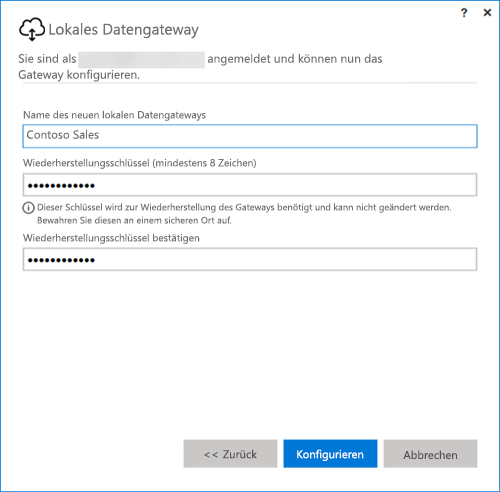

## Installieren von On-premises data gateway
Das Gateway lässt sich auf Ihrem Computer ausführen und installieren. Es wird empfohlen, das Gateway auf einem Computer zu installieren, der immer eingeschaltet sein kann.

> [!NOTE]
> Das Gateway wird nur unter 64-Bit-Windows-Betriebssystemen unterstützt.
> 
> 

Die erste Entscheidung, die Sie in Power BI treffen müssen, ist der Modus des Gateways.

* **On-premises data gateway:** Mehrere Benutzer können ein Gateway in diesem Modus freigeben und wiederverwenden. Dieses Gateway kann von Power BI, PowerApps, Flow oder Logic Apps verwendet werden. Es bietet Power BI Unterstützung für die Zeitplanaktualisierung und DirectQuery.
* **Personal:**: Dieser Modus steht ausschließlich für Power BI zur Verfügung und kann als einzelnes Element ohne Administratorkonfiguration verwendet werden. Dies kann nur für die bedarfsgesteuerte Aktualisierung und Zeitplanaktualisierung verwendet werden. Hierdurch wird die Installation des persönlichen Gateways gestartet.

Beim Installieren beider Modi des Gateways sind einige Punkte zu beachten:

* Beide Gateways erfordern 64-Bit-Windows-Betriebssysteme.
* Gateways können nicht auf einem Domänencontroller installiert werden.
* Sie können bis zu zwei lokale Datengateways auf demselben Computer installieren, von denen jedes jeweils in einem der einzelnen Modi (persönlich oder Standard) ausgeführt wird. 
* Sie dürfen auf ein und demselben Computer nicht mehrere Gateways im gleichen Modus ausführen.
* Sie können mehrere lokale Gateways auf verschiedenen Computern installieren und alle über dieselbe Power BI Gateway-Verwaltungsschnittstelle verwalten (mit Ausnahme des persönlichen Modus, siehe folgender Aufzählungspunkt).
* Sie können für jeden Power BI-Benutzer nur ein Gateway im persönlichen Modus ausführen. Wenn Sie ein weiteres Gateway im persönlichen Modus für denselben Benutzer installieren (selbst wenn dies auf einem anderen Computer geschieht), ersetzt die neueste Installation die vorhandene vorherige Installation.

Die folgenden Punkte sollten Sie berücksichtigen, bevor Sie das Gateway installieren.

* Wenn Sie es auf einem Laptop installieren, und Ihr Laptop ausgeschaltet ist, nicht mit dem Internet verbunden ist oder sich im Energiesparmodus befindet, funktioniert das Gateway nicht, und die Daten im Clouddienst werden nicht mit Ihren lokalen Daten synchronisiert.
* Wenn Ihr Computer mit einem Drahtlosnetzwerk verbunden ist, wird das Gateway möglicherweise langsamer ausgeführt, wodurch mehr Zeit benötigt wird, die Daten im Clouddienst mit Ihren lokalen Daten zu synchronisieren.

Sobald das Gateway installiert ist, müssen Sie sich mit Ihrem Geschäfts-, Schul- oder Unikonto anmelden.

Nachdem Sie sich angemeldet haben, haben Sie die Option, ein neues Gateway zu konfigurieren oder ein bereits vorhandenes Gateway zu migrieren, wiederherzustellen oder zu übernehmen.

## Konfigurieren eines neuen Gateways
1. Geben Sie einen **Namen** für das Gateway ein.
2. Geben Sie einen **Wiederherstellungsschlüssel** ein. Dieser muss mindestens 8 Zeichen lang sein.
3. Wählen Sie **Konfigurieren** aus.

> [!NOTE]
> Der Wiederherstellungsschlüssel wird benötigt, wenn Sie ein Gateway migrieren, wiederherstellen oder übernehmen müssen. Achten Sie darauf, dass Sie diesen Schlüssel an einem sicheren Ort aufbewahren.
> 
> 

### Migrieren, wiederherstellen oder übernehmen eines vorhandenen Gateways
Sie müssen das Gateway auswählen, das Sie wiederherstellen möchten und den Wiederherstellungsschlüssel bereitstellen, der verwendet wurde, als das Gateway erstellt wurde.

### Verbinden mit On-premises data gateway
Sobald das Gateway konfiguriert ist, können Sie es verwenden, um eine Verbindung mit lokalen Datenquellen herzustellen.

Wenn das Gateway für Power BI verwendet werden soll, müssen Sie Ihre Datenquellen dem Gateway im Power BI-Dienst hinzufügen. Dies erfolgt im Bereich **Gateways verwalten**. Weitere Informationen finden Sie in den Artikeln zum Verwalten von Datenquellen.

Für PowerApps müssen Sie ein Gateway für eine definierte Verbindung für unterstützte Datenquellen auswählen. Für Flow und Logic Apps kann dieses Gateway sofort mit Ihren lokalen Verbindungen verwendet werden.

