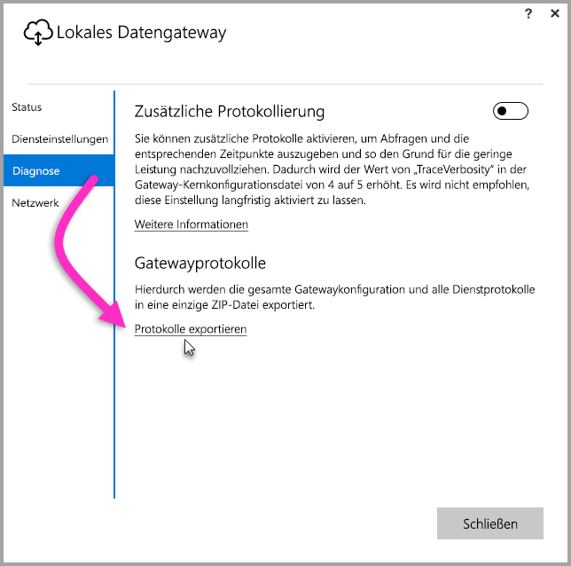
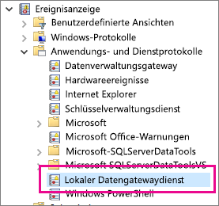

## Tools zur Problembehandlung
<a name="logs" />

### Zusammenstellen von Protokollen über den Gateway-Konfigurator
Es gibt verschiedene Protokolle, die für das Gateway erfasst werden können, und Sie sollten stets mit den Protokollen beginnen. Sie können Protokolle nach dem Installieren des Gateways am einfachsten über die Benutzeroberfläche erfassen. Wählen Sie auf der Benutzeroberfläche des **lokalen Datengateways** die Option **Diagnose** und anschließend den Link **Protokolle exportieren** am unteren Rand der Seite aus, wie in der folgenden Abbildung veranschaulicht.

**Installationsprotokolle**

    %localappdata%\Temp\On-premises_data_gateway_*.log

**Konfigurationsprotokolle**

    %localappdata%\Microsoft\On-premises Data Gateway\GatewayConfigurator*.log

**Dienstprotokolle des lokalen Datengateways**

    C:\Users\PBIEgwService\AppData\Local\Microsoft\On-premises Data Gateway\Gateway*.log

### Ereignisprotokolle
Die Ereignisprotokolle von **On-premises data gateway service** befinden sich unter **Application and Services Logs** (Anwendungs- und Dienstprotokolle).

<a name="fiddler" />

### Ablaufverfolgung mit Fiddler
[Fiddler](http://www.telerik.com/fiddler) ist ein kostenloses Tool von Telerik, mit dem HTTP-Verkehr überwacht werden kann.  Sie können den Datenaustausch zwischen dem Power BI-Dienst und dem Clientcomputer verfolgen. So können Sie Fehler und ähnliche Informationen anzeigen.

