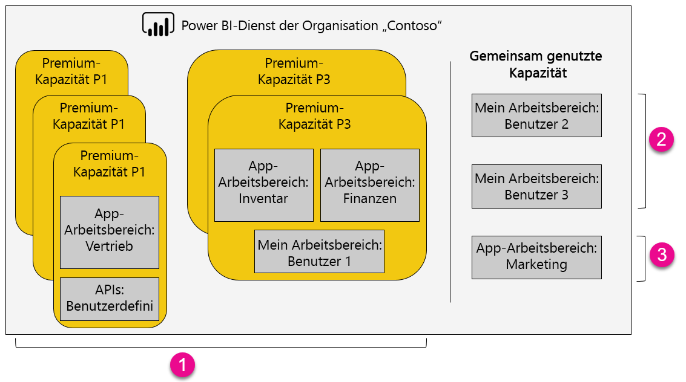

1. Elemente innerhalb einer Premium-Kapazität
   
   * Für das Zugreifen auf App-Arbeitsbereiche (als Mitglied oder Administrator) und das Veröffentlichen von Apps ist eine Power BI Pro-Lizenz erforderlich.
   * App-Leser können Power BI Pro- oder Free-Benutzer sein.
   * Für das Freigeben ist eine Power BI Pro-Lizenz erforderlich, Empfänger können jedoch Power BI Pro- oder Free-Benutzer sein.
   * REST-APIs zum Einbetten verwenden ein Dienstkonto mit einer Power BI Pro-Lizenz anstelle eines Benutzers.
2. Mein Arbeitsplatz in gemeinsam genutzter Kapazität
   
   * Für Teilen ist eine Pro-Lizenz erforderlich. Empfänger benötigen darüber hinaus Pro-Lizenzen.
3. App-Arbeitsbereiche in gemeinsam genutzter Kapazität
   
   * Für jede App-Nutzung sind Pro-Lizenzen erforderlich.

