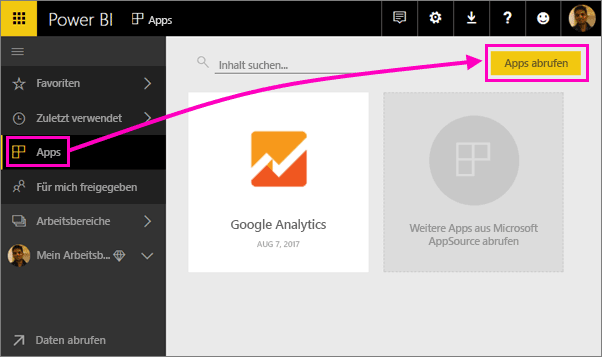
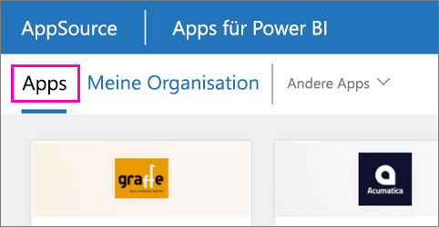

1. Wählen Sie im linken Navigationsbereich **Apps** und dann in der oberen rechten Ecke **Apps abrufen** aus.
   
     
2. Wählen Sie in AppSource die Registerkarte **Apps** aus, und suchen Sie den gewünschten Dienst.
   
    

