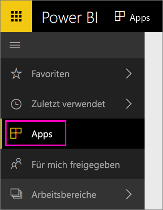

Wenn der Importvorgang abgeschlossen ist, wird die neue App auf der Seite „Apps“ angezeigt.

1. Wählen Sie im linken Navigationsbereich **Apps** und dann die App aus.
   
     
2. Sie können eine Frage im Bereich für Fragen und Antworten stellen oder auf eine Kachel klicken, um den zugrunde liegenden Bericht zu öffnen. 

