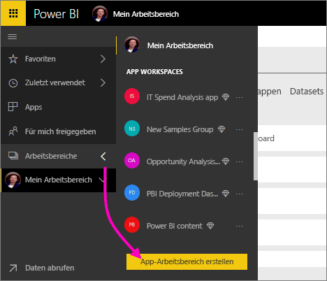
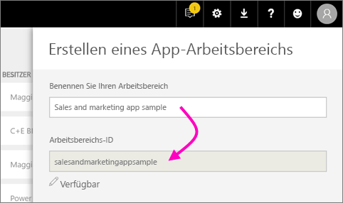
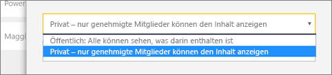
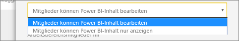
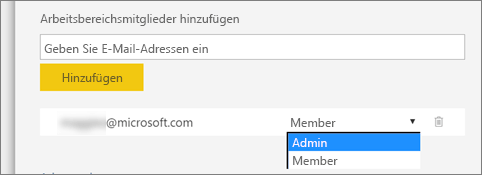
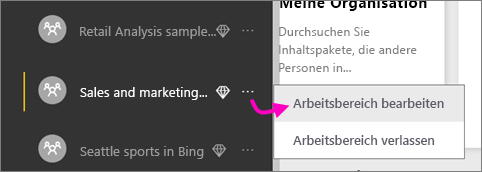

1. Erstellen Sie zunächst den Arbeitsbereich. Wählen Sie **Arbeitsbereiche** > **App-Arbeitsbereich erstellen** aus.
   
     
   
    Hier legen Sie Inhalte ab, die Sie gemeinsam mit Kollegen bearbeiten.

2. Benennen Sie den Arbeitsbereich. Wenn die entsprechende **Arbeitsbereichs-ID** nicht verfügbar ist, geben Sie eine eindeutige ID ein.
   
     Diese wird der Name der App sein.
   
     

3. Sie können einige Optionen festlegen. Wenn Sie **Öffentlich** auswählen, können die Inhalte des Arbeitsbereichs von jedem Benutzer in der Organisation angezeigt werden. **Privat** bedeutet hingegen, dass die Inhalte des Arbeitsbereichs nur von dessen Mitgliedern angezeigt werden können.
   
     
   
    Sie können die Einstellung „Öffentlich“ bzw. „Privat“ einer Gruppe nach deren Erstellung nicht mehr ändern.

4. Sie können auch auswählen, ob Mitglieder Inhalte **bearbeiten** können oder **schreibgeschützten** Zugriff haben.
   
     
   
     Fügen Sie Personen dem App-Arbeitsbereich nur hinzu, damit sie Inhalte bearbeiten können. Wenn das Mitglied den Inhalt nur anzeigen kann, fügen Sie es nicht dem Arbeitsbereich hinzu. Sie können das Mitglied berücksichtigen, wenn Sie die App veröffentlichen.

5. Fügen Sie E-Mail-Adressen von Personen hinzu, die Zugriff auf den Arbeitsbereich haben sollen, und wählen Sie **Hinzufügen** aus. Sie können keine Gruppenaliase, sondern nur einzelne Personen hinzufügen.

6. Legen Sie für jede Person fest, ob sie Mitglied oder Administrator ist.
   
     
   
    Administratoren können den Arbeitsbereich selbst bearbeiten und weitere Mitglieder hinzufügen. Mitglieder können den Inhalt des Arbeitsbereichs bearbeiten, es sei denn, sie haben schreibgeschützten Zugriff. Sowohl Administratoren als auch Mitglieder können die App veröffentlichen.

7. Wählen Sie **Speichern**.

Der Arbeitsbereich wird in Power BI erstellt und geöffnet. Er wird in der Liste der Arbeitsbereiche angezeigt, deren Mitglied Sie sind. Da Sie Administrator sind, können Sie die Auslassungspunkte (...) auswählen, um zurückzukehren, und Änderungen vornehmen, neue Mitglieder hinzufügen oder deren Berechtigungen ändern.

