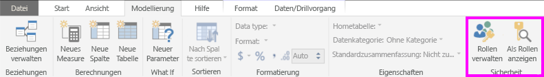
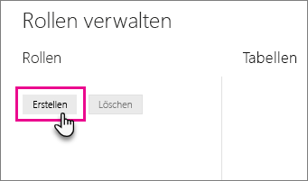
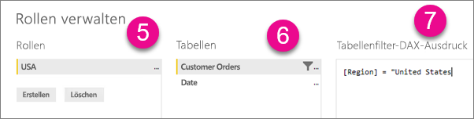
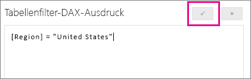

## Definieren von Rollen und Regeln in Power BI Desktop
Sie können Rollen und Regeln in Power BI Desktop definieren. Wenn Sie etwas in Power BI veröffentlichen, werden auch die Rollendefinitionen veröffentlicht.

Wenn Sie die dynamische Sicherheit nutzen möchten, müssen Sie den Previewschalter „Kreuzfilterung in beide Richtungen für DirectQuery aktivieren“. Dadurch können Sie plattformübergreifend filtern und die Sicherheitsfilter in beide Richtungen anwenden.

Gehen Sie wie folgt vor, um Sicherheitsrollen zu definieren:

1. Importieren Sie Daten in Ihren Power BI Desktop-Bericht, oder konfigurieren Sie eine DirectQuery-Verbindung.
   
   > [!NOTE]
   > Sie können in Power BI Desktop keine Rollen für Analysis Services-Liveverbindungen definieren. Sie müssen sie im Analysis Services-Modell definieren.
   > 
   > 
2. Wählen Sie die Registerkarte **Modellierung** aus.
3. Wählen Sie **Rollen verwalten** aus.
   
   
4. Wählen Sie **Erstellen** aus.
   
   
5. Geben Sie einen Namen für die Rolle an. 
6. Wählen Sie die Tabelle aus, auf die eine DAX-Regel angewendet werden soll.
7. Geben Sie die DAX-Ausdrücke ein. Dieser Ausdruck muss TRUE oder FALSE zurückgeben. Zum Beispiel: [Entitäts-ID] = "Wert".
   
   > [!NOTE]
   > Sie können *username()* innerhalb dieses Ausdrucks verwenden. Beachten Sie, dass *username()* in Power BI Desktop das Format *DOMÄNE\Benutzername* aufweist. Im Power BI-Dienst weist es das Format des UPN des Benutzers auf. Alternativ können Sie *userprincipalname()* verwenden, wodurch der Benutzer immer im Format seines Benutzerprinzipalnamens zurückgegeben wird.
   > 
   > 
   
   
8. Wählen Sie nach der Erstellung des DAX-Ausdrucks das Häkchen über dem Ausdrucksfeld aus, um den Ausdruck zu überprüfen.
   
   
9. Wählen Sie **Speichern**.

In Power BI Desktop ist es nicht möglich, Benutzer einer Rolle zuzuweisen. Dies ist nur im Power BI-Dienst möglich. Sie können die dynamische Sicherheit in Power BI Desktop aktivieren, indem Sie *username()*- oder *userprincipalname()*-DAX-Funktionen verwenden und die richtigen Beziehungen konfigurieren.

