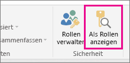
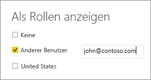

## Überprüfen der Rollen in Power BI Desktop
Nachdem Sie Ihre Rollen erstellt haben, können Sie die Ergebnisse der Rollen in Power BI Desktop testen.

1. Wählen Sie **Als Rollen anzeigen** aus. 

    

    Unter **Als Rollen anzeigen** werden die erstellten Rollen angezeigt.

    

3. Wählen Sie eine von Ihnen erstellte Rolle und anschließend **OK** aus, um diese Rolle anzuwenden. Die Berichte rendert dann die Daten, die für diese Rolle relevant sind. 

4. Sie können auch **Anderer Benutzer** auswählen und einen bestimmten Benutzer angeben. Es wird empfohlen, den Benutzerprinzipalnamen (User Principal Name; UPN) anzugeben, da der Power BI-Dienst und der Power BI-Berichtsserver diesen verwenden.

    

1. Wählen Sie **OK** aus. Daraufhin wird der Bericht unter Berücksichtigung der für diesen Benutzer sichtbaren Elemente gerendert. 

In Power BI Desktop zeigt die Option **Anderer Benutzer** nur dann unterschiedliche Ergebnisse an, wenn Sie die dynamische Sicherheit auf Ihren DAX-Ausdrücken basierend verwenden. 

