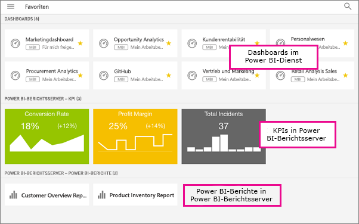

# Erstellen von Favoriten für Dashboards, Apps und lokale Berichte in den mobilen Power BI-Apps
Gilt für:

|  |  |  |  |  |
|:--- |:--- |:--- |:--- |:--- |
| iPhones |iPads |Android-Telefone |Android-Tablets |Windows 10-Geräte |

Auf der Seite „Favoriten“ in den mobilen Apps werden als Favoriten gespeicherte Power BI-Dashboards und -Apps zusammen den Favoriten für lokale Power BI-Berichtsserver- und Reporting Services-KPIs und mobile Berichte angezeigt. Wenn Sie ein Dashboard oder eine App in den mobilen Power BI-Apps als *Favoriten* speichern, werden sie im Power BI-Dienst ([https://powerbi.com](https://powerbi.com)) und auf allen Ihren Mobilgeräten auf der Favoritenseite angezeigt. 

Sie können auch [Power BI-Dashboard und -Apps als Favoriten im Power BI-Dienst speichern](service-dashboard-favorite.md). Sie werden dann auf der Favoritenseite in der mobilen App angezeigt.

Sie können KPIs und Berichte als Favoriten in Ihrem Power BI-Berichtsserver- oder Reporting Services-Webportal markieren und dann bequem neben den als Favoriten gespeicherten Power BI-Dashboards in einem Ordner auf Ihrem Mobilgerät anzeigen.

## Anzeigen von als Favoriten gespeicherten Power BI-Dashboards und -Apps sowie lokalen Berichten und KPIs
* Tippen Sie im oberen Navigationsmenü auf  und dann auf **Favoriten**.
  
  
  
  Sie sehen alle Ihre Favoriten zusammen auf dieser Seite:
  
  

## Speichern einer App als Favoriten
1. Tippen Sie in der mobilen App in der App-Liste neben der gewünschten App auf die Auslassungspunkte (...) > **Zu Favoriten hinzufügen**.
   
    
   
    Sie wird jetzt zusammen mit Ihren anderen Dashboard- und App-Favoriten aufgeführt.
   
    

## Speichern eines Dashboards als Favoriten in den mobilen iOS- und Windows 10-Apps
Sie können ein Power BI-Dashboard oder eine App in der Dashboardliste oder im Dashboard selbst als Favoriten festlegen.

* Tippen Sie in der Liste der Dashboards in der mobilen App auf den leeren Stern neben dem Dashboardnamen . Der Stern wird gelb angezeigt .
  
    
* Tippen Sie im Dashboard auf der Multifunktionsleiste oben auf den leeren Stern . Der Stern wird gelb angezeigt .
  
    

## Speichern eines Dashboards als Favoriten in mobilen Android-Apps
Sie können ein Dashboard in der Dashboardliste oder im Dashboard selbst als Favoriten festlegen.

* Tippen Sie in der Liste der Dashboards in der mobilen App auf die vertikalen Auslassungspunkte (...) neben dem Dashboardnamen, und tippen Sie dann auf **Favorit**. Neben dem Namen wird ein gelber Stern  angezeigt.
  
    
* Tippen Sie im Dashboard auf der Multifunktionsleiste oben auf den leeren Stern . Die Farbe des Sterns ändert sich in Dunkelgrau .
  
    

## Erstellen von Favoriten für Power BI-Berichtsserver- und Reporting Services-Berichte und -KPIs
Sie können Ihre als Favoriten gespeicherten Power BI-Berichtsserver- und Reporting Services-Berichte und -KPIs in den mobilen Power BI-Apps zwar anzeigen, sie dort aber nicht als Favoriten ablegen. Sie [müssen sie im Webportal als Favoriten markieren](report-server/getting-around.md#tag-your-favorite-reports-and-kpis). 

## Nächste Schritte
* [Als Favoriten gespeicherte Dashboards im Power BI-Dienst](service-dashboard-favorite.md) 
* Haben Sie Fragen? [Stellen Sie Ihre Frage in der Power BI-Community.](http://community.powerbi.com/)

