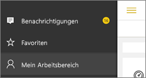

# Abrufen von Benachrichtigungen in den mobilen Power BI-Apps
Gilt für:

|  |  |  |  |  |
|:--- |:--- |:--- |:--- |:--- |
| iPhones |iPads |Android-Telefone |Android-Tablets |Windows 10-Geräte |

Sie erhalten Benachrichtigungen bezüglich Ihrer Power BI-Erfahrung direkt im Power BI-Dienst oder auf Ihrem mobilen Gerät. Wenn Sie „Benachrichtigungen“ öffnen, sehen Sie einen fortlaufenden Benachrichtigungsfeed über [von Ihnen festgelegte Warnungen](mobile-set-data-alerts-in-the-mobile-apps.md), neue Dashboards, die für Sie freigegeben wurden, sowie Änderungen in Ihrem Gruppenarbeitsbereich, Informationen zu Power BI-Veranstaltungen und -Meetings und vieles mehr.

> [!NOTE]
> Wenn Sie sich auf einem iOS-Gerät zum ersten Mal bei der [aktualisierten Version der Power BI-Apps](https://powerbi.microsoft.com/mobile/) angemeldet haben, erhalten Sie eine Meldung, in der Sie gefragt werden, ob Sie Benachrichtigungen von Power BI erhalten möchten. Sie können auch in **Einstellungen** für Ihr Gerät konfigurieren, wie Power BI Sie benachrichtigt. 
> 
> 

## Anzeigen von Benachrichtigungen auf Ihrem mobilen Gerät
1. Wenn Sie Benachrichtigungen auf Ihr mobiles Gerät erhalten, erzeugt Power BI standardmäßig einen Signalton und ein Benachrichtigungsbanner erscheint.
   
   
   
   Oder auf einem iPad:
   
   
   
   Sie können [ändern, wie Sie von Power BI benachrichtigt werden](mobile-apps-notification-center.md#change-or-turn-off-notifications-on-your-mobile-device).
2. Wenn Sie beim Anmelden bei Power BI auf Ihrem Mobilgerät Benachrichtigungen empfangen haben, wird ein gelber Punkt auf der globalen Navigationsschaltfläche  (Android) oder auf dem Symbol **Benachrichtigungen** angezeigt. 
   
   
3. Wählen Sie das Symbol „Benachrichtigungen“  (Windows 10) aus.
   
    Die neuesten Benachrichtigungen werden immer ganz oben angezeigt und die ungelesenen hervorgehoben. Benachrichtigungen werden 90 Tage lang aufbewahrt, es sei denn, Sie löschen sie oder erreichen das zulässige Maximum von 100 Benachrichtigungen.
   
   
4. Um eine Benachrichtigung zu verwerfen, tippen Sie darauf, halten Sie sie gedrückt, und wählen Sie **Verwerfen** aus.

## Ändern oder Deaktivieren von Benachrichtigungen auf Ihrem mobilen Gerät
Sie können ändern, wie Sie von Power BI benachrichtigt werden.

1. Wechseln Sie auf einem iOS-Gerät zu **Einstellungen** > **Benachrichtigungen**. 
   
    Wechseln Sie auf einem Android-Telefon zu **Benachrichtigungseinstellungen**.
   
    Wechseln Sie auf einem Windows-Gerät in **Einstellungen** zu **System** > **Benachrichtigungen**.
2. Wählen Sie in der Liste der Apps **Power BI** aus. 
3. Hier können Sie Benachrichtigungen vollständig deaktivieren oder auswählen, welche Benachrichtigungen Sie erhalten möchten.
   
    **Auf einem iPhone**
   
    
   
    **Auf einem Android-Telefon**
   
    

    **Auf einem Windows 10-Gerät**

    

## Nächste Schritte
* [Datenwarnungen im Power BI-Dienst](service-set-data-alerts.md)
* [Festlegen von Datenwarnungen in der iPhone-App (Power BI für iOS)](mobile-set-data-alerts-in-the-mobile-apps.md)
* [Festlegen von Datenwarnungen in der mobilen Power BI-App für Windows 10](mobile-set-data-alerts-in-the-mobile-apps.md)
* [Laden Sie die neueste Version der Power BI-Apps](https://powerbi.microsoft.com/mobile/) für mobile Geräte herunter

