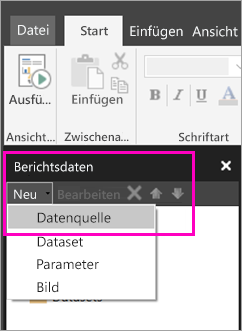

# Erstellen einer eingebetteten Datenquelle für paginierte Berichte im Power BI-Dienst (Vorschau)
In diesem Artikel erfahren Sie, wie eine eingebettete Datenquelle für einen paginierten Bericht im Power BI-Dienst erstellt und geändert wird. Sie definieren eine eingebettete Datenquelle in einem einzelnen Bericht und verwenden sie nur in diesem Bericht. Derzeit sind für paginierte Berichte, die im Power BI-Dienst veröffentlicht werden, eingebettete Datasets und eingebettete Datenquellen erforderlich. Sie können eine Verbindung mit folgenden Datenquellen herstellen:

- Azure SQL-Datenbank und Data Warehouse
- SQL Server
- SQL Server Analysis Services 

Paginierte Berichte stellen eine Verbindung mit lokalen Datenquellen über ein Gateway her. Sie richten Sie das Gateway ein, nachdem Sie den Bericht im Power BI-Dienst veröffentlicht haben. Weitere Informationen zu [Power BI-Gateways](service-gateway-getting-started.md). 

## Erstellen einer eingebetteten Datenquelle
  
1. Öffnen Sie den Berichts-Generator.

1. Wählen Sie auf der Symbolleiste im Berichtsdatenbereich **Neu** > **Datenquelle**. Das Dialogfeld **Datenquelleneigenschaften** wird geöffnet.

    
  
2.  Geben Sie im Textfeld **Name** einen Namen für die Datenquelle ein, oder übernehmen Sie den Standardnamen.  
  
3.  Wählen Sie **In meinem Bericht eingebettete Verbindung verwenden**.  
  
1.  Wählen Sie in der Liste **Verbindungstyp auswählen** einen Datenquellentyp aus. 

1.  Geben Sie mit einer der folgenden Methoden eine Verbindungszeichenfolge an:  
  
    -   Geben Sie die Verbindungszeichenfolge direkt im Textfeld **Verbindungszeichenfolge** ein. 
  
    -   Klicken Sie auf die Ausdrucksschaltfläche (**fx)**, um einen Ausdruck zu erstellen, der als Verbindungszeichenfolge ausgewertet wird. Geben Sie den Ausdruck im Dialogfeld **Ausdruck** im Bereich „Ausdruck“ ein. Wählen Sie **OK**aus. 
  
    -   Wählen Sie **Erstellen**, um das Dialogfeld **Verbindungseigenschaften** für die Datenquelle zu öffnen, die Sie in Schritt 2 ausgewählt haben.  
  
        Füllen Sie die Felder im Dialogfeld **Verbindungseigenschaften** dem Typ der Datenquelle entsprechend aus. Verbindungseigenschaften umfassen den Typ der Datenquelle, den Namen der Datenquelle und die zu verwendenden Anmeldeinformationen. Klicken Sie nach Angabe der Werte in diesem Dialogfeld auf **Verbindung testen**, um sicherzustellen, dass die Datenquelle verfügbar ist und die angegebenen Anmeldeinformationen richtig sind.  
  
4.  Wählen Sie **Anmeldeinformationen** aus.  
  
     Geben Sie die Anmeldeinformationen für diese Datenquelle ein. Der Besitzer der Datenquelle wählt den Typ der Anmeldeinformationen aus, die unterstützt werden. Weitere Informationen finden Sie unter [Angeben von Anmelde- und Verbindungsinformationen für Berichtsdatenquellen](https://docs.microsoft.com/sql/reporting-services/report-data/specify-credential-and-connection-information-for-report-data-sources).
  
5.  Wählen Sie **OK**aus.  
  
     Die Datenquelle wird im Berichtsdatenbereich angezeigt.  

## Nächste Schritte

- [Erstellen eines eingebetteten Datasets für einen paginierten Bericht im Power BI-Dienst](paginated-reports-create-embedded-dataset.md)
- [Was sind paginierte Berichte in Power BI Premium? (Vorschau)?](paginated-reports-report-builder-power-bi.md)