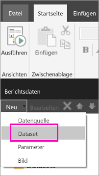
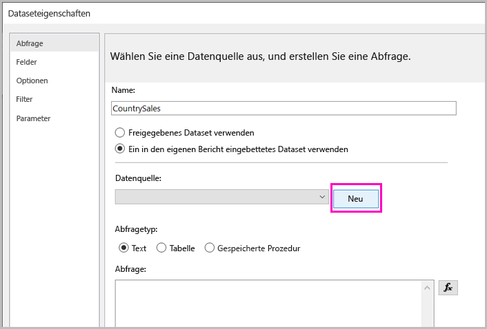
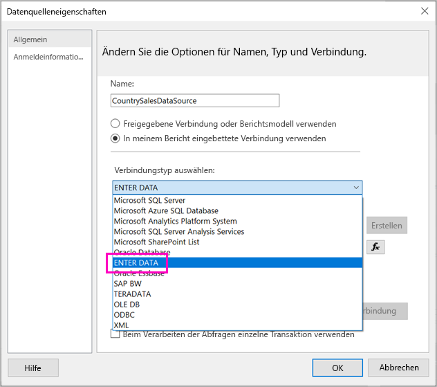
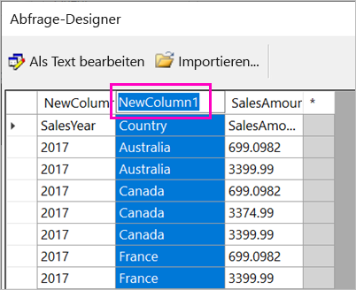
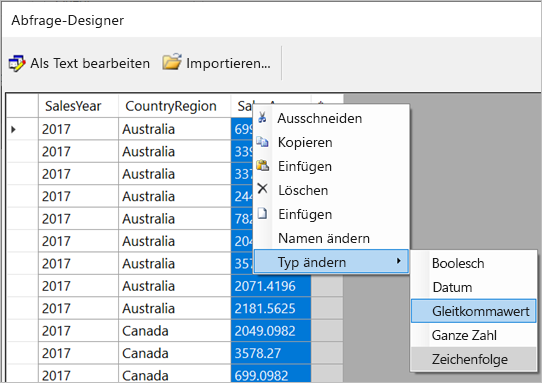
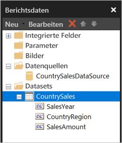

# <a name="enter-data-directly-in-a-paginated-report-in-report-builder-preview---power-bi"></a>Direktes Eingeben von Daten in paginierte Berichte im Berichts-Generator (Vorschau): Power BI

In diesem Artikel erhalten Sie Informationen zu einem Feature in der neuen Version des Berichts-Generators in SQL Server 2016, das es Ihnen ermöglicht, Daten direkt als eingebettetes Dataset in einen RDL-Bericht einzugeben.  Dieses Feature ist Power BI Desktop ähnlich. Sie können die Daten direkt in das Dataset in Ihrem Bericht eingeben oder sie aus einem anderen Programm wie Microsoft Excel einfügen. Wenn Sie durch die Eingabe von Daten ein Dataset erstellen, können Sie dieses genauso wie jedes andere von Ihnen erstellte eingebettete Dataset verwenden. Außerdem können Sie mehre Tabellen hinzufügen und diese als Filter verwenden. Dieses Feature eignet sich besonders für kleine, statische Datasets, die Sie möglicherweise in Ihrem Bericht verwenden müssen (z. B. Berichtsparameter).
 
## <a name="prerequisites"></a>Voraussetzungen

- Wenn Sie Daten direkt in einen paginierten Bericht eingeben möchten, installieren Sie die neue Version des [Berichts-Generators über das Microsoft Download Center](https://www.microsoft.com/download/details.aspx?id=53613). 
- Zum Speichern Ihres paginierten Berichts im Power BI-Dienst benötigen Sie ein [Konto für Power BI Pro](service-self-service-signup-for-power-bi.md) und Schreibzugriff auf einen Arbeitsbereich in einer [Power BI Premium-Kapazität](service-premium-what-is.md).
- Zum Speichern Ihres paginierten Berichts im Berichtsserver benötigen Sie Berechtigungen zum [Bearbeiten der RsReportServer.config-Datei](#upload-the-paginated-report-to-a-report-server).

## <a name="get-started"></a>Erste Schritte

Wenn Sie den Berichts-Generator heruntergeladen und installiert haben, ändert sich der Workflow zum Hinzufügen einer eingebetteten Datenquelle und eines eingebetteten Datensets in Ihren Bericht nicht. In der folgenden Prozedur wird unter **Datenquellen** eine neue Option angezeigt: **Daten eingeben**.  Die müssen diese Datenquelle einmal pro Bericht einrichten. Anschließend können Sie mehrere Tabellen mit eingegebenen Daten als separate Datasets erstellen, die alle dieselbe Datenquelle verwenden.

1. Klicken Sie im Bereich **Berichtsdaten** auf **Neu** > **Dataset**.

    

1. Klicken Sie im Dialogfeld **Dataseteigenschaften** auf **Ein in den eigenen Bericht eingebettetes Dataset verwenden**.

1. Klicken Sie neben **Datenquelle** auf **Neu**.

    

1. Klicken Sie im Dialogfeld **Datenquelleneigenschaften** auf **Use a connection embedded in my report** (In meinem Bericht eingebettete Verbindung verwenden).
2. Klicken Sie unter **Verbindungstyp auswählen** auf **DATEN EINGEBEN** > **OK**.

    

1. Klicken Sie dann wieder im Dialogfeld **Dataseteigenschaften** auf **Abfrage-Designer**.
2. Klicken Sie mit der rechten Maustaste in den Bereich **Abfrage-Designer**, und geben Sie Ihre Daten in die Tabelle ein.

    

1. Führen Sie für **NewColumn** einen Doppelklick aus, und geben Sie den Spaltennamen ein.

    

1. Wenn die erste Spalte Spaltenüberschriften der ursprünglichen Daten enthält, klicken Sie mit der rechten Maustaste darauf, und löschen Sie sie.
    
9. Standardmäßig ist der Datentyp für jede Spalte eine Zeichenfolge. Wenn Sie den Datentyp ändern möchten, klicken Sie erst mit der rechten Maustaste auf den Spaltenheader und anschließend mit der linken auf **Typ ändern**, um einen anderen Datentyp wie „Date“ oder „Float“ festzulegen.

    

1. Wenn Sie fertig sind und die Tabelle erstellt haben, klicken Sie auf **OK**.  

    Die Abfrage, die dann generiert wird, unterscheidet sich nicht von der Abfrage bei einer XML-Datenquelle. Im Hintergrund verwenden wir XML als den Datenanbieter.  Wir haben diesen so umfunktioniert, dass hierbei auch dieses Szenario aktiviert wird.

    

12. Klicken Sie im Dialogfeld **Dataseteigenschaften** auf **OK**.

13. Dann werden Ihre Datenquelle und Ihr Dataset im **Berichtsdatenbereich** angezeigt.

    

Sie können Ihr Dataset als Basis für Datenvisualisierungen in Ihrem Bericht verwenden. Außerdem können Sie ein anderes Dataset hinzufügen und dafür dieselbe Datenquelle verwenden.

## <a name="upload-the-paginated-report-to-the-power-bi-service"></a>Hochladen eines paginierten Berichts im Power BI-Dienst

Da jetzt paginierte Berichte in der Vorschau im Power BI-Dienst unterstützt werden, können Sie Ihren paginierten Bericht für eine Premium-Kapazität hochladen. Weitere Informationen finden Sie unter [Hochladen eines paginierten Berichts](paginated-reports-save-to-power-bi-service.md#upload-a-paginated-report).

## <a name="upload-the-paginated-report-to-a-report-server"></a>Hochladen des paginierten Berichts in einen Berichtsserver

Sie können paginierte Berichte auch im Power BI-Berichtsserver oder dem Berichtsserver für SQL Server Reporting Services 2016 und 2017 hochladen. Vorher müssen Sie allerdings das folgende Element als zusätzliche Datenerweiterung zu Ihrer RsReportServer.config-Datei hinzufügen. Sichern Sie Ihre RsReportServer.config-Datei, bevor Sie Änderungen vornehmen, falls Probleme auftreten sollten.

```xml
<Extension Name="ENTERDATA" Type="Microsoft.ReportingServices.DataExtensions.XmlDPConnection,Microsoft.ReportingServices.DataExtensions">
    <Configuration>
        <ConfigName>ENTERDATA</ConfigName>
    </Configuration>
</Extension>
```

Nach der Bearbeitung sollte die Liste mit Datenanbietern in der Konfigurationsdatei wie folgt aussehen:


Jetzt können Sie Berichte für Ihren Berichtsserver veröffentlichen, die diese neue Funktion verwenden.

## <a name="next-steps"></a>Nächste Schritte

- [Was sind paginierte Berichte in Power BI Premium (Vorschau)?](paginated-reports-report-builder-power-bi.md)
- [Was ist der Power BI-Berichtsserver?](report-server/get-started.md)
