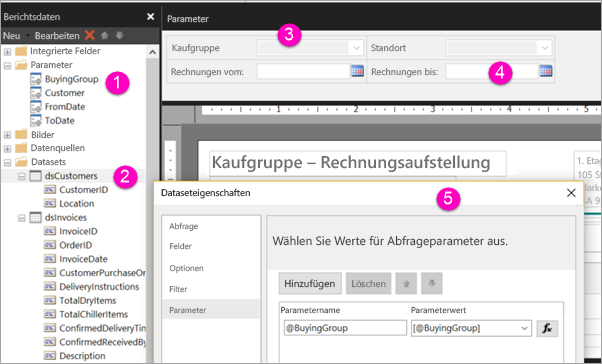

# Erstellen von Parametern für paginierte Berichte im Power BI-Dienst

In diesem Artikel erfahren Sie, wie Sie Parameter für paginierte Berichte im Power BI-Dienst erstellen.  Mit Berichtsparametern können Sie Berichtsdaten auswählen und die Berichtsdarstellung anpassen. Sie haben die Möglichkeit, einen Standardwert und eine Liste der verfügbaren Werte anzugeben, auf deren Grundlage Ihre Berichtsleser die Auswahl ändern.  

Die folgende Abbildung zeigt die Entwurfsansicht im Berichts-Generator für einen Bericht mit den Parametern @BuyingGroup, @Customer, @FromDate und @ToDate. 
  

  
1.  Die Berichtsparameter im Bereich „Berichtsdaten“.  
  
2.  Die Tabelle mit einem Parameter im Dataset.  
  
3.  Der Bereich „Parameter“. Im Bereich „Parameter“ können Sie das Layout von Parametern anpassen. 
  
4.  Die Parameter @FromDate und @ToDate verfügen über den Datentyp **DateTime**. Beim Anzeigen des Berichts können Sie ein Datum in das Textfeld eingeben oder im Kalendersteuerelement auswählen. 

5.  Ein Parameter im Dialogfeld **Dataseteigenschaften**.  

  
## Erstellen oder Bearbeiten eines Berichtsparameters  
  
1.  Öffnen Sie Ihren paginierten Bericht im Berichts-Generator.

1. Klicken Sie im Bereich **Berichtsdaten** mit der rechten Maustaste auf den Knoten **Parameter** > **Parameter hinzufügen**. Daraufhin wird das Dialogfeld **Berichtsparametereigenschaften** geöffnet.  
  
2.  Geben Sie unter **Name** einen Namen für den Parameter ein, oder übernehmen Sie den Standardnamen.  
  
3.  Geben Sie unter **Eingabeaufforderung** Text ein, der beim Ausführen des Berichts durch den Benutzer neben dem Textfeld „Parameter“ angezeigt wird.  
  
4.  Wählen Sie unter **Datentyp** den Datentyp für den Parameterwert aus.  
  
5.  Wenn für den Parameter ein leerer Wert ausgewählt werden darf, wählen Sie **Leeren Wert zulassen** aus.  
  
6.  Wenn für den Parameter ein Nullwert ausgewählt werden darf, wählen Sie **Nullwert zulassen** aus.  
  
7.  Damit Benutzer mehrere Werte für den Parameter auswählen können, wählen Sie **Mehrere Werte zulassen** aus.  
  
8.  Legen Sie die Sichtbarkeitsoption fest.  
  
    -   Um den Parameter in der Symbolleiste oben im Bericht anzuzeigen, wählen Sie **Sichtbar** aus.  
  
    -   Um den Parameter auszublenden, sodass er nicht in der Symbolleiste angezeigt wird, wählen Sie **Ausgeblendet** aus.  
  
    -   Um den Parameter auszublenden und vor Änderungen auf dem Berichtsserver nach der Veröffentlichung des Berichts zu schützen, wählen Sie **Intern** aus. Der Berichtsparameter lässt sich dann nur noch in der Berichtsdefinition anzeigen. Bei dieser Option müssen Sie einen Standardwert festlegen oder einen Nullwert für den Parameter zulassen.  
  
9. Wählen Sie **OK**aus. 
  
## Nächste Schritte

Unter [Anzeigen von Parametern für paginierte Berichte](paginated-reports-view-parameters.md) erfahren Sie, wie die Parameter im Power BI-Dienst angezeigt werden.

Ausführliche Informationen zu Parametern in paginierten Berichten finden Sie in der SQL Server Reporting Services-Dokumentation im Artikel [Berichtsparameter (Berichts-Generator und Berichts-Designer)](https://docs.microsoft.com/sql/reporting-services/report-design/report-parameters-report-builder-and-report-designer).  
