# Tutorial: Erstellen eines paginierten Berichts und Hochladen in den Power BI-Dienst (Vorschau)

In diesem Tutorial stellen Sie eine Verbindung mit einer Beispielinstanz von Azure SQL-Datenbank her. Anschließend erstellen Sie mithilfe eines Assistenten im Berichts-Generator einen paginierten Bericht mit einer Tabelle, die sich auf mehrere Seiten erstreckt. Dann laden Sie den paginierten Bericht in einen Arbeitsbereich in einer Premium-Kapazität im Power BI-Dienst hoch. Paginierte Berichte im Power BI-Dienst befinden sich derzeit in der Vorschauphase.

Im Folgenden werden die Schritte beschrieben, die Sie in diesem Tutorial ausführen:

> [!div class="checklist"]
> * Erstellen einer Azure-Beispieldatenbank
> * Erstellen einer Matrix im Berichts-Generator mithilfe eines Assistenten
> * Formatieren des Berichts mit Titel, Seitenzahlen und Spaltenüberschriften auf jeder Seite
> * Formatieren der Währung
> * Hochladen des Berichts in den Power BI-Dienst

Wenn Sie kein Azure-Abonnement haben, erstellen Sie ein [kostenloses Konto](https://azure.microsoft.com/free/?WT.mc_id=A261C142F), bevor Sie beginnen.
 
## Voraussetzungen  

Im Folgenden werden die Voraussetzungen für die Erstellung eines paginierten Berichts aufgeführt:

- Installieren Sie den [Berichts-Generator aus dem Microsoft Download Center](http://go.microsoft.com/fwlink/?LinkID=734968). 

- Führen Sie die Schritte im [Schnellstart: Erstellen einer Beispielinstanz von Azure SQL-Datenbank im Azure-Portal](https://docs.microsoft.com/azure/sql-database/sql-database-get-started-portal) durch. Kopieren und speichern Sie den Wert im Feld **Servername** auf der Registerkarte **Übersicht**. Merken Sie sich den Benutzernamen und das Kennwort, die Sie in Azure erstellt haben.

Im Folgenden werden die Voraussetzungen zum Hochladen Ihres paginierten Berichts in den Power BI-Dienst aufgeführt:

- Sie benötigen eine [Power BI Pro-Lizenz](service-admin-power-bi-pro-in-your-organization.md).
- Sie benötigen einen App-Arbeitsbereich für den Dienst in einer [Power BI Premium-Kapazität](service-premium.md). Diese ist durch ein Diamantsymbol  neben den Namen des Arbeitsbereichs gekennzeichnet.

## Erstellen der Matrix mit einem Assistenten
  
1.  Starten Sie den Berichts-Generator auf Ihrem Computer.  
  
     Das Dialogfeld **Erste Schritte** wird geöffnet.  
  
     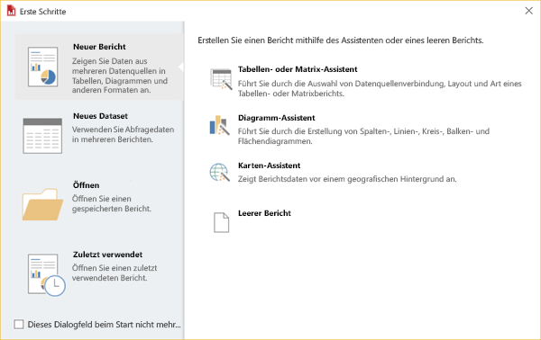
  
1.  Vergewissern Sie sich, dass im linken Bereich **Neuer Bericht** und im rechten Bereich **Tabellen- oder Matrix-Assistent** ausgewählt ist.  
  
4.  Wählen Sie auf der Seite **Dataset auswählen** die Optionen **Dataset erstellen** > **Weiter** aus.  

    
  
5.  Klicken Sie auf der Seite **Verbindung mit einer Datenquelle auswählen** auf **Neu**. 

    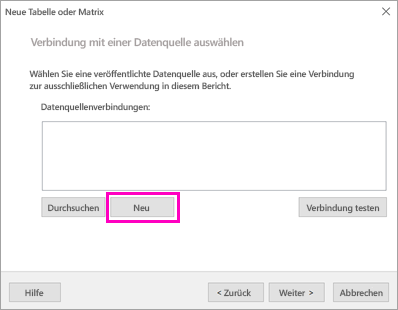
  
     Das Dialogfeld **Datenquelleneigenschaften** wird geöffnet.  
  
6.  Sie können einen beliebigen Namen für die Datenquelle bestehend aus Zeichen und Unterstrichen auswählen. Geben Sie für dieses Tutorial in das Feld **Name** **MyAzureDataSource** ein.  
  
7.  Wählen Sie im Feld **Verbindungstyp auswählen** die Option **Microsoft Azure SQL-Datenbank** aus.  
  
8.  Klicken Sie neben dem Feld **Verbindungszeichenfolge** auf **Erstellen**. 

    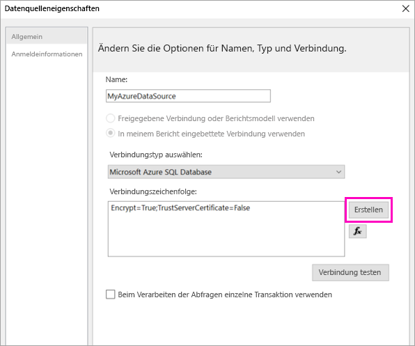

9. **In Azure:** Kehren Sie zum Azure-Portal zurück, und klicken Sie auf **SQL-Datenbanken**.

1. Wählen Sie die Azure SQL-Datenbank-Instanz aus, die Sie im „Schnellstart: Erstellen einer Beispielinstanz von Azure SQL-Datenbank im Azure-Portal“ im Abschnitt **Voraussetzungen** dieses Artikels erstellt haben.

1. Kopieren Sie auf der Registerkarte **Übersicht** den Wert im Feld **Servername**.

2. **Im Berichts-Generator**: Fügen Sie im Dialogfeld **Verbindungseigenschaften** unter **Servername** den Servernamen ein, den Sie kopiert haben. 

1. Stellen Sie sicher, dass für **Beim Server anmelden** **SQL Server-Authentifizierung** ausgewählt ist, und geben Sie den Benutzernamen und das Kennwort ein, die Sie für die Beispieldatenbank in Azure erstellt haben.

1. Klicken Sie unter **Mit Datenbank verbinden** auf den Dropdownpfeil, und wählen Sie den Datenbanknamen aus, den Sie in Azure erstellt haben.
 
    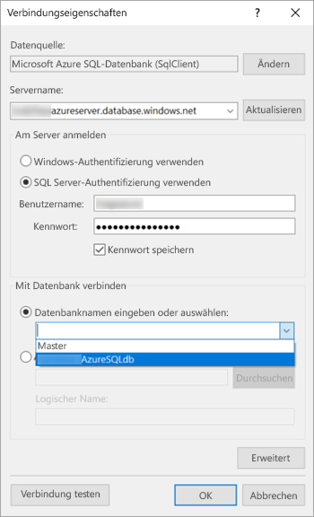

1. Klicken Sie auf **Testverbindung**. Sie sehen die Meldung **Testergebnisse**, die Folgendes besagt: **Die Testverbindung war erfolgreich.**

1. Klicken Sie auf **OK** > **OK**. 

   Im Feld **Verbindungszeichenfolge** zeigt der Berichts-Generator die Verbindungszeichenfolge an, die Sie gerade erstellt haben. 

    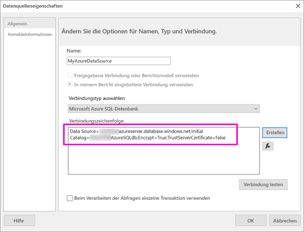

1. Wählen Sie **OK**aus.
  
9. Auf der Seite **Verbindung mit einer Datenquelle auswählen** wird unter der Datenquellenverbindung „(in diesem Bericht)“ angezeigt, die Sie gerade erstellt haben. Wählen Sie diese Datenquelle aus, und klicken Sie auf **Weiter**.  

    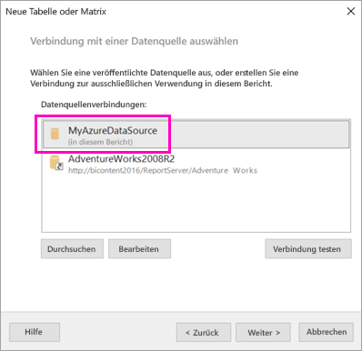

10. Geben Sie den gleichen Benutzernamen und das Kennwort in das Feld ein. 
  
10. Erweitern Sie auf der Seite **Abfrage entwerfen** „SalesLT“ und „Tabellen“, und wählen Sie dann diese Tabellen aus:

    - Adresse
    - Customer
    - Produkt
    - ProductCategory
    - SalesOrderDetail
    - SalesOrderHeader

     Da **Beziehungen** > **Automatische Erkennung** ausgewählt ist, erkennt der Berichts-Generator die Beziehungen zwischen diesen Tabellen. 
    
    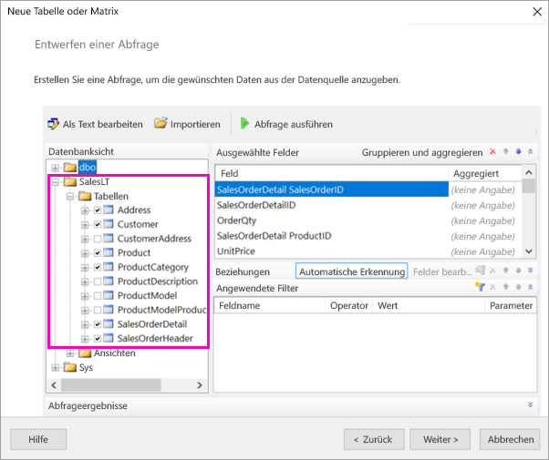
 
1.  Wählen Sie **Abfrage ausführen** aus. Der Berichts-Generator zeigt die **Abfrageergebnisse** an. 
 
     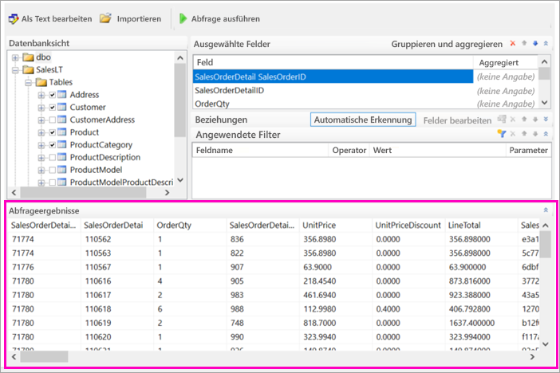

18. Wählen Sie **Weiter**aus. 

19. Wählen Sie auf der Seite **Dataset auswählen** das Dataset aus, das Sie gerade erstellt haben, und klicken Sie auf **Weiter**.

    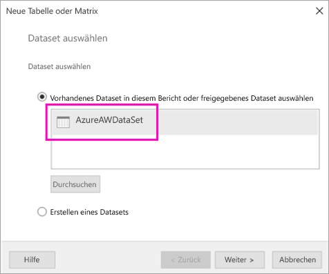

1. Ziehen Sie diese Felder auf der Seite **Felder anordnen** aus dem Feld **Verfügbare Felder** in das Feld **Zeilengruppen**:

    - CompanyName
    - SalesOrderNumber
    - Product_Name

1. Ziehen Sie diese Felder aus dem Feld **Verfügbare Felder** in das Feld **Werte**:

    - OrderQty
    - UnitPrice
    - Zwischensumme

    Der Berichts-Generator hat die Felder automatisch in den Summenfeldern **Werte** erstellt.

    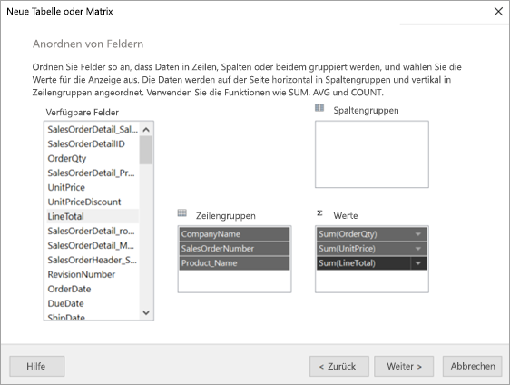

24. Übernehmen Sie auf der Seite **Layout auswählen** die Standardeinstellungen, aber deaktivieren Sie **Gruppen erweitern/reduzieren**. Das Feature zum Erweitern bzw. Reduzieren von Gruppen ist zwar generell sehr nützlich, doch dieses Mal soll sich die Tabelle auf mehrere Seiten erstrecken.

1. Wählen Sie **Weiter** > **Fertig stellen** aus. Die Tabelle wird auf der Entwurfsoberfläche angezeigt.
 
## Ergebnisse

Lassen Sie uns einen Moment die Ergebnisse des Assistenten betrachten.

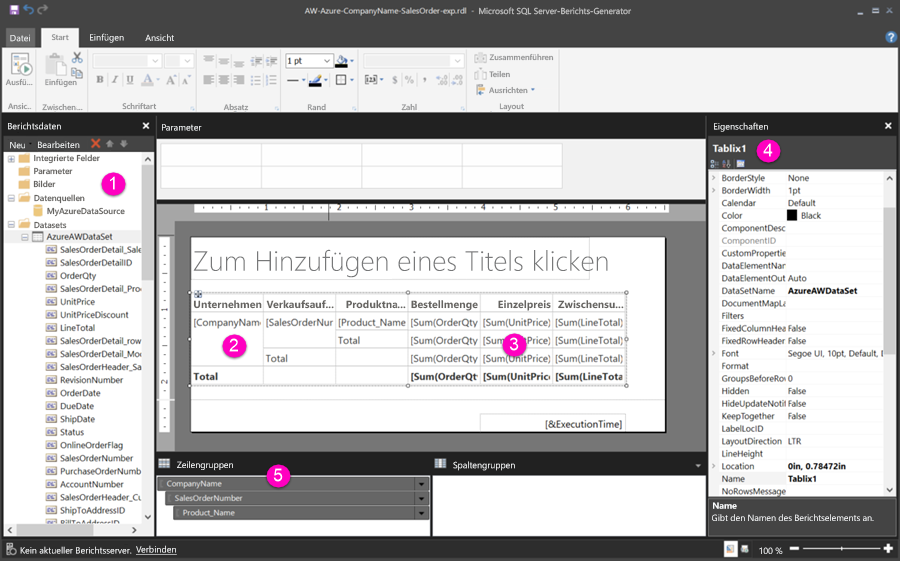

1. Im Bereich „Berichtsdaten“ werden die eingebettete Azure-Datenquelle und das darauf basierende eingebettete Dataset angezeigt. Beides haben Sie erstellt. 

2. Die Entwurfsoberfläche ist ungefähr 6 Zoll breit. Auf der Entwurfsoberfläche wird die Matrix angezeigt, in der Spaltenüberschriften und Platzhalterwerte zu sehen sind. Die Matrix umfasst sechs Spalten und offensichtlich nur fünf Zeilen. 

3. „Auftragsmenge“, „Einzelpreis“ und „Zeilensumme“ stellen alle Summen dar, wobei jede Zeilengruppe ein Teilergebnis enthält. 

    Die tatsächlichen Datenwerte werden dennoch nicht angezeigt. Hierfür müssen Sie den Bericht ausführen.

4. Klicken Sie im Bereich „Eigenschaften“ auf die ausgewählte Matrix „Tablix1“. Eine *Tablix* im Berichts-Generator ist ein Datenbereich, in dem Daten in Zeilen und Spalten angezeigt werden. Hierbei kann es sich um eine Tabelle oder eine Matrix handeln.

5. Im Bereich „Gruppierung“ werden die drei Zeilengruppen angezeigt, die Sie im Assistenten erstellt haben: 

    - CompanyName
    - Verkaufsaufträge
    - Produktname

    Die Matrix enthält keine Spaltengruppen.

### Ausführen des Berichts

Um die tatsächlichen Werte anzuzeigen, müssen Sie den Bericht ausführen.

1. Klicken Sie auf der Symbolleiste **Startseite** auf **Ausführen**.

   Nun werden die Werte angezeigt. Die Matrix enthält mehr Zeilen, als Sie in der Entwurfsansicht gesehen haben. Beachten Sie, dass der Berichts-Generator angibt, dass es sich um Seite **1** **von 2?** handelt. Der Berichts-Generator lädt den Bericht möglichst schnell, sodass immer nur Daten für ein paar Seiten abgerufen werden. Das Fragezeichen gibt an, dass der Berichts-Generator noch nicht alle Daten geladen hat.

   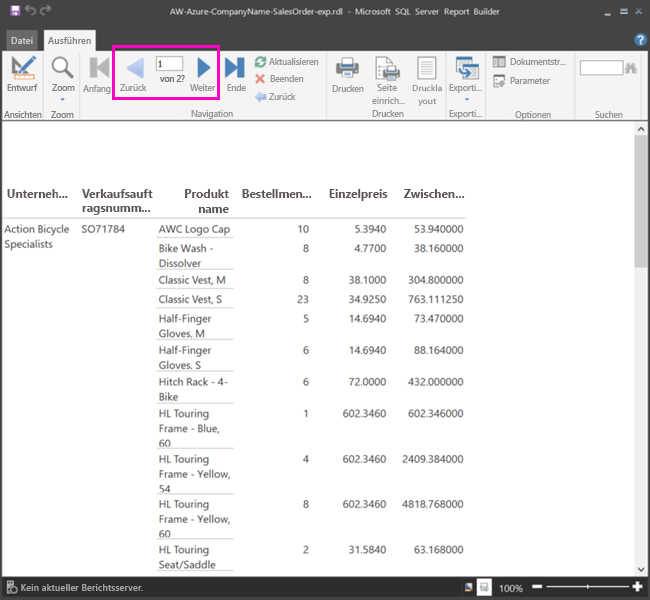

2. Klicken Sie auf **Seitenlayout**. Der Bericht wird in diesem Format ausgegeben, wenn Sie ihn drucken. Der Berichts-Generator weiß nun, dass der Bericht 33 Seiten enthält und hat diesen automatisch mit einem Datums- und Zeitstempel in der Fußzeile versehen.

## Formatieren des Berichts

Nun haben Sie einen Bericht mit einer Matrix, die sich auf 33 Seiten erstreckt. Lassen Sie uns einige weitere Features hinzufügen und die Darstellung verbessern. Sie können den Bericht nach jedem Schritt ausführen, wenn Sie sehen möchten, wie dieser ausseht.

- Klicken Sie auf der Registerkarte **Ausführen** des Menübands auf **Entwurf**, um weitere Änderungen vorzunehmen.  

### Festlegen der Seitenbreite

In der Regel wird ein paginierter Bericht für den Druck formatiert. Eine typische Seite umfasst 8 1/2 x 11 Zoll. 

1. Ziehen Sie das Lineal, um die Entwurfsoberfläche auf eine Breite von 7 Zoll zu erweitern. Die Standardränder betragen 1 Zoll auf jeder Seite. Die Seitenränder müssen also schmaler gemacht werden.

1. Klicken Sie auf die graue Fläche um die Entwurfsoberfläche herum, um die **Bericht**-Eigenschaften anzuzeigen.

    Wenn der Eigenschaftenbereich nicht angezeigt wird, klicken Sie auf die Registerkarte **Ansicht** > **Eigenschaften**.

2. Erweitern Sie **Ränder**, und ändern Sie den Wert unter **Links** und **Rechts** von 1 Zoll in 0,75 Zoll. 

    
  
### Hinzufügen eines Berichtstitels  

1. Klicken Sie am oberen Rand der Seite auf **Zum Hinzufügen eines Titels klicken**, und geben Sie dann **Umsätze nach Unternehmen** ein.  

2. Wählen Sie den Titeltext aus, und ändern Sie im Bereich „Eigenschaften“ unter **Schriftart** die **Farbe** in **Blau**.
  
### Hinzufügen einer Seitenzahl

Sie werden bemerkt haben, dass der Bericht einen Datums- und Zeitstempel in der Fußzeile enthält. Sie können auch eine Seitenzahl zur Fußzeile hinzufügen.

1. Am unteren Rand der Entwurfsoberfläche sehen Sie auf der rechten Seite in der Fußzeile „[&ExecutionTime]“. 

2. Erweitern Sie im Bereich „Berichtsdaten“ den Ordner „Integrierte Felder“. Ziehen Sie **Seitenzahl** auf die linke Seite der Fußzeile auf dieselbe Höhe wie „[&ExecutionTime]“.

3. Ziehen Sie die rechte Seite des Felds „[&PageNumber]“, um es in Quadrat umzuwandeln.

4. Wählen Sie auf der Registerkarte **Einfügen** die Option **Textfeld** aus.

5. Klicken Sie rechts neben „[&PageNumber]“, geben Sie „von“ ein, und ziehen Sie das Textfeld in eine quadratische Form.

6. Ziehen Sie **Gesamtseiten** in die Fußzeile, rechts neben „von“, und ziehen Sie dann die rechte Seite, um es ebenfalls eine quadratische Form umzuwandeln.

    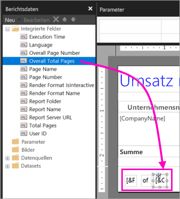

### Verbreitern der Tabelle  

Nun können Sie die Matrix so einstellen, dass sie die Breite der Seite ausfüllt, und die Textspalten breiter machen, damit die Namen sichtbar bleiben. 
 
1. Wählen Sie die Matrix aus, und markieren Sie dann die Spalte „Unternehmensname“.

3. Zeigen Sie mit dem Mauszeiger auf die graue Leiste am oberen Rand der Matrix am rechten Rand der Spalte „Unternehmensname“. Ziehen Sie sie nach rechts bis zum Ende der Spalte bei 1 3/8 Zoll. 

    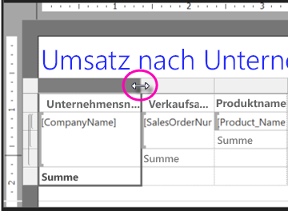

4. Ziehen Sie den rechten Rand der Spalte „Produktname“ bis zum Ende der Spalte bei 3 3/4 Zoll.   

Die Matrix ist jetzt fast so breit wie der Druckbereich.

### Formatieren der Währung

Beim Ausführen des Berichts ist Ihnen womöglich aufgefallen, dass die Dollarbeträge noch nicht als Währung formatiert sind.

1. Klicken Sie auf die Zelle oben links „[Sum(OrderQty)]“, halten Sie die UMSCHALTTASTE gedrückt, und klicken Sie auf die Zelle unten rechts „[SUM(LineTotal)]“.

    

2. Klicken Sie auf der Registerkarte **Startseite** auf das Dollarzeichen (**$**) und dann auf den Pfeil neben **Platzhalterformate** > **Beispielwerte**.
 
    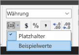

    Nun können Sie sehen, dass die Werte als Währung formatiert sind.

    

### Hinzufügen von Spaltenüberschriften auf jeder Seite

Eine weitere Formatierungsverbesserung vor der Veröffentlichung des Berichts im Power BI-Dienst ist, die Spaltenüberschriften auf jeder Seite im Bericht anzuzeigen.

1. Wählen Sie am rechten Ende der oberen Leiste im Bereich „Gruppierung“ den Dropdownpfeil aus und dann **Erweiterter Modus**.

    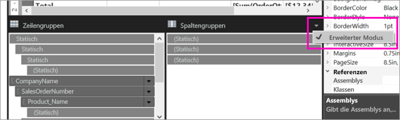

2. Wählen Sie die oberste Leiste **Statisch** unter **Zeilengruppen** aus. Sie sehen, dass die Zelle „Unternehmensname“ in der Matrix markiert ist.

   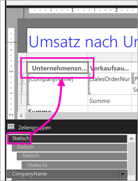

3. Im Bereich **Eigenschaften** sehen Sie die Eigenschaften für **Tablix-Element**. Legen Sie **KeepWithGroup** auf **After** und **RepeatOnNewPage** auf **True** fest.

    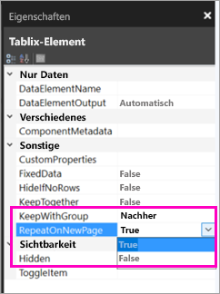

    Nun kann der Bericht ausgeführt und geprüft werden, wie dieser jetzt aussieht.

5. Wählen Sie auf der Registerkarte **Start** die Option **Ausführen** aus.

6. Wählen Sie **Seitenlayout** aus, falls noch nicht geschehen. Der Bericht umfasst nun 29 Seiten. Scrollen Sie durch ein paar Seiten. Sie sehen, dass die Währung formatiert ist, dass die Spalten auf jeder Seite Spaltenüberschriften enthalten und dass der Bericht über eine Fußzeile mit Seitenzahlen sowie einen Datums- und Zeitstempel auf jeder Seite verfügt.
 
    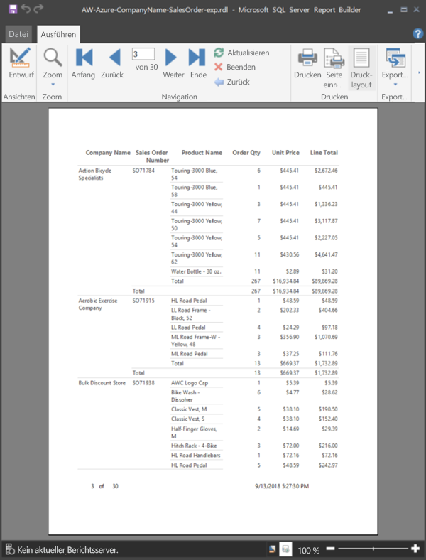

7. Speichern Sie den Bericht auf Ihrem Computer.
 
##  Hochladen des Berichts in den Dienst

Nachdem Sie diesen paginierten Bericht erstellt haben, können Sie ihn in den Power BI-Dienst hochladen.

1. Wählen Sie im Power BI-Dienst (http://app.powerbi.com) im linken Navigationsbereich die Option **Arbeitsbereiche** > **App-Arbeitsbereich erstellen** aus.

2. Nennen Sie Ihren Arbeitsbereich **Azure AW**, oder vergeben Sie einen anderen eindeutigen Namen. Sie sind jetzt das einzige Mitglied. 

3. Wählen Sie den Pfeil neben **Erweitert** aus, und aktivieren Sie **Dedizierte Kapazität**. 

    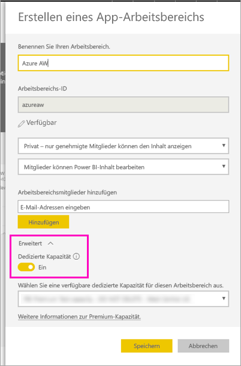

    Wenn Sie sie nicht aktivieren können, müssen Sie Ihren Power BI-Administrator darum bitten, Ihnen die Berechtigungen zum Hinzufügen des Arbeitsbereichs zur dedizierten Premium-Kapazität zu erteilen.

4. Wählen Sie eine **verfügbare dedizierte Kapazität für diesen Arbeitsbereich** aus (sofern erforderlich), und klicken Sie auf **Speichern**.
    
    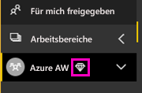

    Wenn sich der Arbeitsbereich nicht in einer Premium-Kapazität befindet, wird bei dem Versuch, den Bericht hochzuladen, folgende Meldung angezeigt: „Paginierter Bericht kann nicht hochgeladen werden.“ Wenden Sie sich an Ihren Power BI-Administrator, um den Arbeitsbereich zu verschieben.

1. Klicken Sie im neuen Arbeitsbereich auf **Daten abrufen**.

2. Wählen Sie im Feld **Dateien** die Option **Abrufen** aus.

3. Wählen Sie **Lokale Datei** aus, navigieren Sie zum Speicherort der Datei, und klicken Sie auf **Öffnen**.

   Power BI importiert Ihre Datei. Sie wird dann auf der Seite der App-Liste unter **Berichte** angezeigt.

    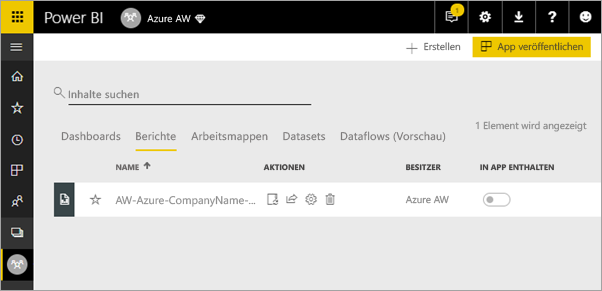

4. Wählen Sie den Bericht aus, um ihn anzuzeigen.

5. Wenn Sie eine Fehlermeldung erhalten, müssen Sie Ihre Anmeldeinformationen möglicherweise erneut eingeben. Klicken Sie auf das Symbol **Verwalten**.

    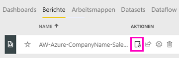

6. Klicken Sie auf **Anmeldeinformationen bearbeiten**, und geben Sie die Anmeldeinformationen ein, die Sie in Azure bei der Erstellung der Azure-Datenbank verwendet haben.

    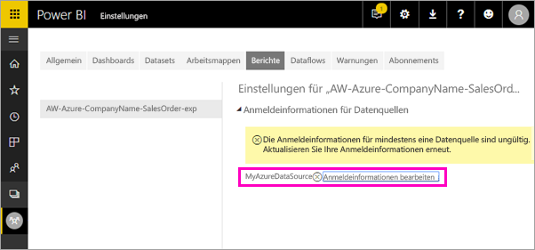

7. Jetzt können Sie Ihren paginierten Bericht im Power BI-Dienst anzeigen.

    

## Nächste Schritte

[Was sind paginierte Berichte in Power BI Premium (Vorschau)?](paginated-reports-report-builder-power-bi.md)

