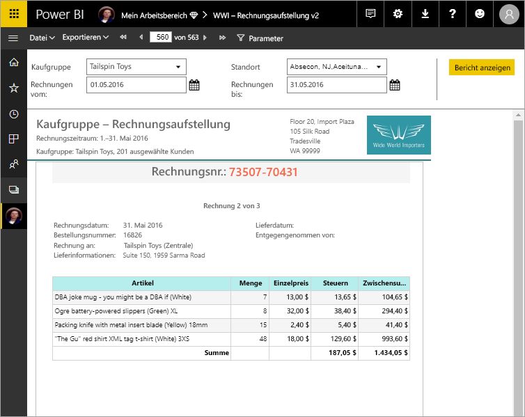

# Was sind paginierte Berichte in Power BI Premium? (Vorschau)

Paginierte Berichte sind seit Langem das Standardberichtsformat in SQL Server Reporting Services und stehen jetzt auch im Power BI-Dienst zur Verfügung. Diese Berichte können ausgedruckt oder freigegeben werden. Sie werden als „paginiert“ bezeichnet, weil sie so formatiert sind, dass sie gut auf eine Seite passen. Sie zeigen alle Daten in einer Tabelle an, selbst wenn die Tabelle sich über mehrere Seiten erstreckt. Sie werden gelegentlich auch als „pixelperfekt“ bezeichnet, weil Sie das Berichtsseitenlayout detailliert steuern können. Paginierte Berichte basieren auf der RDL-Berichtstechnologie von SQL Server Reporting Services. Der Berichts-Generator ist das eigenständige Tool für die Erstellung paginierter Berichte. 

Paginierte Berichte können viele Seiten umfassen. Dieser Bericht umfasst beispielsweise 563 Seiten. Jede Seite ist genau strukturiert, mit einer Seite pro Rechnung und sich wiederholenden Kopf- und Fußzeilen.

Sie können eine Vorschau Ihres Berichts im Berichts-Generator anzeigen und dann im Power BI-Dienst unter http://app.powerbi.com veröffentlichen. Sie benötigen eine Power BI Pro-Lizenz, um einen Bericht im Dienst zu veröffentlichen. Sie können paginierte Berichte in Ihrem Arbeitsbereich oder in App-Arbeitsbereichen veröffentlichen und freigeben, solange sich der Arbeitsbereich in einer Power BI Premium-Kapazität befindet. Darüber hinaus muss ein Power BI-Administrator paginierte Berichte im Power BI-Verwaltungsportal aktivieren. 

## Erstellen von Berichten in Power BI-Berichts-Generator

Paginierte Berichte haben ihre eigenen Design-Tool, Power BI-Berichts-Generator. Es ist ein neues Tool, das die gleiche Grundlage wie die Tools, die Sie zuvor, zum Erstellen paginierter Berichte für Power BI-Berichtsserver und SQL Server Reporting Services (SSRS verwendet haben), gemeinsam verwendet. Tatsächlich sind paginierte Berichte, die Sie für SSRS 2016 und 2017 oder für den Power BI-Berichtsserver lokal erstellen, mit dem Power BI-Dienst kompatibel. Der Power BI-Dienst gewährleistet Abwärtskompatibilität, sodass Sie Ihre Berichte weiterverwenden und paginierte Berichte früherer Versionen aktualisieren können. Mit Veröffentlichung sind nicht alle Berichtsfunktionen verfügbar. Unter [Einschränkungen und Überlegungen](#limitations-and-considerations) finden Sie weitere Informationen.
     
## Erstellen von Berichten aus einer Vielzahl von Datenquellen

Ein einzelner paginierter Bericht kann über eine Reihe unterschiedlicher Datenquellen verfügen. Im Gegensatz zu Power BI-Berichten liegt ihm kein Datenmodell zugrunde. Für die erste Version paginierter Berichte im Power BI-Dienst erstellen Sie eingebettete Datenquellen und Datasets im Bericht selbst. Momentan können Sie keine freigegebenen Datenquellen oder freigegebene Datasets verwenden. Sie erstellen Berichte im Berichts-Generator auf dem lokalen Computer. Wenn ein Bericht eine Verbindung mit lokalen Daten herstellt, nachdem Sie den Bericht in den Power BI-Dienst hochgeladen haben, müssen Sie ein Gateway erstellen und die Datenverbindung umleiten. Hier sind die Datenquellen, die Sie zu diesem Zeitpunkt Verbindung möglich:

- Azure SQL-Datenbank und Data Warehouse
- Azure Analysis Services (über SSO).
- SQL Server über ein Gateway
- SQL Server Analysis Services über ein Gateway
- Power BI-Premium-Datasets
- Oracle
- Teradata
 
Weitere Datenquellen werden während des Vorschauzeitraums hinzugefügt.

## Entwerfen des Berichts  

### Erstellen Sie paginierte Berichte mit Matrix-, Diagramm- und Freiformlayouts

Tabellenberichte eignen sich gut für spaltenbasierte Daten. Matrixberichte wie Kreuztabellenberichte oder PivotTable-Berichte eignen sich gut für zusammengefasste Daten. Diagrammberichte stellen Daten in einem grafischen Format dar. Freiform-*Listenberichte* können fast alles Andere wie z.B. Rechnungen darstellen. 
  
Sie können mit einem der Assistenten des Berichts-Generators starten. Die Tabellen-, Matrix- und Diagramm-Assistenten führen Sie durch die Erstellung der Verbindung mit der eingebetteten Datenquelle und dem eingebetteten Dataset. Ziehen Sie anschließend Felder per Drag & Drop, um eine Datasetabfrage zu erstellen, wählen Sie Layout und Stil aus, und passen Sie den Bericht an.  
  
Mit dem Karten-Assistenten erstellen Sie Berichte, die aggregierte Daten vor einem geografischen oder geometrischen Hintergrund anzeigen. Kartendaten können räumliche Daten aus einer Transact-SQL-Abfrage oder einer Shape-Datei des Environmental Systems Research Institute (ESRI) sein. Sie können auch einen Microsoft Bing-Kartenkachelhintergrund hinzufügen.  

### Hinzufügen weiterer Elemente zum Bericht

Ändern Sie Ihre Daten, indem Sie sie filtern, gruppieren und sortieren bzw. Formeln oder Ausdrücke hinzufügen. Fügen Sie Diagramme, Messgeräte, Sparklines und Indikatoren hinzu, um Daten in einem visuellen Format zusammenzufassen.  Verwenden Sie Parameter und Filter, um Daten für benutzerdefinierte Sichten zu filtern. Betten Sie Bilder oder andere Ressourcen ein, oder verweisen Sie darauf – auch externe Inhalte.  

Alles in einem paginierten Bericht, vom Bericht selbst bis hin zu jedem Textfeld, jedem Bild, jeder Tabelle und jedem Diagramm, besitzt ein Array von Eigenschaften, die Sie festlegen können, damit der Bericht genau Ihren Vorstellungen entspricht.

## Erstellen einer Berichtsdefinition

Wenn Sie einen paginierten Bericht entwerfen, erstellen Sie eigentlich eine *Berichtsdefinition*. Sie enthält keine Daten. Sie gibt an, wo die Daten bereitstehen, welche Daten abzurufen sind und wie die Daten angezeigt werden sollen. Bei Ausführung des Berichts legt der Berichtsprozessor die angegebene Berichtsdefinition zugrunde, ruft die Daten ab und kombiniert sie mit dem Berichtslayout, um den Bericht zu generieren. Sie laden die Berichtsdefinition in den Power BI-Dienst hoch (http://app.powerbi.com), entweder in „Mein Arbeitsbereich“ oder in einen Arbeitsbereich, den Sie gemeinsam mit Ihren Kollegen verwenden. Ist die Berichtsdatenquelle lokal gespeichert, leiten Sie die Datenquellenverbindung nach dem Hochladen des Berichts so um, dass sie über ein Gateway verläuft. 

## Anzeigen Ihres paginierten Berichts
Sie können Ihren paginierten Bericht im Power BI-Dienst in einem Browser und auch in den Power BI Mobile-Apps anzeigen. Sie können den Bericht über den Power BI-Dienst in mehrere Formate exportieren, darunter HTML, MHTML, PDF, XML, CSV, TIFF, Word und Excel. Zudem können Sie ihn für andere Benutzer freigeben.  

## Erstellen Sie ein Abonnement zu einem Bericht

Sie können jetzt e-Mail-Abonnements für sich selbst und andere für paginierte Berichte im Power BI-Dienst einrichten. Im Allgemeinen ist der Prozess identisch mit dem Abonnieren von Berichten und Dashboards in Power BI-Dienst. Einrichten von Abonnements, Sie wählen Sie im wie oft soll die e-Mail-Nachrichten: täglich, wöchentlich oder stündlich. Das Abonnement enthält eine Anlage PDF-Datei der gesamte Berichtsausgabe.

Weitere Informationen finden Sie im Artikel [sich selbst und andere paginierte Berichte in Power BI-Dienst abonnieren](paginated-reports-subscriptions.md). 

## Einschränkungen und Überlegungen

Hier sind einige andere Features aufgeführt, die in der ersten Version nicht unterstützt werden:

- Anheften von Berichtsseiten oder Visuals an Power BI-Dashboards. Sie können noch immer Visualisierungen aus einem lokalen paginierten Bericht auf einem Power BI-Berichtsserver oder einem Reporting Services-Berichtsserver an ein Power BI-Dashboard anheften. Weitere Informationen finden Sie unter [Anheften von Reporting Services-Elementen an Power BI-Dashboards](https://docs.microsoft.com/sql/reporting-services/pin-reporting-services-items-to-power-bi-dashboards).
- Interaktive Features wie Dokumentstrukturen und Schaltflächen zum Ein-/Ausblenden.
- Unterberichte und Drillthroughberichte.
- Freigegebene Datenquellen und freigegebene Datasets.
- Visuals aus Power BI-Berichten.
 
## Nächste Schritte

- [Installieren von Power BI-Berichts-Generator aus dem Microsoft Download Center](https://go.microsoft.com/fwlink/?linkid=2086513)
- [Tutorial: Erstellen eines paginierten Berichts](paginated-reports-quickstart-aw.md)
- [Enter data directly in a paginated report (Eingeben von Daten direkt in einem paginierten Bericht)](paginated-reports-enter-data.md)

  

